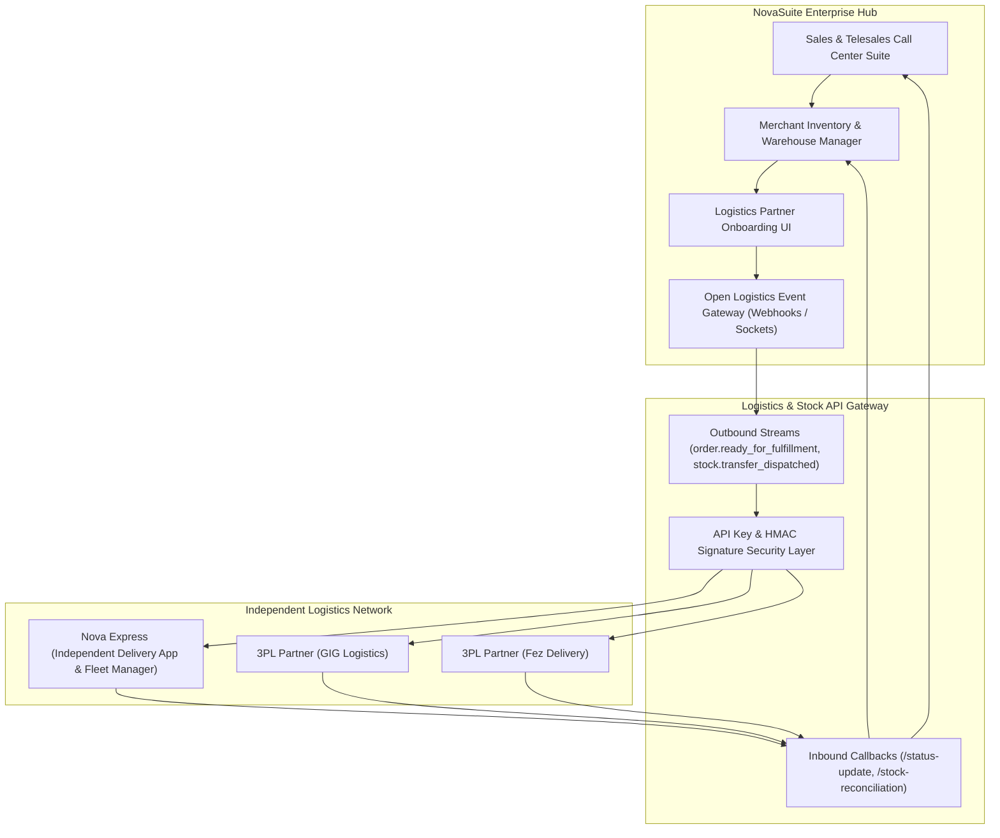
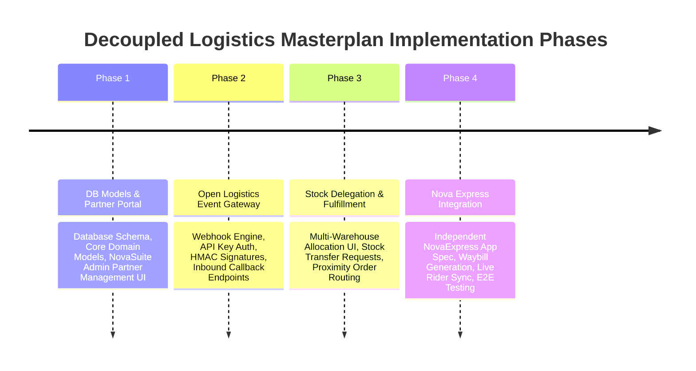

# Decoupled Logistics & Open API Platform — Masterplan Overview

This masterplan details the complete architectural evolution to **decouple logistics and warehousing operations from NovaSuite CRM**, transforming NovaSuite into an open e-commerce/sales hub that streams live confirmed orders to independent logistics partners (e.g., **Nova Express**, GIG Logistics, Fez Delivery, Red Star), manages multi-warehouse stock delegation, and exposes a secure Open Logistics Event Gateway.

---

## High-Level System Architecture

---

## Implementation Roadmap & Phases

| Phase Document | Focus Area | Deliverables |
| :--- | :--- | :--- |
| **[Phase 1](file:///c:/PROJECT/novasuite/Documentation/Decoupled_Logistics_Masterplan/PHASE_1_DB_MODELS_AND_PARTNER_PORTAL.md)** | DB Schema & Partner Portal | Database tables, Domain Models (`LogisticsPartner`, `StockAllocation`), Admin Onboarding UI |
| **[Phase 2](file:///c:/PROJECT/novasuite/Documentation/Decoupled_Logistics_Masterplan/PHASE_2_OPEN_LOGISTICS_EVENT_GATEWAY.md)** | Open Event Gateway | Outbound Webhooks, HMAC SHA-256 Security, Inbound API Callbacks (`/status-update`, `/stock-reconciliation`) |
| **[Phase 3](file:///c:/PROJECT/novasuite/Documentation/Decoupled_Logistics_Masterplan/PHASE_3_MERCHANT_STOCK_DELEGATION_AND_FULFILLMENT.md)** | Stock Delegation & Fulfillment | Multi-Warehouse Stock Management UI, Stock Transfer Requests, Proximity Routing Engine |
| **[Phase 4](file:///c:/PROJECT/novasuite/Documentation/Decoupled_Logistics_Masterplan/PHASE_4_NOVA_EXPRESS_STANDALONE_INTEGRATION.md)** | Nova Express Integration | Independent Nova Express Fleet App Spec, Waybill Generator, Live Rider GPS Sync, E2E Test Suite |
| **[Nova Express Architecture](file:///c:/PROJECT/novasuite/Documentation/Decoupled_Logistics_Masterplan/NOVA_EXPRESS_CIRCUIT_CENTERS_AND_IDA_ARCHITECTURE.md)** | Circuit Centers & IDAs | Distribution Center Network, Independent Delivery Agent Onboarding & Hybrid Auto/Manual Dispatch |

---

## Core Principles

1. **Domain Isolation**: NovaSuite CRM owns sales, leads, telephony, and customer financial accounts. Nova Express and 3PL partners own fulfillment, warehousing, and rider dispatch.
2. **Standardized Open API**: Any 3PL logistics provider can integrate with NovaSuite using our open Webhook/REST API standard.
3. **Multi-Warehouse Stock Accountability**: Merchants retain inventory ownership while delegating physical stock counts to Nova Express hubs.
