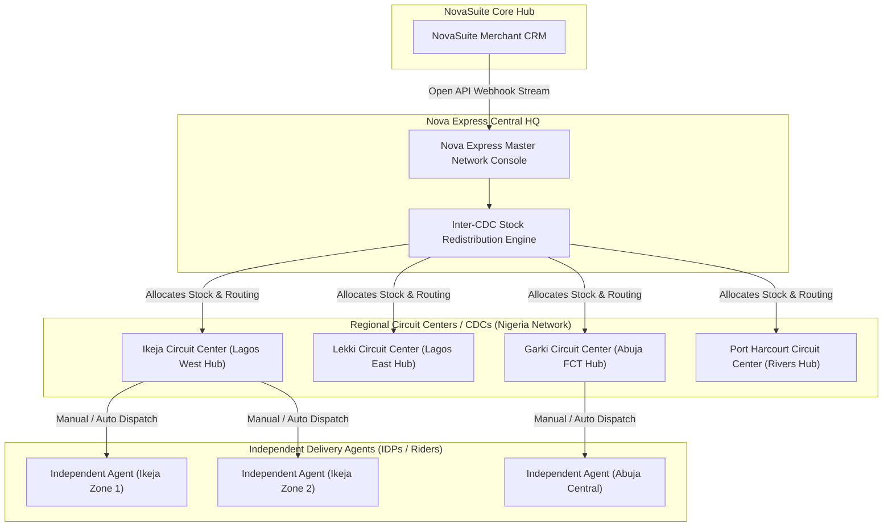
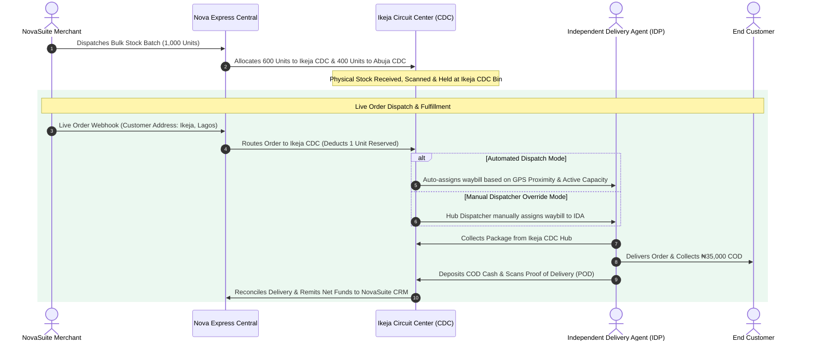
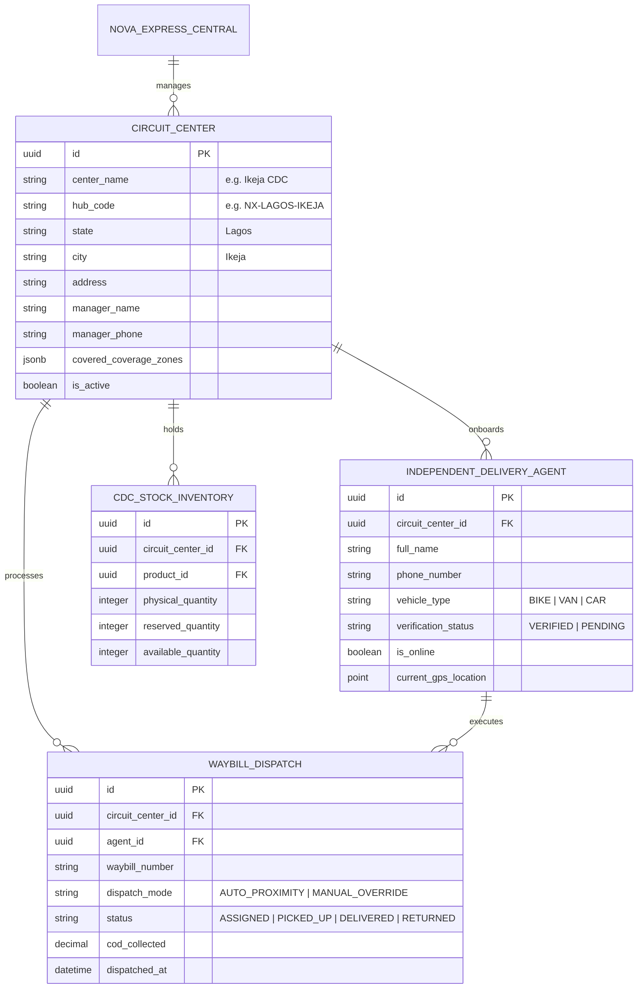

# Nova Express Architecture: Circuit Centers, Distribution Network & Independent Delivery Agents (IDPs)

This specification defines the internal structural architecture for **Nova Express**, detailing the hierarchical relationship between **Nova Express Central**, regional **Circuit Centers (Collation & Distribution Centers - CDCs)**, and **Independent Delivery Agents (IDPs)**.

---

## 1. Nova Express Structural Hierarchy

---

## 2. Operational Roles & Responsibilities

### Tier 1: Nova Express Central (Master Headquarters)
- **Circuit Center Onboarding**: Onboards new regional Circuit Centers / Collation & Distribution Centers (CDCs) across states in Nigeria.
- **Inter-CDC Stock Redistribution**: Orchestrates bulk inventory movements between distribution centers (e.g. moving 200 excess units from Ikeja CDC to Abuja CDC).
- **Master COD & Financial Settlement**: Aggregates Cash-on-Delivery collections from all CDCs and remits net settlements back to NovaSuite merchants.

### Tier 2: Circuit Centers / Collation & Distribution Centers (CDCs)
- **Physical Warehousing & Holding**: Receives merchant stock shipments, stores physical inventory, and manages bin locations.
- **IDA Onboarding & Attachment**: Onboards, verifies, and attaches Independent Delivery Agents (IDPs) to the specific Circuit Center.
- **Hybrid Dispatch Engine (Auto & Manual)**:
  - **Auto-Dispatch**: Automatically assigns orders to available IDPs based on proximity geofencing, rider capacity, and workload.
  - **Manual Override**: Allows the Circuit Center Dispatcher to manually assign or re-assign specific waybills to high-priority IDPs.

### Tier 3: Independent Delivery Agents (IDPs / Riders)
- **Pickup & Verification**: Collects physical packages from their attached Circuit Center hub.
- **Last-Mile Delivery**: Navigates to customer address using the Nova Express Rider App.
- **COD Collection & Deposit**: Collects Cash-on-Delivery (or transfer) from customer and deposits funds back to their assigned Circuit Center at the end of shift.

---

## 3. Circuit Center Order Dispatch & Stock Allocation Lifecycle

---

## 4. Entity Relationship Diagram: Circuit Centers & IDPs

---

## 5. Summary of Integration Points with NovaSuite

1. **NovaSuite Master Stock Allocation**: Merchants allocate stock to Circuit Center hub codes (`hub_code`).
2. **Nova Express Central Routing**: Orders are streamed to Nova Express Central, which routes them to the correct regional Circuit Center.
3. **Circuit Center Hybrid Dispatch**: Circuit Center dispatchers or auto-algorithms assign waybills to Independent Delivery Agents (IDPs).
4. **Callback Loop**: Delivery resolutions and COD collections are reported back through Circuit Center $\rightarrow$ Central $\rightarrow$ NovaSuite CRM.
