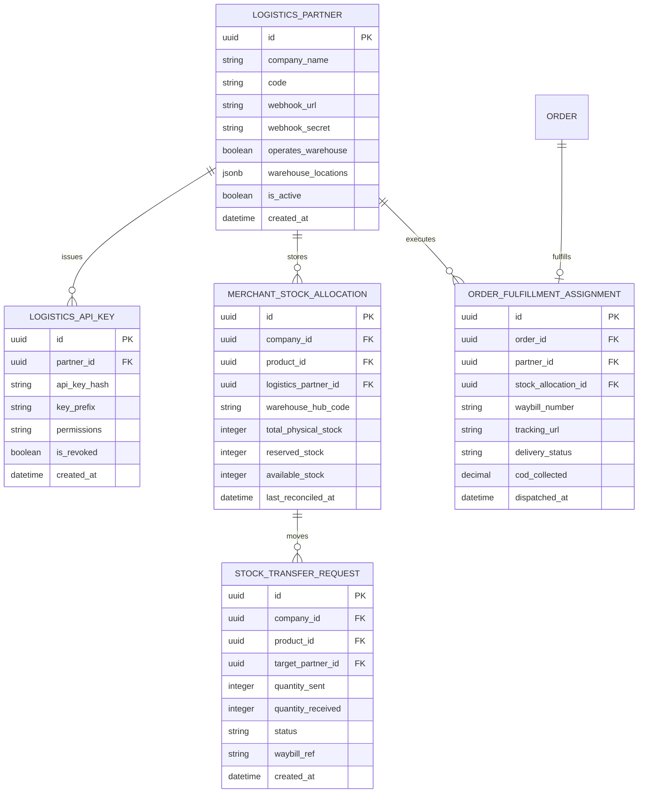
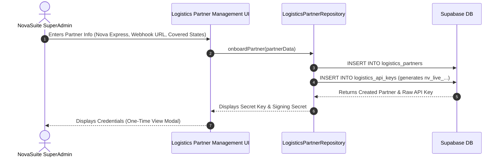

# Phase 1: Database Schema, Core Models & Partner Management Portal

**Focus Area**: Data Architecture, Supabase Migrations, Core Models, and NovaSuite Admin Onboarding Interface.

---

## Architecture & Entity Relationships

---

## Deliverables & Tasks

### 1. Database Migrations (`supabase/migrations/`)
- Create `logistics_partners` table for onboarding 3PL companies (Nova Express, GIG, Fez).
- Create `logistics_api_keys` table for authentication (`nv_live_...`).
- Create `merchant_stock_allocations` table for multi-hub stock management.
- Create `stock_transfer_requests` table for tracking physical inventory shipments.
- Create `order_fulfillment_assignments` table for tracking 3PL waybills and delivery status.

### 2. Core Domain Models (`packages/novasuite_core/lib/src/models/`)
- `LogisticsPartner`: Partner entity with webhook URL, secret, and coverage rules.
- `LogisticsApiKey`: Secret key manager with prefixing and hashing.
- `MerchantStockAllocation`: Physical inventory counts allocated to partner hubs.
- `StockTransferRequest`: Shipment requests sent from merchants to Nova Express.

### 3. Core Repositories (`packages/novasuite_core/lib/src/repositories/`)
- `LogisticsPartnerRepository`: CRUD operations for onboarding partners, issuing API keys, and defining state coverage.

### 4. Admin Partner Portal (`apps/novasuite_admin/lib/features/logistics/`)
- `LogisticsPartnersManagementPage`: UI for SuperAdmins to:
  - Onboard new logistics companies (Nova Express, 3PLs).
  - Issue API Keys (`nv_live_...`) and HMAC Webhook Signing Secrets.
  - Map regional coverage (e.g. Nova Express covers Lagos & Abuja).
  - View real-time API logs, delivery success rates, and partner latency.

---

## Verification Criteria

- Static analysis (`flutter analyze`): **0 Errors, 0 Warnings**.
- Successful creation of a test partner ("Nova Express") in the Admin Portal.
- Secure API key generation verified with SHA-256 hash checks.
