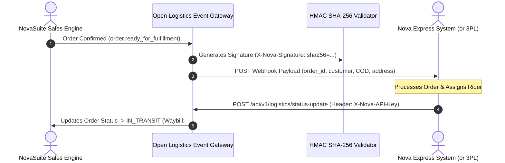

# Phase 2: Open Logistics Event Gateway & Webhook API Engine

**Focus Area**: Outbound Webhook Engine, API Key Security, HMAC SHA-256 Signature Verification, and Inbound REST Callbacks.

---

## Event Gateway Architecture



---

## Deliverables & Technical Specs

### 1. Outbound Webhook Engine (`LogisticsEventGatewayService`)
- Emits real-time JSON webhooks to onboarded partners (Nova Express, 3PLs) when orders reach dispatchable states:
  - `order.ready_for_fulfillment`: Fired when telesales rep confirms an order.
  - `order.cancelled`: Fired if a customer cancels prior to pickup.
  - `order.address_updated`: Fired if customer updates delivery location.
  - `stock.transfer_dispatched`: Fired when merchant sends stock to Nova Express.

#### Outbound Webhook Sample Payload (`order.ready_for_fulfillment`):
```json
{
  "event": "order.ready_for_fulfillment",
  "event_id": "evt_9921821",
  "timestamp": "2026-08-08T12:00:00Z",
  "data": {
    "order_id": "ord-8812",
    "order_number": "ORD-2026-9912",
    "customer_name": "Adeyemi Benson",
    "customer_phone": "08012345678",
    "delivery_address": "14 Allen Avenue, Ikeja",
    "delivery_city": "Ikeja",
    "delivery_state": "Lagos",
    "cod_amount_due": 35000.00,
    "allocated_hub_code": "NX-LAGOS-IKEJA",
    "items": [
      { "product_id": "tea-1", "product_name": "Slim Tea Detox", "quantity": 2, "unit_price": 17500.00 }
    ]
  }
}
```

---

### 2. HMAC SHA-256 Signature Security
To guarantee payload authenticity, NovaSuite signs every webhook request using the partner's unique `webhook_secret`:
- Request Header: `X-Nova-Signature: sha256=<hmac_hash>`
- Partners verify the signature before processing the payload.

---

### 3. Inbound REST API Callbacks (For Nova Express & 3PL Integration)

#### Endpoint 1: Delivery Status & Waybill Callback
- `POST /api/v1/logistics/status-update`
- Header: `X-Nova-API-Key: nv_live_...`
```json
{
  "order_id": "ord-8812",
  "waybill_number": "NX-WAYBILL-9912",
  "tracking_url": "https://express.novasuite.com/track/NX-WAYBILL-9912",
  "status": "DELIVERED",
  "cod_collected": 35000.00,
  "rider_name": "Emmanuel Okafor",
  "rider_phone": "08099887766",
  "timestamp": "2026-08-08T14:30:00Z"
}
```

#### Endpoint 2: Physical Stock Reconciliation Callback
- `POST /api/v1/logistics/stock-reconciliation`
- Header: `X-Nova-API-Key: nv_live_...`
```json
{
  "company_id": "comp-1",
  "product_id": "tea-1",
  "warehouse_hub_code": "NX-LAGOS-IKEJA",
  "physical_stock_count": 485,
  "damaged_stock_count": 2,
  "returned_stock_count": 13,
  "timestamp": "2026-08-08T18:00:00Z"
}
```

---

## Verification Criteria

- Verification of HMAC SHA-256 signature generator against test payloads.
- End-to-end webhook delivery test using a local webhook receiver (e.g. `webhook.site` or local Node.js listener).
- Static analysis (`flutter analyze`): **0 Errors, 0 Warnings**.
