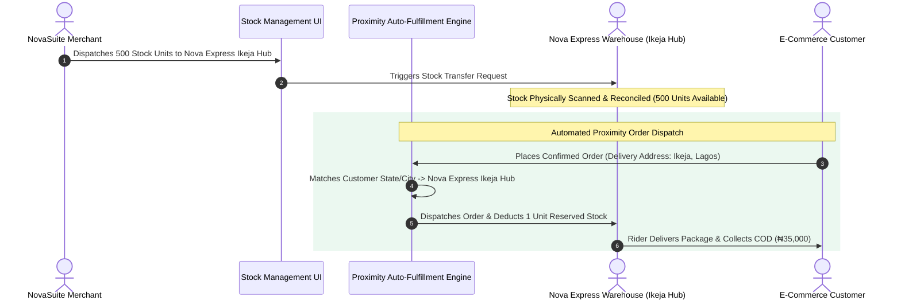

# Phase 3: Multi-Warehouse Stock Delegation & Fulfillment Engine

**Focus Area**: Merchant Stock Allocation UI, Stock Transfer Requests, Proximity Routing Engine, and COD Financial Settlement.

---

## Inventory Delegation & Fulfillment Flow

---

## Deliverables & Technical Specs

### 1. Merchant Stock Allocation Interface (`MerchantInventoryLogisticsPage`)
- A dedicated tab inside NovaSuite Admin allowing merchants to:
  - View live physical inventory balances across internal warehouses vs 3PL hubs (Nova Express Ikeja, Nova Express Abuja, GIG Port Harcourt).
  - Create **Stock Transfer Requests** to dispatch inventory batches to Nova Express.
  - Set low-stock alert thresholds per warehouse hub.

### 2. Proximity-Based Auto-Fulfillment Engine (`LogisticsRoutingEngine`)
- Automatically evaluates confirmed orders against merchant inventory locations and customer delivery addresses:
  1. Identifies customer delivery state/city.
  2. Finds nearest 3PL warehouse hub with available allocated merchant stock.
  3. Assigns order fulfillment to the target partner (e.g. Nova Express) and reserves physical stock unit.

### 3. Cash-on-Delivery (COD) Financial Reconciliation
- Tracks COD cash collections reported by Nova Express riders back into NovaSuite Remittance Module.
- Generates merchant payout reconciliation ledgers (`COD Collected` vs `Logistics Delivery Fee` = `Net Remittance`).

---

## Verification Criteria

- Verification of multi-warehouse stock reservation algorithms.
- Simulating stock transfers and order placement to verify proper inventory deduction per hub.
- Static analysis (`flutter analyze`): **0 Errors, 0 Warnings**.
