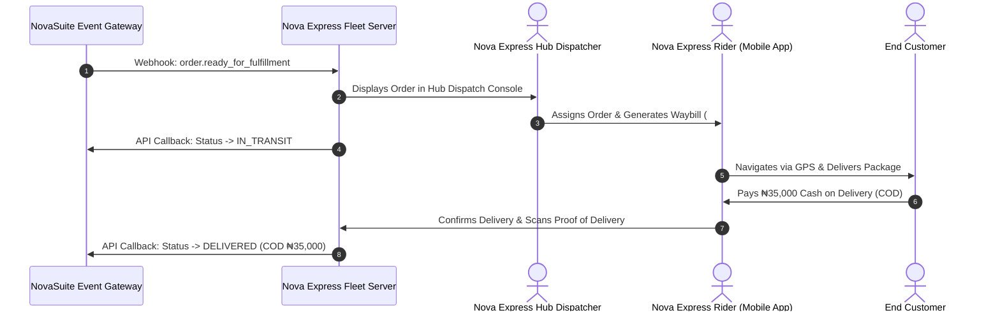

# Phase 4: Standalone Nova Express Integration & Fleet Management Spec

**Focus Area**: Standalone Nova Express Architecture, Fleet & Rider Management, Waybill Generation, Live GPS Sync, and End-to-End Test Suite.

---

## Nova Express Independent Data Flow

---

## Deliverables & Technical Specs

### 1. Nova Express Standalone Service Architecture
- Independent backend service / application designed to consume NovaSuite's Open Logistics API:
  - **Webhook Consumer**: Listens for `order.ready_for_fulfillment` and `stock.transfer_dispatched`.
  - **Waybill Generator**: Automatically issues unique barcodes and waybill tracking numbers (`NX-WAYBILL-XXXX`).
  - **Warehouse Receiving Console**: Barcode scanner interface for receiving merchant stock shipments.
  - **Rider Mobile App**: Native Android/iOS app for delivery riders (accept orders, navigation, POD photo upload, COD collection).

### 2. End-to-End Integration Test Suite
- Automated test suite testing full cycle:
  1. Telesales Rep confirms order in NovaSuite.
  2. NovaSuite fires `order.ready_for_fulfillment` webhook to Nova Express.
  3. Nova Express accepts order and responds with waybill number.
  4. Nova Express sends delivery update callback (`DELIVERED`, COD ₦35,000).
  5. NovaSuite automatically marks order delivered, deducts physical stock count, and updates merchant financial ledger.

---

## Verification Criteria

- Successful execution of the full E2E test suite covering order creation, dispatch, fulfillment, and COD remittance.
- Static analysis across all packages (`flutter analyze`): **0 Errors, 0 Warnings**.
