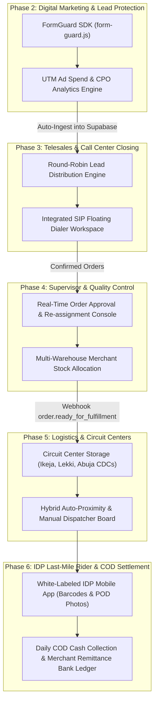

# End-to-End System Transformation — Implementation Phase Roadmap

This masterplan details the end-to-end transformation of NovaSuite into a fully working, production-grade enterprise platform operating seamlessly from **Digital Marketer Lead Generation** down to **Independent Delivery Agent (IDP) Last-Mile Delivery & Cash-on-Delivery (COD) Bank Settlement**.

---

## 🔄 End-to-End Operational Lifecycle

---

## 📂 Implementation Phase Index

| Phase File | System Role & Domain | Scope & Deliverables |
| :--- | :--- | :--- |
| **[Phase 1](file:///c:/PROJECT/novasuite/Documentation/End_to_End_Phase_Implementation_Plan/PHASE_01_CATEGORIZED_ROLES_AND_SEED_CREDENTIALS.md)** | Categorized Role Logins & Database Seed | Categorize login UI into E-Commerce vs. Logistics roles, Supabase seed migration (`20260809000001_seed_categorized_roles_and_logins.sql`), login authentication handlers. |
| **[Phase 2](file:///c:/PROJECT/novasuite/Documentation/End_to_End_Phase_Implementation_Plan/PHASE_02_DIGITAL_MARKETER_FORM_AND_AD_ATTRIBUTION.md)** | Digital Marketer & Lead Protection | Fail-Safe form builder, embeddable JS SDK, UTM campaign attribution dashboard, and CPO analytics. |
| **[Phase 3](file:///c:/PROJECT/novasuite/Documentation/End_to_End_Phase_Implementation_Plan/PHASE_03_TELESALES_CLOSER_ROUND_ROBIN_WORKSPACE.md)** | Sales Call Rep (Telesales Closer) | Auto-allocated lead queue, floating SIP WebRTC dialer, product script drawer, upsell/downsell calculator. |
| **[Phase 4](file:///c:/PROJECT/novasuite/Documentation/End_to_End_Phase_Implementation_Plan/PHASE_04_SUPERVISOR_APPROVALS_AND_QUALITY_CONTROL.md)** | Supervisor & Sales HOD Console | Squad performance monitoring, order approval queue, agent re-assignments, merchant stock reservation. |
| **[Phase 5](file:///c:/PROJECT/novasuite/Documentation/End_to_End_Phase_Implementation_Plan/PHASE_05_LOGISTICS_CDC_WAREHOUSE_AND_HYBRID_DISPATCH.md)** | Logistics CDC Manager & Dispatcher | Circuit Center directory, inbound barcode scanner receiving, hybrid auto-proximity dispatch, waybill printing. |
| **[Phase 6](file:///c:/PROJECT/novasuite/Documentation/End_to_End_Phase_Implementation_Plan/PHASE_06_IDP_RIDER_APP_AND_COD_SETTLEMENT.md)** | Independent Delivery Agent (IDP) & Finance | Personalized rider mobile app, barcode scanner, offline POD photo upload, daily COD cash deposits, bank remittance ledgers. |
