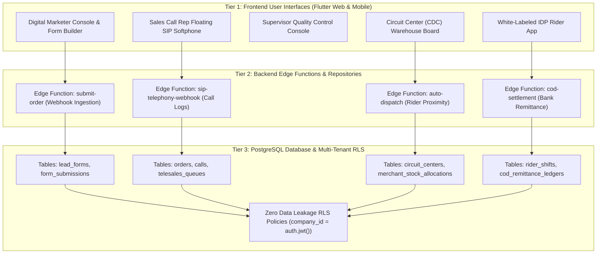

# End-to-End System Transformation — 3-Tier Execution Roadmap Overview

This masterplan mandates the end-to-end transformation of NovaSuite into a fully working, production-grade enterprise platform operating seamlessly from **Digital Marketer Lead Generation** down to **Independent Delivery Agent (IDP) Last-Mile Delivery & Cash-on-Delivery (COD) Bank Settlement**.

> [!IMPORTANT]
> **Mandatory 3-Tier Execution Guarantee**:
> Every feature phase implemented MUST include all 3 architectural tiers:
> 1. **Tier 1 (Frontend UI Suite)**: High-grade Flutter Web/Mobile interface with state management, interactive controls, live metrics, and real-time updates.
> 2. **Tier 2 (Backend Edge Functions & Repositories)**: Supabase Edge Functions in Deno (`submit-order`, `auto-dispatch`, `cod-settlement`, `sip-telephony-webhook`), RPC stored procedures, and Flutter Repositories connecting directly to Supabase REST / WebSockets.
> 3. **Tier 3 (Database Schema & RLS Migrations)**: Production-grade SQL migration scripts with strict PostgreSQL schema definitions, foreign key constraints, indexes, and Row Level Security (RLS) policies for Zero Data Leakage multi-tenancy.

---

## 🔄 End-to-End Operational Architecture & 3-Tier Handshake

---

## 📂 3-Tier Full-Stack Phase Index

| Phase File | System Role & Scope | Tier 1 (UI) | Tier 2 (Backend/Edge Functions) | Tier 3 (Database & RLS) | Status |
| :--- | :--- | :--- | :--- | :--- | :--- |
| **[Phase 1](file:///c:/PROJECT/novasuite/Documentation/End_to_End_Phase_Implementation_Plan/PHASE_01_CATEGORIZED_ROLES_AND_SEED_CREDENTIALS.md)** | Categorized Role Logins & Database Seed | Login Screen with E-Commerce vs. Logistics Categories | AuthRepository & Session Handlers | `20260809000001_seed_categorized_roles_and_logins.sql` | **Completed & Verified** |
| **[Phase 2](file:///c:/PROJECT/novasuite/Documentation/End_to_End_Phase_Implementation_Plan/PHASE_02_DIGITAL_MARKETER_FORM_AND_AD_ATTRIBUTION.md)** | Digital Marketer & Lead Protection | Pangea CRM Form Builder, Offer Packages, Custom Questions & Submissions | `submit-order` Edge Function & FormGuard SDK | `20260809000002_add_campaign_forms_and_broadcasts_schema.sql` | **Completed & Verified** |
| **[Phase 3](file:///c:/PROJECT/novasuite/Documentation/End_to_End_Phase_Implementation_Plan/PHASE_03_TELESALES_CLOSER_ROUND_ROBIN_WORKSPACE.md)** | Sales Call Rep (Telesales Closer) | Round-Robin Dialer Suite, Floating Softphone, Script Drawer | `sip-telephony-webhook` Edge Function & RPC `assign_order_round_robin` | `20260809000003_add_telesales_dialer_schema.sql` | **Next Implementation** |
| **[Phase 4](file:///c:/PROJECT/novasuite/Documentation/End_to_End_Phase_Implementation_Plan/PHASE_04_SUPERVISOR_APPROVALS_AND_QUALITY_CONTROL.md)** | Supervisor & Sales HOD Console | Squad Performance Board, Approval Queue, Audio Call Player | `order-approval-workflow` Edge Function & Lead Re-assignment RPC | `20260809000004_add_supervisor_approvals_schema.sql` | Planned |
| **[Phase 5](file:///c:/PROJECT/novasuite/Documentation/End_to_End_Phase_Implementation_Plan/PHASE_05_LOGISTICS_CDC_WAREHOUSE_AND_HYBRID_DISPATCH.md)** | Logistics CDC Manager & Dispatcher | Circuit Centers Directory, Barcode Inbound Scanner, Hybrid Dispatch Board | `auto-dispatch` Proximity Edge Function & Waybill PDF Printer | `20260809000005_add_logistics_dispatch_schema.sql` | Planned |
| **[Phase 6](file:///c:/PROJECT/novasuite/Documentation/End_to_End_Phase_Implementation_Plan/PHASE_06_IDP_RIDER_APP_AND_COD_SETTLEMENT.md)** | Independent Delivery Agent (IDP) & Finance | White-Labeled IDP Mobile App, Offline POD Camera Scanner, COD Ledger | `cod-settlement` Edge Function & Merchant Bank Remittance Payout | `20260809000006_add_cod_remittance_schema.sql` | Planned |
