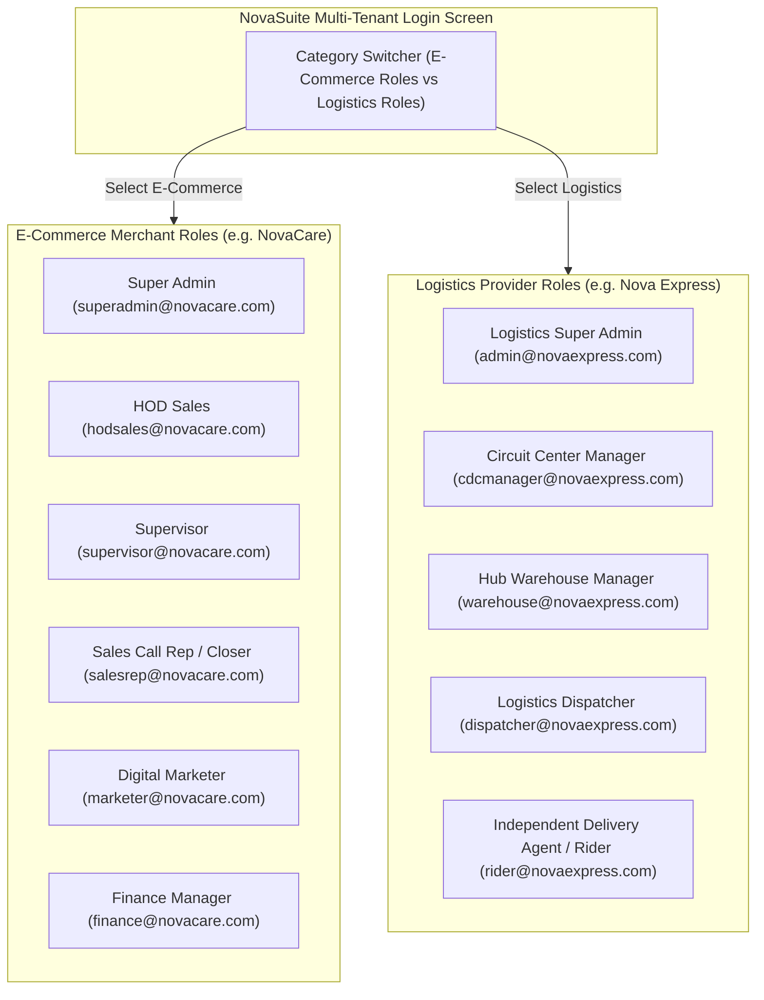

# Phase 1 Specification: Categorized Role Logins & Supabase Seed Credentials

**Focus Area**: Login Screen UI Categorization (E-Commerce Roles vs. Logistics Roles), Supabase Seed SQL Data, and Session Handlers.

---

## 🏛️ Login Role Categorization Architecture

---

## 📋 Categorized Role Quick Presets

### E-Commerce Company Roles (NovaCare Health & Wellness)
| Role Label | Email | Password | Target Default Workspace View |
| :--- | :--- | :--- | :--- |
| **Super Admin** | `superadmin@novacare.com` | `password123` | Super Admin Platform Console |
| **HOD Sales** | `hodsales@novacare.com` | `password123` | Sales Call Center / Organogram Console |
| **Supervisor** | `supervisor@novacare.com` | `password123` | Supervisor Squad Dashboard & Approvals |
| **Sales Call Rep** | `salesrep@novacare.com` | `password123` | Sales Call Center Dialer Suite |
| **Digital Marketer** | `marketer@novacare.com` | `password123` | Digital Marketing & Form Builder Suite |
| **Finance Manager** | `finance@novacare.com` | `password123` | Finance & Remittance Verification Suite |

### Logistics Company Roles (Nova Express Logistics Network)
| Role Label | Email | Password | Target Default Workspace View |
| :--- | :--- | :--- | :--- |
| **Logistics Super Admin** | `admin@novaexpress.com` | `password123` | Nova Express Master Network Console |
| **Circuit Center Manager (CDC)** | `cdcmanager@novaexpress.com` | `password123` | Circuit Centers Directory & Local Hub View |
| **Hub Warehouse Manager** | `warehouse@novaexpress.com` | `password123` | Warehouse Stock Receiving & Bin Storage |
| **Logistics Dispatcher** | `dispatcher@novaexpress.com` | `password123` | Hybrid Auto/Manual Dispatch Console |
| **IDP Rider / Agent** | `rider@novaexpress.com` | `password123` | Personalized IDP Delivery Agent App View |

---

## 🛢️ Supabase Seed Migration (`20260809000001_seed_categorized_roles_and_logins.sql`)
- Inserts mock auth users and profiles into `auth.users` and `public.users` for all 11 categorized roles.
- Seeds default `company_id` linkages for NovaCare (`eCommerce`) and Nova Express (`logistics`).
