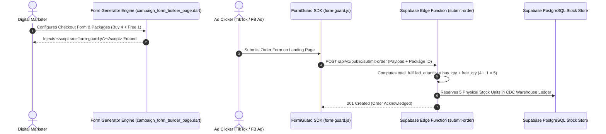

# Phase 2 Specification: Digital Marketer Suite & Fail-Safe Lead Protection

**Focus Area**: Digital Marketer Workspace, Drag-and-Drop Landing Page Form Generator, UTM Ad Campaign Attribution, CPO Analytics, and Total Physical Stock Accounting (`total_fulfilled_quantity = buy_qty + free_qty`).

---

## 📦 Total Physical Stock Accounting Rule

> [!IMPORTANT]
> **Warehouse Inventory Rule**:
> When an offer package includes free units (e.g. `"4 Grazer Detox Tea + 1 Free"`, where `buy_qty = 4` and `free_qty = 1`), the system calculates:
> $$\text{Total Fulfilled Units Deducted} = \text{buy\_qty} + \text{free\_qty} = 4 + 1 = 5 \text{ Physical Units}$$
> - **Warehouse Stock Ledger**: Deducts **5 physical units** from `merchant_stock_allocations`.
> - **Customer Invoice**: Charges fixed package amount for 4 units (1 free unit).

---

## 🎯 Digital Marketer Lead Protection Lifecycle

---

## 💻 Digital Marketer UI Features

1. **Offer Packages DataTable & Modal**:
   - Highlighted table displaying `PACKAGE LABEL`, `BUY QTY`, `FREE QTY`, `AMOUNT (₦)`, `SAVINGS BADGE`, `DEFAULT CHOICE`, and `ACTIONS`.
   - Explicitly displays `Total Physical Units Deducted` (Buy Qty + Free Qty) so marketers and stock managers see true physical inventory depletion rates.

2. **Campaign Performance & CPO Metrics**:
   - Visual cards for Total Ad Spend, Leads Ingested, Orders Closed, Cost-per-Order (CPO), and Net Return on Ad Spend (ROAS).

3. **FormGuard SDK Embed Code Generator**:
   - Generates embeddable single-line `` code.
