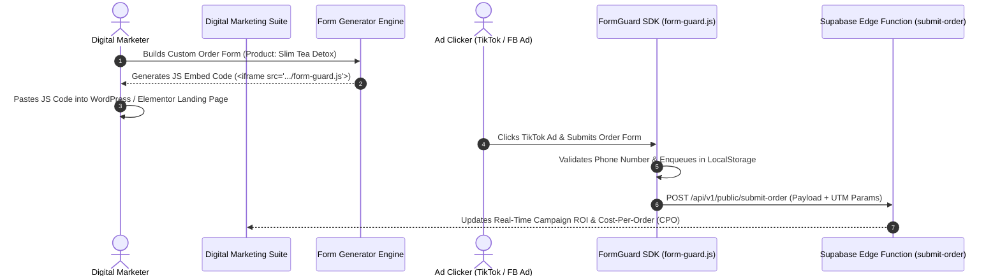

# Phase 2 Specification: Digital Marketer Suite & Fail-Safe Lead Protection

**Focus Area**: Digital Marketer Workspace, Drag-and-Drop Landing Page Form Generator, UTM Ad Campaign Attribution, and CPO Analytics.

---

## 🎯 Digital Marketer Lead Protection Lifecycle

---

## 💻 Digital Marketer UI Features

1. **Campaign Performance & CPO Metrics**:
   - Visual cards for Total Ad Spend, Leads Generated, Orders Closed, Cost-per-Acquisition (CPA), and Net Return on Ad Spend (ROAS).
2. **Fail-Safe Form Builder**:
   - Customizable form fields (Name, Phone, Delivery State, Address, Product Quantity).
   - Generates embeddable single-line `` code.
3. **UTM Attribution Table**:
   - Displays incoming lead breakdown grouped by `utm_source` (TikTok, Facebook, Google Ads), `utm_campaign`, and `ad_id`.
