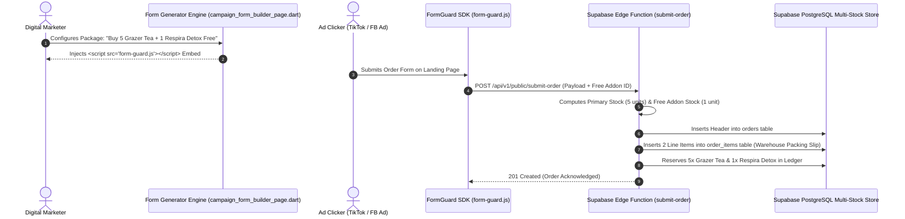

# Phase 2 Specification: Digital Marketer Suite & Multi-Product Stock Accounting

**Focus Area**: Digital Marketer Workspace, Drag-and-Drop Landing Page Form Generator, UTM Ad Campaign Attribution, CPO Analytics, Searchable Product Catalog Attachment, and Cross-Product Free Gift Stock Accounting (`buy_qty + free_qty + free_addon_qty`).

---

## 📦 Multi-Product & Cross-Product Free Gift Inventory Accounting Rule

> [!IMPORTANT]
> **Multi-Product Bundle Warehouse Rule**:
> When an offer package includes a cross-product free gift (e.g. `"Buy 5 Grazer Tea + 1 Respira Detox Free"`, where `buy_qty = 5` of Grazer Tea and `free_addon_qty = 1` of Respira Clear Detox), the system calculates multi-product warehouse stock deductions:
> 1. **Primary Product Inventory Deduction**: Deducts **5 physical units** of `Grazer Herbal Tea` from CDC stock.
> 2. **Cross-Product Free Gift Inventory Deduction**: Deducts **1 physical unit** of `Respira Clear Detox` from CDC stock.
> 3. **Packing Slip Generation**: Inserts 2 separate line items into `public.order_items` table:
>    - Line 1: `5x Grazer Herbal Tea` (Main Item - ₦85,000)
>    - Line 2: `1x Respira Clear Detox` (Cross-Product Free Gift - ₦0)

---

## 🎯 Multi-Product Bundle Lead Protection Lifecycle

---

## 💻 Digital Marketer UI Features

1. **Offer Packages DataTable with Cross-Product Gifts**:
   - Displays `PACKAGE LABEL`, `BUY QTY`, `FREE GIFT / ADDON` (e.g. `🎁 1x Respira Clear Detox (FREE)`), `TOTAL DEDUCTED STOCK`, `AMOUNT (₦)`, `SAVINGS`, `DEFAULT CHOICE`, and `ACTIONS`.

2. **Cross-Product Free Gift Addon Modal Picker**:
   - `_showOfferPackageModalDialog` includes a **Cross-Product Free Gift Addon Selector** allowing marketers to attach any onboarded product (e.g. `Respira Clear Detox`, `SkinCare Glow Capsule`, `Flat Belly Tea Cleanse`) as an optional free gift.

3. **Searchable Product Catalog Attachment (Linked Items)**:
   - Searchable Autocomplete/Typeahead dialog searching `public.products` catalog by name or SKU.
