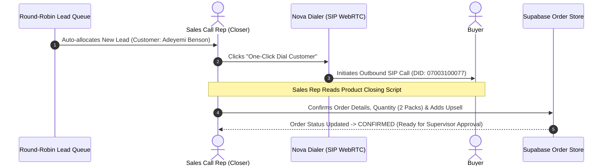

# Phase 3 Specification: Sales Call Rep (Telesales Closer) Round-Robin Workspace

**Focus Area**: Sales Call Rep Workspace, Automated Round-Robin Lead Distribution, Floating WebRTC/SIP Phone Dialer, Product Scripts, and Upsell Engine.

---

## 🔄 Telesales Closing Workflow

---

## 💻 Telesales Closer UI Components

1. **Round-Robin Lead Queue Drawer**:
   - Displays real-time incoming leads assigned to the sales rep.
   - Shows lead age, delivery state, and UTM source.
2. **Integrated SIP Floating Dialer**:
   - WebRTC / UDP SIP softphone bar with Call, Mute, Hold, Transfer, and Call Recording triggers.
3. **Product Script & Objection Drawer**:
   - Interactive objection handling guide (e.g. price concerns, delivery timeframe FAQ).
4. **Order Confirmation & Upsell Calculator**:
   - Package selector (Single Pack vs. Buy 2 Get 1 Free Promo).
   - Real-time commission earnings estimator for the closer.
