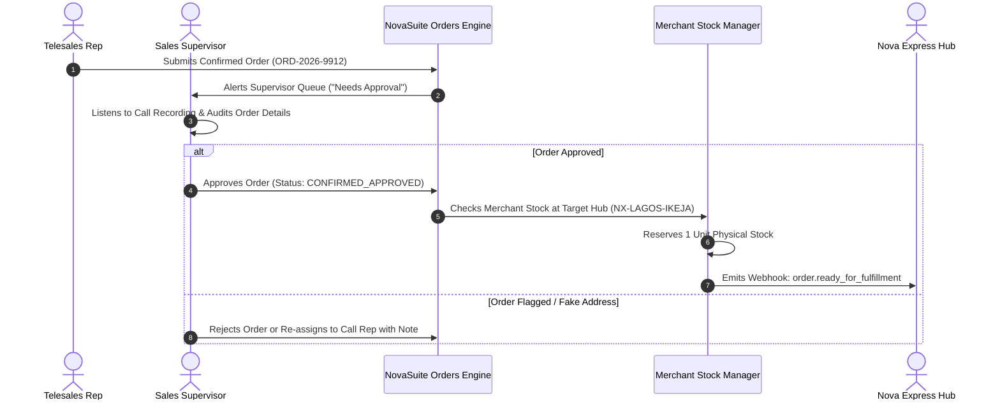

# Phase 4 Specification: Supervisor Squad Console & Quality Approvals

**Focus Area**: Supervisor Squad Management, Call Recording Quality Audit, Order Approval Queue, and Merchant Stock Allocation to Logistics.

---

## 🔍 Supervisor Approval & Stock Routing Lifecycle

---

## 💻 Supervisor UI Features

1. **Squad Performance Board**:
   - Live metrics per agent (Calls Made, Total Talk Time, Confirmation Rate %, Upsell Rate %).
2. **Order Approval Queue**:
   - Fast approval modal with integrated audio call player, address verification, and one-click approve/reject actions.
3. **Agent Lead Re-assignment Console**:
   - Re-assign dormant leads from underperforming agents to top closers.
