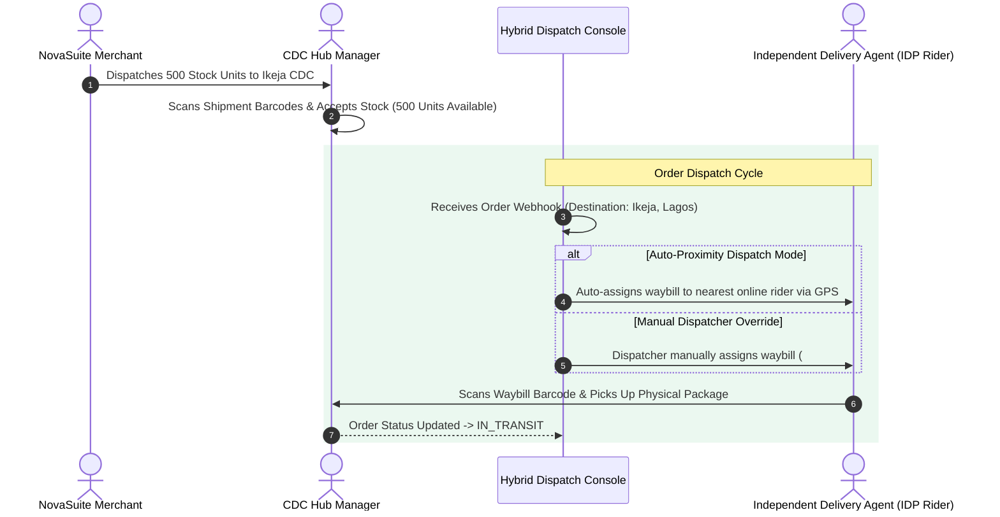

# Phase 5 Specification: Logistics CDC Manager & Hybrid Dispatch Engine

**Focus Area**: Circuit Center (CDC) Management, Inbound Stock Receiving, Barcode Scanner, Hybrid Auto/Manual Order Dispatch Console, and Waybills.

---

## 🚚 CDC Warehouse & Dispatch Flow

---

## 💻 Logistics CDC UI Components

1. **Circuit Centers Directory**:
   - Manage regional distribution hubs across Nigeria (Ikeja CDC, Lekki CDC, Abuja CDC).
2. **Inbound Stock Receiving Console**:
   - Barcode scanner interface for confirming incoming merchant inventory shipments.
3. **Hybrid Dispatch Console**:
   - Split-screen view: Pending Waybills vs Active Online IDP Riders on a live GPS map.
   - Barcoded Waybill PDF generator & thermal print trigger.
