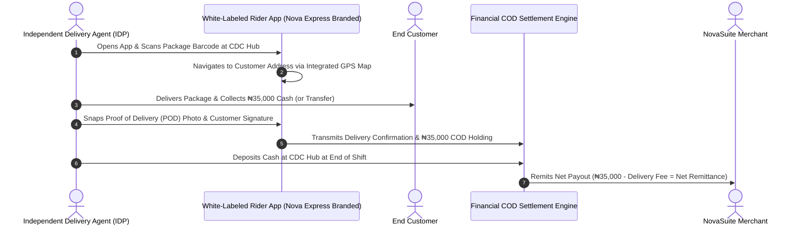

# Phase 6 Specification: Independent Delivery Agent (IDP) Rider App & COD Financial Settlement

**Focus Area**: White-Labeled IDP Mobile App, GPS Navigation, Camera Barcode Scanner, Offline Proof of Delivery (POD), Daily COD Cash Collection, and Merchant Remittance Payout Ledgers.

---

## 📲 IDP Last-Mile Delivery & COD Settlement Flow

---

## 💻 IDP Rider App & Finance Features

1. **White-Labeled Rider Mobile UI**:
   - Dynamically loads tenant logo, splash screen, and primary/secondary colors.
2. **Barcode Scanner & POD Photo Capture**:
   - Camera scanner for package pickup and Proof-of-Delivery photo upload.
3. **Daily COD Cash Holding Tracker**:
   - Tracks cash collected per rider during active shift.
4. **Merchant Remittance Bank Ledger**:
   - Automated payout reconciliation ledger for merchant bank transfers.
