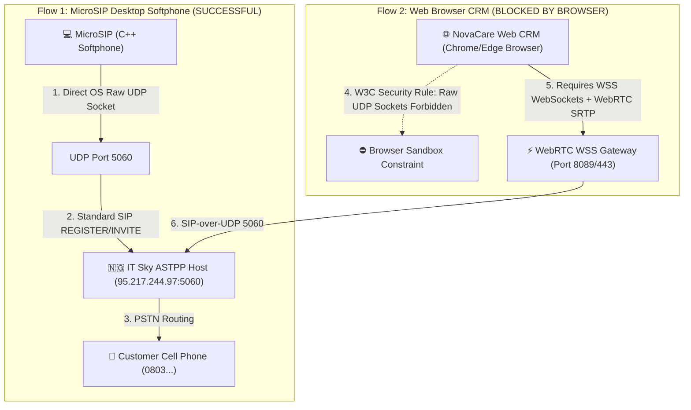
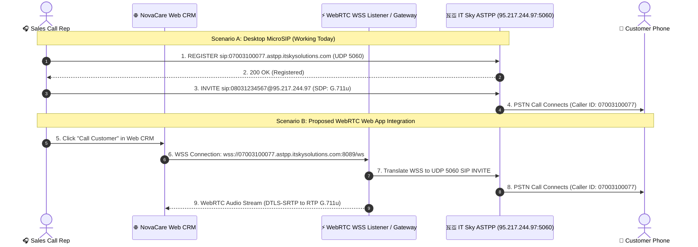

# IT Sky Telecom Engineering Specification: WebRTC / WSS Interconnect for NovaCare CRM

**Document Title**: Technical Requirement & Architectural Specification for Web-Based VoIP Telephony  
**Prepared For**: IT Sky Solutions Engineering & ASTPP PBX Administration Team  
**Prepared By**: NovaSuite Engineering Team  
**Interconnect Trunk DID**: `07003100077`  
**Current Provider Host**: `95.217.244.97:5060` (UDP)  

---

## 🎯 Executive Summary & Objective

NovaSuite is a enterprise Web & Mobile CRM used by sales call reps in Nigeria to process Cash-on-Delivery (COD) e-commerce orders. 

Currently, outbound & inbound calls execute successfully when using desktop softphones (**MicroSIP** on Windows). However, when call reps attempt to place calls directly inside the **NovaCare Web CRM (Google Chrome / Microsoft Edge)**, the browser blocks the connection.

This document outlines the **technical root cause** (Browser Security Sandbox prohibiting raw UDP 5060 sockets) and proposes **two architectural integration designs** for IT Sky's technical team to enable seamless in-browser WebRTC calling.

---

## 🔬 Technical Root Cause Analysis: MicroSIP vs. Web Browsers

### Detailed Protocol & Constraint Matrix

| Metric / Parameter | MicroSIP Desktop App (Current Working Setup) | Web Browser CRM (Required Setup) |
| :--- | :--- | :--- |
| **Transport Layer** | **UDP (User Datagram Protocol)** | **WSS (WebSocket Secure over TLS)** |
| **Target Port** | `5060` | `8089` / `443` / `8443` |
| **Browser Support** | N/A (Runs as native C++ process) | **Native HTML5 / W3C WebRTC Engine** |
| **Media Stream** | Unencrypted RTP (G.711u / PCMU) | Encrypted DTLS-SRTP (WebRTC Audio) |
| **SIP Registration** | Standard SIP Digest MD5 (`User-Agent: MicroSIP/3.21.3`) | SIP-over-WebSocket (`SIP.js` / WebRTC UA) |

> 📌 **Key Technical Takeaway**: HTML5 Web Browsers (Chrome, Firefox, Edge, Safari) strictly prohibit JavaScript and WebAssembly applications from opening raw UDP sockets on Port 5060. Browsers **only allow VoIP calling via WebSockets (`wss://`) and WebRTC (`DTLS-SRTP`)**.

---

## 🔄 Protocol Handshake Sequence Diagram

The following sequence illustrates the signaling difference between MicroSIP and the proposed WebRTC WSS architecture:

---

## 🛠️ Architectural Integration Options for IT Sky

We propose **two simple options** for the IT Sky technical team to review and confirm:

### Option 1 (Preferred): Enable WebSockets (WSS) Module on IT Sky ASTPP / FreeSWITCH
If IT Sky's ASTPP / FreeSWITCH / Asterisk server can enable its native **WSS (WebSocket Secure)** module:
- **WSS Listener Endpoint**: `wss://07003100077.astpp.itskysolutions.com:8089/ws` (or Port `443` / `8443`).
- **TLS Certificate**: Valid SSL/TLS certificate (Let's Encrypt / Commercial) assigned to the ASTPP domain.
- **WebRTC Codecs**: Support for `PCMU` (G.711u), `PCMA` (G.711a), and `Opus`.

### Option 2: NovaSuite Managed WebRTC Gateway (Zero Changes Required on IT Sky Server)
If IT Sky prefers not to modify or enable WSS on the production ASTPP host (`95.217.244.97`):
- NovaSuite will host a lightweight **Kamailio / OpenSIPS WebRTC Proxy** (`sip.novasuite.app`).
- The NovaSuite Gateway terminates browser `wss://` WebSockets and proxies raw SIP UDP packets to IT Sky (`95.217.244.97:5060`) over IP whitelisting.

---

## 📋 Action Items & Request for IT Sky Technical Team

To assist us in finalizing the WebRTC integration, please provide feedback on the following:

1. **WSS Capability**: Is WSS (SIP-over-WebSocket) currently enabled or can it be enabled on `astpp.itskysolutions.com`?
2. **Preferred WSS Port**: What is the designated WSS port (e.g., `8089`, `8443`, or `443`)?
3. **STUN / TURN Server**: Does IT Sky provide a STUN/TURN server for ICE candidate resolution, or should NovaSuite supply our STUN server (`stun:stun.l.google.com:19302`)?

---

### Technical Contact
- **NovaSuite Engineering Team**  
- **Documentation Reference**: `Documentation/IT_SKY_WEBRTC_SIP_INTERCONNECT_SPECIFICATION.md`
