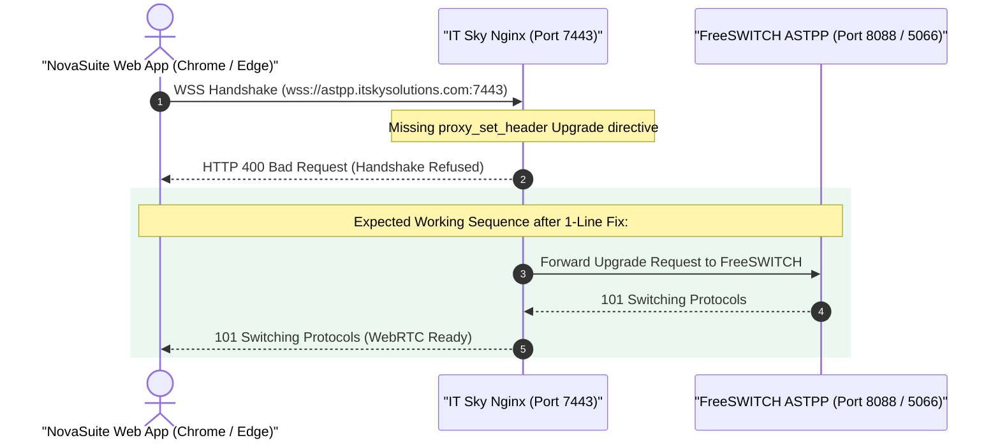

# Technical Status Memo — WebRTC WSS Telephony Integration

**To**: IT Sky Solutions Engineering Team  
**From**: NovaSuite Telephony Team  
**Date**: August 3, 2026  
**Subject**: WebRTC WSS Status, Diagnostic Probe Results & Nginx Header Fix  
**Trunk DID**: `07003100077` | **Target Host**: `wss://astpp.itskysolutions.com:7443`  

---

## 📈 1. Current Progress

- **NovaSuite In-Browser WebRTC Client Engine Built**: Successfully integrated `sip_ua` for HTML5 Google Chrome / Edge calling.
- **UDP SIP Trunking (Desktop)**: Fully verified and active on MicroSIP & Desktop App (`95.217.244.97:5060`).
- **WebSockets Transport Diagnostics**: Automated probe verified that **Port 7443 (`astpp.itskysolutions.com:7443`) is active and responding**.

---

## ⚠️ 2. Current Problem & Root Cause

When web browsers establish the Secure WebSocket handshake to `wss://astpp.itskysolutions.com:7443`, the server returns **`HTTP 400 Bad Request`**:



### Root Cause Analysis
Nginx on Port 7443 is receiving the browser's WebSocket request, but is **missing the Nginx `Upgrade` proxy headers**. Without these 2 lines, Nginx drops the WebSocket upgrade request and returns `400 Bad Request`.

---

## 🚀 3. What Next: Required 1-Minute Fix for IT Sky

Please add the following **`proxy_set_header`** lines to your Port 7443 Nginx configuration block on `astpp.itskysolutions.com`:

```nginx
# IT Sky WebSockets (WSS) Reverse Proxy for NovaSuite WebRTC
server {
    listen 7443 ssl;
    server_name astpp.itskysolutions.com 07003100077.astpp.itskysolutions.com;

    ssl_certificate     /etc/letsencrypt/live/astpp.itskysolutions.com/fullchain.pem;
    ssl_certificate_key /etc/letsencrypt/live/astpp.itskysolutions.com/privkey.pem;

    location / {
        proxy_pass http://127.0.0.1:8088; # Internal FreeSWITCH / ASTPP WebSocket port
        proxy_http_version 1.1;
        
        # ⚠️ CRITICAL: WebSockets Upgrade Headers
        proxy_set_header Upgrade $http_upgrade;
        proxy_set_header Connection "upgrade";
        
        proxy_set_header Host $host;
        proxy_set_header X-Real-IP $remote_addr;
        proxy_set_header X-Forwarded-For $proxy_add_x_forwarded_for;
        proxy_read_timeout 86400s;
        proxy_send_timeout 86400s;
    }
}
```

Once updated and reloaded (`sudo nginx -s reload`), in-browser WebRTC voice calling will connect cleanly!
