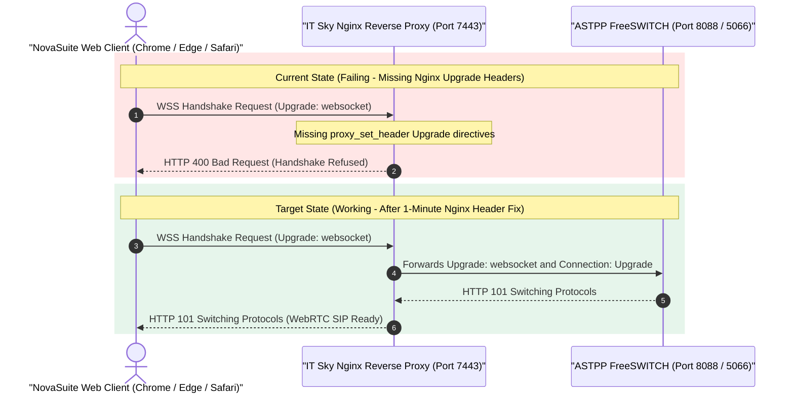

# Formal Technical Request: Nginx WebSocket Upgrade Header Configuration for WebRTC SIP

**Date**: August 7, 2026  
**To**: IT Sky Solutions Network & Infrastructure Engineering Team  
**From**: NovaSuite Enterprise Engineering Team  
**Subject**: Enablement of Secure WebSocket (`wss://`) Proxy Headers for WebRTC In-Browser Calling  
**Trunk DID**: `07003100077` | **Target Endpoint**: `wss://astpp.itskysolutions.com:7443`

---

## 📌 Executive Summary

NovaSuite has successfully implemented in-browser WebRTC telephony for sales reps, agents, and supervisors operating on Web browsers (Google Chrome, Microsoft Edge, Apple Safari).

While native desktop applications can use raw UDP sockets (`95.217.244.97:5060`), modern web browsers enforce W3C security sandboxes that prohibit raw UDP packet transmission. Consequently, in-browser clients require **Secure WebSockets (`wss://`)** for SIP registration and call signaling over port `7443`.

During our WebSocket handshake probes to `wss://astpp.itskysolutions.com:7443`, the server responds with **`HTTP 400 Bad Request`**. Our network diagnostic trace indicates that Nginx on port 7443 is receiving the browser's `GET /` upgrade request but is missing the standard Nginx **WebSocket Proxy Upgrade Headers**.

We respectfully request a **1-minute Nginx configuration update** on `astpp.itskysolutions.com` to forward WebSocket upgrade headers to your backend FreeSWITCH/ASTPP service.

---

## 🔍 Technical Analysis & Sequence Flow

When a web browser connects to `wss://astpp.itskysolutions.com:7443`, it sends an HTTP header requesting to upgrade the HTTP connection to a WebSocket connection (`Upgrade: websocket`). 

Without explicit `proxy_set_header` directives in Nginx, Nginx strips the `Upgrade` header before forwarding the packet to FreeSWITCH, resulting in a dropped connection and an **HTTP 400 Bad Request** error.



---

## 🛠️ Required Action: 1-Minute Nginx Configuration Update

Please update the Nginx server block for port **7443** on `astpp.itskysolutions.com` (typically located in `/etc/nginx/sites-available/` or `/etc/nginx/conf.d/`) by adding the two `proxy_set_header` lines below:

```nginx
# IT Sky WebSockets (WSS) Reverse Proxy Block for ASTPP / FreeSWITCH
server {
    listen 7443 ssl;
    server_name astpp.itskysolutions.com 07003100077.astpp.itskysolutions.com;

    # SSL Certificate Paths
    ssl_certificate     /etc/letsencrypt/live/astpp.itskysolutions.com/fullchain.pem;
    ssl_certificate_key /etc/letsencrypt/live/astpp.itskysolutions.com/privkey.pem;

    location / {
        # Backend ASTPP / FreeSWITCH WebSocket Handler (e.g. 127.0.0.1:8088 or 127.0.0.1:5066)
        proxy_pass http://127.0.0.1:8088; 

        # REQUIRED WEBSOCKET UPGRADE HEADERS (Fixes HTTP 400 Bad Request)
        proxy_http_version 1.1;
        proxy_set_header Upgrade $http_upgrade;
        proxy_set_header Connection "Upgrade";

        # Standard Forwarding Headers
        proxy_set_header Host $host;
        proxy_set_header X-Real-IP $remote_addr;
        proxy_set_header X-Forwarded-For $proxy_add_x_forwarded_for;
        proxy_set_header X-Forwarded-Proto $scheme;

        # WebSocket Timeout Rules
        proxy_read_timeout 86400s;
        proxy_send_timeout 86400s;
    }
}
```

### Command to apply changes:
```bash
sudo nginx -t && sudo systemctl reload nginx
```

---

## ✅ Verification & Validation Test

Once Nginx is reloaded, we can verify success using the following `curl` command:

```bash
curl -i -N \
  -H "Connection: Upgrade" \
  -H "Upgrade: websocket" \
  -H "Host: astpp.itskysolutions.com:7443" \
  -H "Origin: https://astpp.itskysolutions.com" \
  https://astpp.itskysolutions.com:7443/
```

**Expected Success Response**:
`HTTP/1.1 101 Switching Protocols` (or FreeSWITCH SIP WebSocket Handshake Acceptance).

---

## 🤝 Conclusion

Applying this 2-line Nginx update will immediately unlock in-browser WebRTC telephony for all NovaSuite web users without requiring any changes to your core FreeSWITCH/ASTPP routing rules or trunk DID allocations.

Thank you for your prompt assistance and support!
