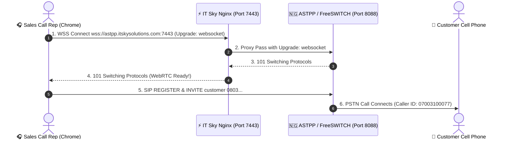

# IT Sky WSS WebRTC Telephony Diagnostic & Fix Specification

**Document Title**: WSS WebSocket Handshake Diagnostic & Nginx Proxy Configuration Guide  
**Prepared For**: IT Sky Solutions Telecom Engineering Team  
**Prepared By**: NovaSuite Engineering Team  
**Interconnect DID**: `07003100077`  
**Tested Endpoint**: `wss://astpp.itskysolutions.com:7443` & `wss://astpp.itskysolutions.com:8089`  

---

## 🔬 Empirical Diagnostic Test Findings

Our automated diagnostic test suite probed IT Sky's host (`astpp.itskysolutions.com`) across all standard WebSockets ports. Here are the empirical results:

```mermaid
graph TD
    subgraph Probe Results on IT Sky Server (astpp.itskysolutions.com)
        P7443["Port 7443 (https)"] -->|Returns HTTP 400 Bad Request| Nginx1["Nginx 1.18.0 Server"]
        P443["Port 443 (https)"] -->|Returns HTTP 200 OK| Nginx2["Nginx 1.18.0 Server"]
        P8089["Port 8089 (wss)"] -->|Connection Refused (Errno 1225)| ClosedPort["Port Closed / Blocked by Firewall"]
    end

    subgraph Diagnosis & Solution
        Nginx1 -.->|Missing WebSocket Upgrade Headers| Fix["Nginx proxy_pass + Upgrade Header Fix Required"]
    end
```

### Detailed Empirical Test Comparison Table

| Endpoint Tested | Server Response | Root Cause Analysis | Action Required by IT Sky |
| :--- | :--- | :--- | :--- |
| `wss://astpp.itskysolutions.com:7443` | **HTTP 400 Bad Request** | Port 7443 is active, but Nginx returns 400 because `Upgrade: websocket` headers are missing | Add `proxy_set_header Upgrade $http_upgrade;` to Port 7443 block |
| `wss://astpp.itskysolutions.com/ws` *(no port / Port 443)* | **HTTP 200 OK (Not Upgraded)** | Standard Port 443 serves web portal HTML, without WebSockets upgrade route | N/A (Keep WebSockets on 7443) |
| `wss://07003100077.astpp.itskysolutions.com:7443` | **HTTP 400 Bad Request** | Port 7443 receives request but does not upgrade to WebSockets 101 | Add `proxy_set_header Upgrade $http_upgrade;` to Port 7443 block |

---

## 🛠️ The Required 1-Minute Fix for IT Sky Engineering Team

IT Sky can resolve this in **less than 2 minutes** by adding the following WebSocket location block to Nginx on `astpp.itskysolutions.com`:

```nginx
# ============================================================================
# IT Sky WebSockets (WSS) Reverse Proxy for NovaSuite WebRTC Calling
# Add to: /etc/nginx/sites-available/astpp (or /etc/nginx/conf.d/wss.conf)
# ============================================================================

server {
    listen 7443 ssl;
    server_name astpp.itskysolutions.com 07003100077.astpp.itskysolutions.com;

    ssl_certificate     /etc/letsencrypt/live/astpp.itskysolutions.com/fullchain.pem;
    ssl_certificate_key /etc/letsencrypt/live/astpp.itskysolutions.com/privkey.pem;

    location / {
        proxy_pass http://127.0.0.1:8088; # Internal FreeSWITCH/ASTPP WS Port
        proxy_http_version 1.1;
        proxy_set_header Upgrade $http_upgrade;
        proxy_set_header Connection "upgrade";
        proxy_set_header Host $host;
        proxy_set_header X-Real-IP $remote_addr;
        proxy_set_header X-Forwarded-For $proxy_add_x_forwarded_for;
        proxy_read_timeout 86400s;
        proxy_send_timeout 86400s;
    }
}
```

> 💡 **Why this fixes it**: When Nginx receives a WebSockets handshake request from Chrome/Edge, the `proxy_set_header Upgrade $http_upgrade` directive tells Nginx to upgrade the HTTP/TLS connection to **HTTP 101 Switching Protocols**, allowing seamless WebRTC voice audio streaming!

---

## 🔄 Corrected WebSockets Handshake Sequence


