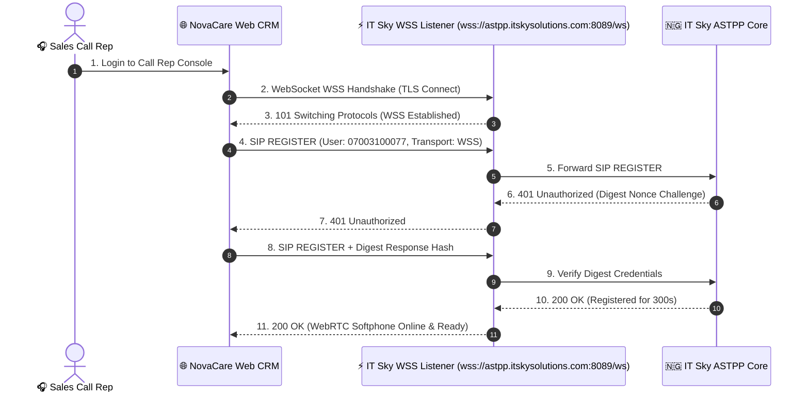

# IT Sky WSS SIP Registration Settings Specification

**Document Title**: WSS Telephony Registration Fields & Settings Guide  
**Prepared For**: IT Sky Solutions Telecom Engineering & ASTPP Administration Team  
**Prepared By**: NovaSuite Engineering Team  
**Interconnect Trunk DID**: `07003100077`  

---

## 📧 Suggested Email / Message Response to IT Sky

> Dear IT Sky Technical Team,
>
> Thank you for following up! Below are the exact SIP-over-WebSocket (WSS) registration fields and parameters that NovaCare Web CRM will use to register and authenticate with your ASTPP PBX via WebRTC:
>
> 1. **WebSocket Server URI**: `wss://astpp.itskysolutions.com:8089/ws` *(or designated WSS port e.g. 443 / 8443)*
> 2. **SIP Domain / Realm**: `07003100077.astpp.itskysolutions.com` *(or `astpp.itskysolutions.com`)*
> 3. **SIP Extension / Username**: `07003100077` *(or rep extension e.g. `101`, `102`)*
> 4. **Authentication User**: `07003100077`
> 5. **Password / Auth Secret**: *(Our assigned SIP password)*
> 6. **Transport Protocol**: `WSS` (Secure WebSocket over TLS)
> 7. **User-Agent**: `NovaCare-WebRTC/1.0 (SIP.js)`
> 8. **Supported Audio Codecs**: `PCMU` (G.711u), `PCMA` (G.711a), and `Opus`
>
> Attached below is the technical specification table and UI settings mockup showing how these fields are configured in our application.

---

## 📋 WSS Registration Field Specification

| Setting Field | Expected Value / Format | Description |
| :--- | :--- | :--- |
| **WebSocket URI** | `wss://astpp.itskysolutions.com:8089/ws` | Secure WebSocket endpoint on IT Sky ASTPP server |
| **SIP Domain / Realm** | `07003100077.astpp.itskysolutions.com` | SIP domain used in `From` and `To` headers |
| **SIP Username / Extension**| `07003100077` | Account extension / line number |
| **Auth Username** | `07003100077` | Digest Authentication username |
| **Password** | `••••••••••••` | SIP Digest authentication secret |
| **Transport** | `WSS` | WebSocket Secure (`wss://`) over TLS |
| **User Agent** | `NovaCare-WebRTC/1.0 (SIP.js)` | Client identifier header |
| **Audio Codecs** | `G.711 u-law (PCMU)`, `G.711 a-law (PCMA)`, `Opus` | Prioritized audio payload codecs |
| **ICE / STUN Server** | `stun:stun.l.google.com:19302` | Session Traversal Utilities for NAT |

---

## 🔄 WSS SIP Registration Handshake Sequence

The following sequence shows how NovaCare Web CRM sends the WSS `REGISTER` payload to IT Sky's ASTPP server:



---

## 🖥️ UI Registration Settings Mockup

```
+-------------------------------------------------------------------------------+
| ⚙️ NovaCare CRM — IT Sky WSS Telephony Settings                               |
+-------------------------------------------------------------------------------+
|                                                                               |
|  WebSocket Server URI:                                                        |
|  [ wss://astpp.itskysolutions.com:8089/ws                              ]      |
|                                                                               |
|  SIP Domain / Realm:                                                          |
|  [ 07003100077.astpp.itskysolutions.com                                ]      |
|                                                                               |
|  SIP Username / Extension:                                                    |
|  [ 07003100077                                                         ]      |
|                                                                               |
|  Authentication User:                                                         |
|  [ 07003100077                                                         ]      |
|                                                                               |
|  Password / Secret:                                                           |
|  [ •••••••••••••••••••••••••                                           ]      |
|                                                                               |
|  Transport Protocol:         User-Agent:                                      |
|  (•) WSS (Secure WebSockets) [ NovaCare-WebRTC/1.0 (SIP.js)           ]      |
|                                                                               |
|  Audio Codecs Supported:                                                      |
|  [x] G.711 u-law (PCMU)   [x] G.711 a-law (PCMA)   [x] Opus                |
|                                                                               |
|  +------------------------------+   +--------------------------------------+  |
|  |  Cancel                      |   |  🟢 Save & Test WSS Registration     |  |
|  +------------------------------+   +--------------------------------------+  |
+-------------------------------------------------------------------------------+
```
