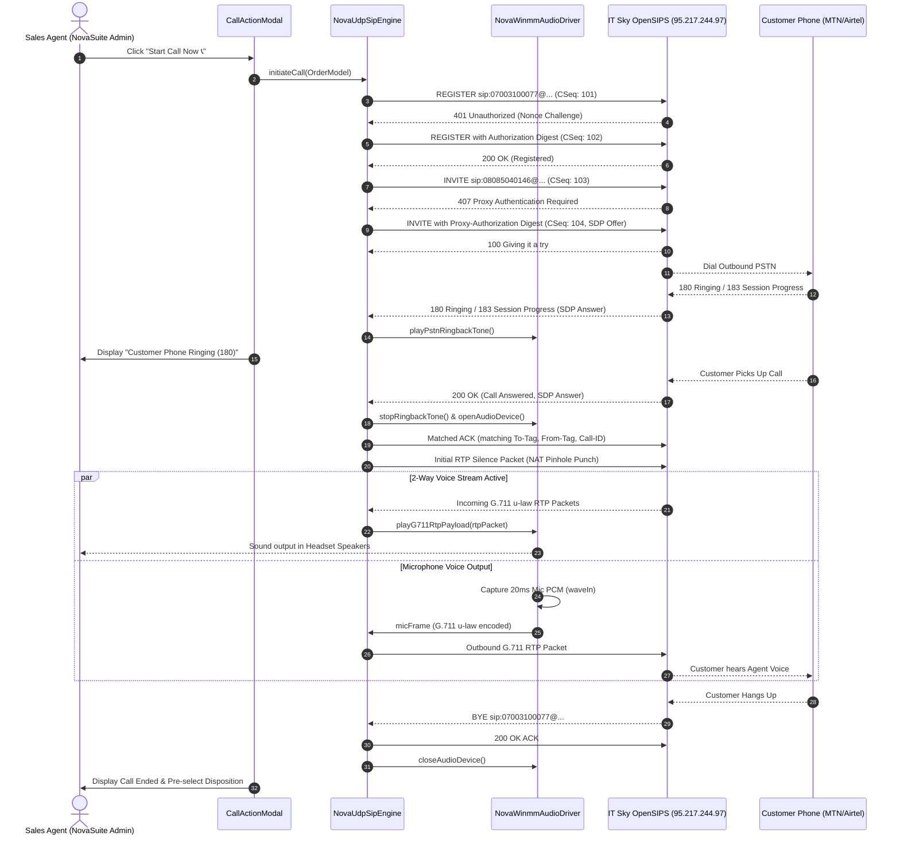

# IT Sky SIP & Native Windows Telephony Architecture

## Overview
This document specifies the technical architecture for the **100% Native Embedded VoIP Softphone** implemented in NovaSuite for Flutter Windows Desktop, interconnecting directly with the **IT Sky Solutions OpenSIPS PBX / SIP Trunk (`95.217.244.97:5060`)**.

Unlike traditional Flutter VoIP solutions that rely on external softphones (such as MicroSIP) or heavy WebSockets (`WSS 7443`), NovaSuite features a **self-contained, C-less, zero-dependency native stack** built directly inside Dart using **Raw Datagram Sockets (UDP 5060)** for SIP RFC 3261 signaling and **Dart FFI (`winmm.dll`)** for Windows WASAPI audio recording and playback.

---

## High-Level Architecture Component Diagram

```mermaid
graph TD
    subgraph Flutter Application Layer (apps/novasuite_admin)
        UI["CallActionModal (CRM UI)"]
        State["Provider Feedback & Disposition Stream"]
    end

    subgraph Core Telephony Domain (packages/novasuite_core)
        Facade["NovaSipTelephonyService (Platform Abstraction)"]
        
        subgraph Native Windows UDP Engine
            Engine["NovaUdpSipEngine (SIP RFC 3261 State Machine)"]
            Parser["SIP Text Parser & MD5 Digest Calculator"]
            RTPEngine["RTP Packet Formatter & NAT Hole-Puncher"]
        end

        subgraph Pure Dart FFI Audio Driver
            AudioDriver["NovaWinmmAudioDriver (Win32 FFI)"]
            WaveOut["waveOut (Speaker Playback)"]
            WaveIn["waveIn (Headset Microphone Recording)"]
            G711["ITU-T G.711 u-law Codec (PCMU)"]
        end
    end

    subgraph External Network Infrastructure
        OpenSIPS["IT Sky OpenSIPS PBX (95.217.244.97:5060)"]
        MediaGateway["IT Sky RTP Media Gateway (46.62.246.2:RTP)"]
        PSTN["Nigerian Telco PSTN (MTN / Airtel / Glo)"]
    end

    UI -->|Initiate Call| Facade
    Facade -->|Windows Platform Route| Engine
    Engine -->|UDP 5060 SIP Packets| OpenSIPS
    OpenSIPS -->|PSTN Route| PSTN
    PSTN -->|Early Media / Voice| MediaGateway
    MediaGateway <-->|Bidirectional G.711 RTP Audio| Engine
    Engine -->|Raw Binary RTP Payload| AudioDriver
    AudioDriver -->|PCM Decompression| WaveOut
    WaveIn -->|PCM Compression| AudioDriver
    AudioDriver -->|G.711 Mic Frames| Engine
    Engine -->|Feedback Events| State
    State -->|Auto-Disposition & Badge| UI
```

---

## System Component Responsibilities

### 1. `NovaSipTelephonyService` (Platform Abstraction Facade)
- Detects running OS environment at runtime (`Platform.isWindows` vs `kIsWeb` vs Mobile).
- Directs Windows Desktop traffic to `NovaUdpSipEngine` and Web/Mobile traffic to `sip_ua` / `flutter_webrtc`.
- Exposes unified streams: `callStateStream`, `durationStream`, `registrationStatusStream`, and `providerReasonStream`.

### 2. `NovaUdpSipEngine` (Native SIP RFC 3261 Signaling Engine)
- Binds local UDP socket dynamically (`RawDatagramSocket.bind(InternetAddress.anyIPv4, 0)`).
- Executes SIP registration with MD5 Digest `401 Unauthorized` handshake.
- Places outbound `INVITE` calls, computes `407 Proxy Authentication` digest hashes, and handles `180 Ringing`, `183 Session Progress`, `200 OK`, `BYE`, and `CANCEL`.
- Formats SDP offers advertising active LAN IPv4 address and bound UDP audio port.
- Executes RFC 3581 **Symmetric RTP NAT Hole-Punching**.

### 3. `NovaWinmmAudioDriver` (Pure Dart FFI Windows Audio Driver)
- Binds to Windows Multimedia C Library (`winmm.dll`) using `dart:ffi`.
- **Playback (`waveOut`)**: Opens 8,000Hz 16-bit Mono WaveOut audio device; decompresses incoming 8-bit G.711 u-law RTP payloads to 16-bit PCM samples and writes to Windows speakers.
- **Recording (`waveIn`)**: Opens laptop/headset microphone; captures 20ms PCM audio frames (160 samples), encodes to 8-bit G.711 u-law bytes, and streams outbound over RTP.
- **Synthesizer**: Synthesizes pure 440Hz + 480Hz dual sine-wave PSTN ringback tones in math without external sub-processes.

---

## Call Setup & Media Flow Sequence Diagram


