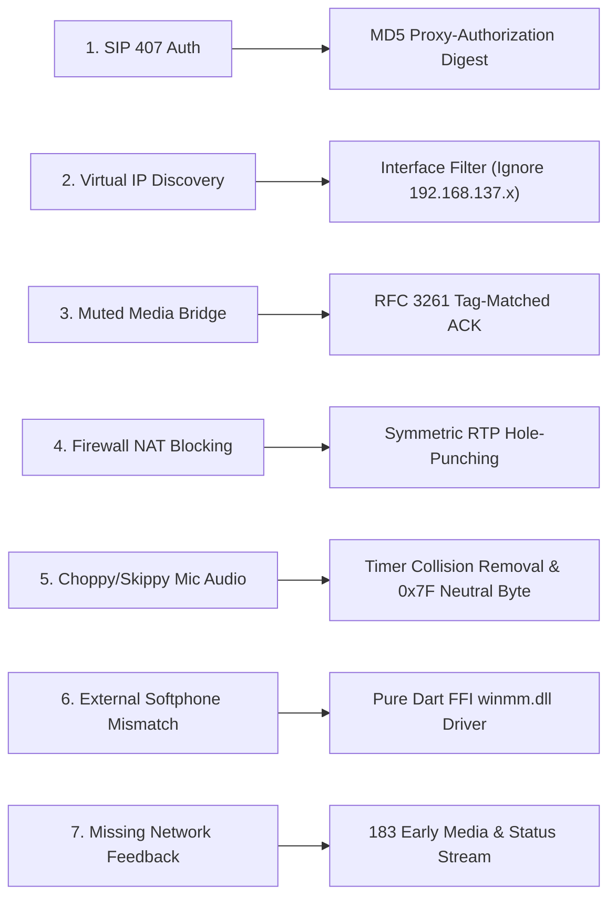
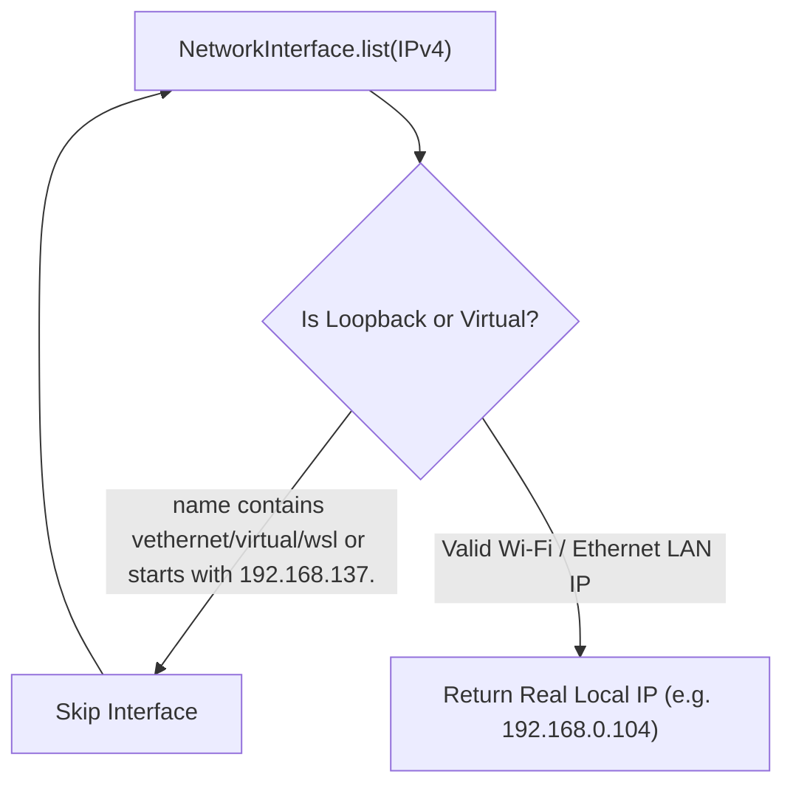
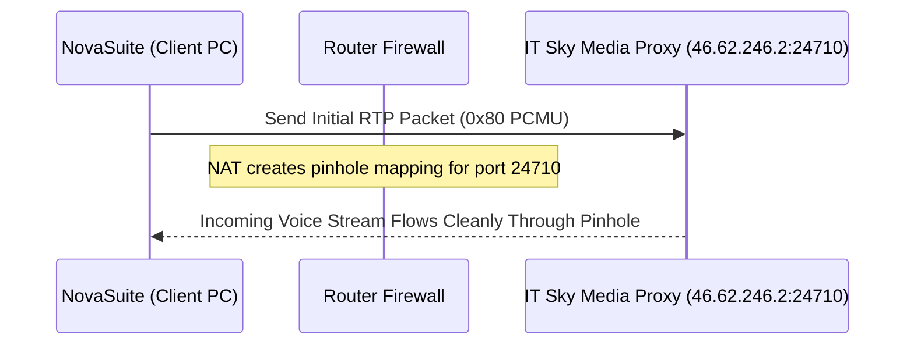
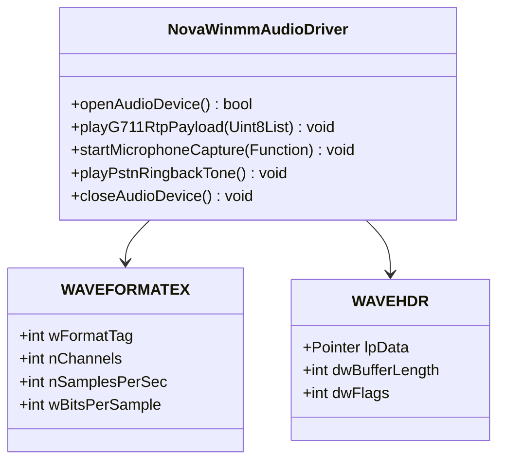

# Technical Challenges & Engineering Solutions

Building a custom, zero-dependency VoIP softphone in Flutter Windows Desktop involves solving deep networking, protocol compliance, and audio driver challenges. This document details the **7 primary challenges** encountered during the IT Sky SIP trunk integration and their exact engineering solutions.

---

## Technical Challenges Overview Matrix



---

## Challenge 1: SIP 401 & 407 Proxy Authentication

### The Problem
When placing outbound calls to IT Sky's OpenSIPS PBX, sending an initial `INVITE` packet without credentials results in a `407 Proxy Authentication Required` challenge containing a `realm` and `nonce`. Similarly, registration returns `401 Unauthorized`.

```text
SIP/2.0 407 Proxy Authentication Required
Proxy-Authenticate: Digest realm="07003100077.astpp.itskysolutions.com", nonce="689d01a3..."
```

### The Solution
Implement RFC 2617 MD5 Digest Authentication calculation:
1. `HA1 = MD5(username : realm : password)`
2. `HA2 = MD5(method : digestUri)`
3. `Response = MD5(HA1 : nonce : HA2)`

Re-send the `INVITE` packet with `CSeq` incremented by 1, preserving the exact same `Call-ID` and `From` tag:

```dart
final ha1 = md5.convert(utf8.encode('$username:$realm:$password')).toString();
final ha2 = md5.convert(utf8.encode('$method:$digestUri')).toString();
final response = md5.convert(utf8.encode('$ha1:$nonce:$ha2')).toString();

sipMsg.writeln('Proxy-Authorization: Digest username="$username", realm="$realm", nonce="$nonce", uri="$digestUri", response="$response", algorithm=MD5');
```

---

## Challenge 2: Network Virtual Adapters & SDP IP Address Discovery

### The Problem
Windows PCs frequently run virtual network interfaces (Internet Connection Sharing `192.168.137.1`, Hyper-V `vEthernet`, WSL `172.x.x.x`, VirtualBox `10.0.2.x`). When `NetworkInterface.list()` returns a virtual adapter IP address, the SDP offer advertises `c=IN IP4 192.168.137.1`. The IT Sky media server streams RTP audio packets to that virtual adapter, dropping all incoming voice audio!

### The Solution
Filter out virtual network interfaces during local IP resolution:



```dart
Future<String> _getLocalIpAddress() async {
  final interfaces = await NetworkInterface.list(type: InternetAddressType.IPv4, includeLinkLocal: false);
  for (final interface in interfaces) {
    final name = interface.name.toLowerCase();
    if (name.contains('vethernet') || name.contains('virtual') || name.contains('vmnet') || name.contains('wsl')) continue;
    for (final addr in interface.addresses) {
      if (!addr.isLoopback && !addr.address.startsWith('192.168.137.')) {
        return addr.address;
      }
    }
  }
  return '127.0.0.1';
}
```

---

## Challenge 3: Muted Media Bridge Due to RFC 3261 ACK Mismatch

### The Problem
When the customer answers the call, OpenSIPS sends `SIP/2.0 200 OK`. If the client sends an `ACK` packet with a newly generated `From` tag or missing server `To` tag, OpenSIPS rejects the `ACK`, retransmits `200 OK` 3 times, and **refuses to open the RTP media audio bridge**!

```text
OpenSIPS 200 OK: To: <sip:08085040146...>;tag=c89Z16DmSKtaF
Client Invalid ACK: To: <sip:08085040146...>  (Missing tag=c89Z16DmSKtaF!)
```

### The Solution
Extract the exact `To` header (including OpenSIPS's server `;tag=...`) from the `200 OK` response and echo it back in the `ACK` packet:

```dart
void _sendAckPacket([String? responseMessage]) async {
  String toHeader = '<sip:$formattedPhone@${ItSkySipConfig.domain}>';
  if (responseMessage != null) {
    final toMatch = RegExp(r'To: ([^\r\n]+)', caseSensitive: false).firstMatch(responseMessage);
    if (toMatch != null) toHeader = toMatch.group(1)!;
  }
  
  sipMsg.writeln('ACK sip:$formattedPhone@${ItSkySipConfig.domain} SIP/2.0');
  sipMsg.writeln('From: <sip:${ItSkySipConfig.username}@...>;tag=${_activeFromTag}');
  sipMsg.writeln('To: $toHeader'); // Contains OpenSIPS server ;tag=...
  sipMsg.writeln('Call-ID: $_activeCallId');
}
```

---

## Challenge 4: Symmetric RTP NAT Traversal & Hole-Punching

### The Problem
Router firewalls and OpenSIPS MediaProxies operate under **Symmetric RTP (RFC 3581)**: they will not stream incoming G.711 audio packets to a client until the client sends at least one outbound RTP packet to the server's remote RTP port first.

### The Solution
Extract the remote media target host and port from OpenSIPS's `200 OK` / `183 Session Progress` SDP answer (`m=audio 24710`, `c=IN IP4 46.62.246.2`) and send an initial RTP packet:



---

## Challenge 5: Microphone Audio Distortion & Timer Collision

### The Problem
During active calls, the phone speaker audio sounded lagged, dragged, and 50% chopped.
**Root Cause**: Two concurrent 20ms timers were running simultaneously:
1. `startMicrophoneCapture` streaming 50 microphone voice frames/sec.
2. `_rtpKeepaliveTimer` streaming 50 silence frames/sec (`0xFF`).

The phone received an interleaved stream (`[Voice] -> [Silence] -> [Voice] -> [Silence]`), chopping the voice in half! Furthermore, `0xFF` in G.711 u-law is peak negative amplitude (-32,124), triggering telecom noise gates.

### The Solution
1. **Remove Duplicate Timer**: Cancel `_rtpKeepaliveTimer` once microphone capture is active; let `startMicrophoneCapture` manage the single 20ms stream.
2. **RFC 3551 Compliance**: Use `0x7F` (0 PCM amplitude) as the neutral G.711 u-law byte value.
3. **Gain Control**: Apply $0.6\times$ soft gain scaling to prevent digital peak clipping distortion on headset microphones:

```dart
static int pcm16ToULaw(int pcm16) {
  pcm16 = (pcm16 * 0.6).round().clamp(-32635, 32635);
  int sign = (pcm16 >> 8) & 0x80;
  if (sign != 0) pcm16 = -pcm16;
  if (pcm16 > 32635) pcm16 = 32635;
  pcm16 += 0x84;

  int exponent = 7;
  for (int expMask = 0x4000; (pcm16 & expMask) == 0 && exponent > 0; exponent--, expMask >>= 1) {}
  int mantissa = (pcm16 >> (exponent + 3)) & 0x0F;
  return ~(sign | (exponent << 4) | mantissa) & 0xFF;
}
```

---

## Challenge 6: Embedded Windows WASAPI Audio via Pure Dart FFI

### The Problem
Relying on external softphones (MicroSIP) introduces third-party dependencies, window focus issues, and installer bloat.

### The Solution
Bind directly to Windows Multimedia C API (`winmm.dll`) using `dart:ffi`:
- **`waveOutOpen` / `waveOutWrite`**: Decompress incoming G.711 u-law RTP payloads to 16-bit PCM and write to speakers.
- **`waveInOpen` / `waveInStart`**: Record 20ms PCM audio frames from the laptop headset microphone and convert to G.711 u-law.



---

## Challenge 7: RFC 3960 Early Media vs 180 Ringing

### The Problem
When dialing numbers, telco operators (MTN / Airtel / Glo) return `183 Session Progress` with an SDP answer containing early media (operator voice prompts: *"The subscriber is on another call"*). If local ringback tones continue playing, the agent cannot hear the operator announcement.

### The Solution
Parse `183 Session Progress` SDP answers, stop local ringback tones, and open the RTP audio channel immediately so the agent hears network announcements live in their headset!
