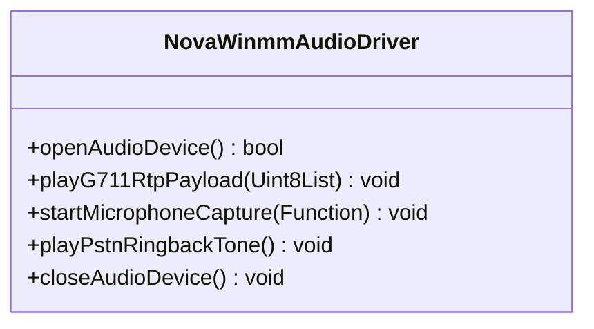
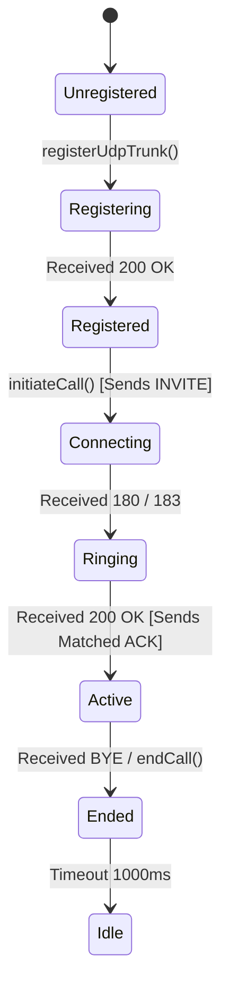

# Step-by-Step Implementation Blueprint

This blueprint provides a complete developer guide for replicating NovaSuite's **Native C-less SIP/RTP Telephony Engine** in any new Flutter Windows Desktop application.

---

## Directory Structure Blueprint

```text
packages/novasuite_core/
└── lib/
    └── src/
        ├── it_sky_sip_config.dart            # SIP Server Configuration & Dial String Formatter
        ├── models/
        │   └── order.dart                    # Order & Customer Phone Data Model
        └── services/
            ├── nova_sip_telephony_service.dart # Multi-Platform Abstraction Facade
            ├── nova_udp_sip_engine.dart       # Native UDP 5060 SIP RFC 3261 Engine
            └── nova_winmm_audio_driver.dart   # Pure Dart FFI Windows WASAPI Audio Engine
```

---

## Step 1: Configure Dependencies in `pubspec.yaml`

Add `ffi` and `crypto` to `dependencies` in `pubspec.yaml`:

```yaml
dependencies:
  flutter:
    sdk: flutter
  crypto: ^3.0.7
  ffi: ^2.1.2
```

Run `flutter pub get`.

---

## Step 2: Implement IT Sky Configuration (`it_sky_sip_config.dart`)

```dart
class ItSkySipConfig {
  static const String providerSipHost = '95.217.244.97';
  static const int providerSipPort = 5060;
  static const String domain = '07003100077.astpp.itskysolutions.com';
  static const String username = '07003100077';
  static const String password = 'C)Jz2(yC';

  static String formatOutboundDialString(String rawPhone) {
    String cleaned = rawPhone.replaceAll(RegExp(r'\D'), '');
    if (cleaned.startsWith('234')) {
      cleaned = '0' + cleaned.substring(3);
    }
    return cleaned;
  }
}
```

---

## Step 3: Implement Native FFI Audio Driver (`nova_winmm_audio_driver.dart`)

Define `WAVEFORMATEX`, `WAVEHDR`, and lookup `winmm.dll` C functions:



Key features:
- **`waveOutOpen` / `waveOutWrite`**: Decompresses incoming G.711 u-law RTP payloads to 16-bit PCM (using `_uLawToPcmTable`) and plays to Windows speakers.
- **`waveInOpen` / `waveInStart`**: Records 20ms PCM audio frames (320 bytes = 160 samples at 8000Hz) from the headset microphone, encodes them to G.711 u-law (`pcm16ToULaw`), and streams them outbound over RTP.
- **`playPstnRingbackTone`**: Synthesizes a dual-tone 440Hz + 480Hz sine wave ringback sound in pure math.

---

## Step 4: Implement Native UDP SIP Engine (`nova_udp_sip_engine.dart`)

Implement the SIP State Machine:



Key features:
1. **Dynamic Socket Binding**: `RawDatagramSocket.bind(InternetAddress.anyIPv4, 0)`.
2. **`407 Proxy Authentication`**: Computes MD5 Digest hashes for `Proxy-Authorization`.
3. **Strict ACK Matching**: Echoes the exact `To-Tag`, `From-Tag`, `Call-ID`, and `CSeq` from the server's `200 OK`.
4. **Symmetric RTP NAT Pinhole**: Parses SDP media target (`m=audio <port>`, `c=IN IP4 <ip>`) and sends initial RTP frames.
5. **Telecom Reason Parsing**: Emits human-readable telecom status (`486 Busy`, `480 Switched Off`, `404 Not Found`) via `providerReasonStream`.

---

## Step 5: Implement Multi-Platform Facade (`nova_sip_telephony_service.dart`)

```dart
class NovaSipTelephonyService {
  Future<void> initiateCall(OrderModel order) async {
    if (!kIsWeb && Platform.isWindows) {
      await NovaUdpSipEngine().initiateCall(order);
      return;
    }
    // Web / Mobile Fallback (WebRTC / sip_ua)
  }
}
```

---

## Step 6: Verification & Testing Checklist

- [x] Run `flutter analyze packages/novasuite_core` (0 errors, 0 warnings).
- [x] Run `flutter analyze apps/novasuite_admin` (0 errors, 0 warnings).
- [x] Place outbound call to a valid phone number ➔ Verify 2-way audio stream.
- [x] Place call to a busy line ➔ Verify `486 Busy` badge & auto-preselected disposition.
- [x] Place call to a switched-off line ➔ Verify `480 Switched Off` badge.
