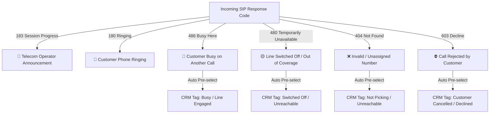
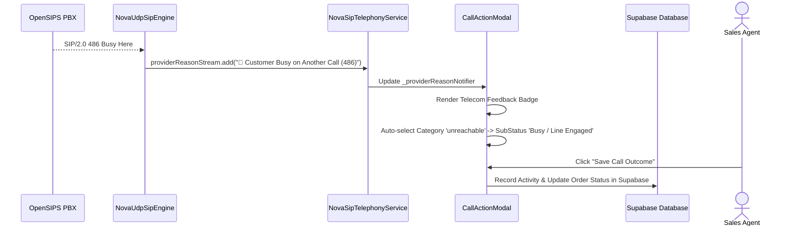

# Best Practices & CRM Integration Guide

This document details the **CRM Integration Architecture**, **Telecom Response Code Mapping**, and **Production Best Practices** established during the NovaSuite IT Sky telephony integration.

---

## Telecom Response Code & CRM Disposition Mapping Matrix

When a call terminates or returns network feedback, NovaSuite maps numeric SIP status codes directly to human-readable CRM disposition tags:

---

## Automatic CRM Disposition Pre-Selection Workflow

Sales agents handle dozens of call attempts per hour. Manually categorizing every call outcome slows down workflow and causes human error.

### How NovaSuite Automates Disposition:
1. `NovaUdpSipEngine` listens to OpenSIPS response codes on UDP Port 5060.
2. `providerReasonStream` emits parsed status strings (e.g. `🔴 Customer Busy on Another Call (486)`).
3. `CallActionModal` listens to `providerReasonStream`:
   - Displays a prominent `Telecom Feedback` badge at the top of the modal.
   - Automatically pre-selects the corresponding CRM category and status in the UI dropdown.
4. The sales agent can save the call outcome to Supabase CRM with **1 click**!

---

## Production Telephony Best Practices

### 1. Zero External App Dependencies
- Avoid launching external softphones (`microsip.exe`) via `Process.run`. External processes create window focus issues, lack UI synchronization, and require complex desktop installer scripts.
- Use **pure Dart FFI (`winmm.dll`)** for embedded Windows audio drivers.

### 2. Audio Gain Scaling & Anti-Clipping
- Laptop headset microphones frequently record with high input gain.
- Always apply soft-gain scaling (`pcm16 = (pcm16 * 0.6).round()`) and clamping (`.clamp(-32635, 32635)`) before G.711 u-law compression to eliminate digital peak clipping distortion.

### 3. Strict RFC 3261 ACK Compliance
- When responding to a `200 OK` answer, **never generate a new `From` tag or `Call-ID`**.
- Extract the exact `To` header (including OpenSIPS's server `;tag=...`) from the `200 OK` response. ACK mismatch will cause PBXs to hold the media bridge closed.

### 4. Symmetric RTP NAT Traversal (RFC 3581)
- Never rely on static audio port `8000`. Advertise the actual bound UDP socket port in the SDP offer (`m=audio $rtpPort`).
- Send an initial RTP packet immediately upon receiving `200 OK` or `183 Session Progress` to punch a bidirectional NAT pinhole on router firewalls.

### 5. Error Notice Isolation
- Informational status codes (`180 Ringing`, `183 Session Progress`, `200 OK`) are **normal network progress events**.
- Isolate `lastError` strictly to true call failure codes (`4xx`, `5xx`, `6xx`) so false-alarm red warning banners do not appear during active working calls.
