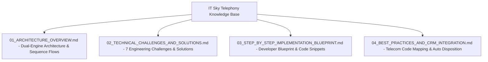

# IT Sky SIP & Native Telephony Integration Knowledge Base

Welcome to the comprehensive technical documentation for NovaSuite's **Native C-less Embedded Telephony Engine** interconnecting with **IT Sky Solutions OpenSIPS PBX (`95.217.244.97:5060`)**.

This subfolder serves as a complete engineering reference manual for replicating, maintaining, or extending custom Flutter VoIP softphone solutions.

---

## Documentation Subfolder Structure

---

## Document Links Index

1. [01 Architecture Overview](01_ARCHITECTURE_OVERVIEW.md)
   - High-level system architecture, dual-engine design (`NovaUdpSipEngine` + `NovaWinmmAudioDriver`), component responsibilities, and end-to-end SIP/RTP sequence diagrams.
2. [02 Technical Challenges & Solutions](02_TECHNICAL_CHALLENGES_AND_SOLUTIONS.md)
   - Exhaustive analysis of the 7 major engineering challenges encountered (SIP 407 Auth, Virtual Network IP filtering, RFC 3261 ACK matching, Symmetric RTP NAT hole-punching, timer collision removal, FFI audio drivers, RFC 3960 Early Media).
3. [03 Step-by-Step Implementation Blueprint](03_STEP_BY_STEP_IMPLEMENTATION_BLUEPRINT.md)
   - Complete step-by-step developer blueprint for building a C-less, zero-dependency SIP/RTP softphone in Flutter from scratch.
4. [04 Best Practices & CRM Integration Guide](04_BEST_PRACTICES_AND_CRM_INTEGRATION.md)
   - Telecom status code mapping matrix (`486 Busy`, `480 Switched Off`, `404 Not Found`), 1-click automatic CRM disposition pre-selection, audio gain scaling, and production security rules.
