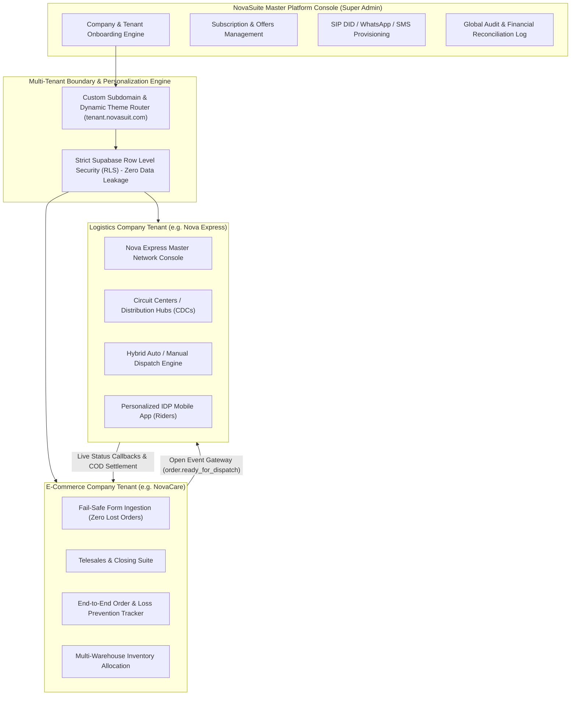

# NovaSuite Enterprise Multi-Tenant Platform — Master Index & Architecture Blueprint

Welcome to the comprehensive master documentation for **NovaSuite Enterprise**, the all-in-one Multi-Tenant SaaS Platform empowering both **E-Commerce Merchants** (e.g., NovaCare, Leafora) and **Logistics Companies** (e.g., Nova Express, GIG Logistics) to run their operations independently under a unified, high-availability architecture.

---

## 🏛️ Platform Architecture Overview



---

## 📁 Master Directory Structure

```
Documentation/NovaSuite_Enterprise_Masterplan/
├── 00_MASTER_INDEX.md
├── 01_Architecture_and_Security/
│   ├── MULTI_TENANT_ISOLATION_AND_WHITE_LABEL_SPEC.md
│   └── ZERO_DATA_LOSS_AND_HIGH_AVAILABILITY_SPEC.md
├── 02_Ecommerce_Suite/
│   ├── ECOMMERCE_SUITE_END_TO_END_WORKFLOW.md
│   └── LANDING_PAGE_FORM_INGESTION_AND_LEAD_PROTECTION.md
├── 03_Logistics_Suite/
│   ├── NOVA_EXPRESS_LOGISTICS_SUITE_SPEC.md
│   └── CIRCUIT_CENTERS_AND_IDP_RIDER_APP_SPEC.md
├── 04_Platform_Console_and_Subscriptions/
│   ├── SUPER_ADMIN_PLATFORM_CONSOLE_SPEC.md
│   └── TELEPHONY_WHATSAPP_SMS_ADDON_PROVISIONING.md
├── 05_Financials_and_Monetization/
│   ├── BUSINESS_MODEL_AND_SUBSCRIPTION_TIERS.md
│   └── INFRASTRUCTURE_COST_BENCHMARKS_AND_HOSTING_COMPARISON.md
└── 06_Implementation_Phases/
    └── OVERALL_ENTERPRISE_IMPLEMENTATION_PHASES.md
```

---

## 🎯 Primary Problem Solved: Eliminating Loss of Marketing Revenue

Legacy systems like Pangea CRM lost **70 orders daily** (costing ₦5,000 per acquisition = **₦350,000 daily loss / ₦10.5M monthly loss**). NovaSuite solves this with:
1. **100% Fail-Safe Order Ingestion**: Offline-first form queues, retry mechanisms, and instant webhook confirmations so zero orders are dropped.
2. **End-to-End Auditable Order Tracking**: Every lead is tracked from ad click $\rightarrow$ form submission $\rightarrow$ call center closing $\rightarrow$ logistics dispatch $\rightarrow$ last-mile IDP delivery $\rightarrow$ COD bank remittance.
3. **High Availability Infrastructure**: Multi-region database replication, automated failover, and zero-downtime server reloads.
4. **Complete White-Label Personalization**: Dynamic brand customization (logos, colors, domains, IDP app branding) for all tenants.
