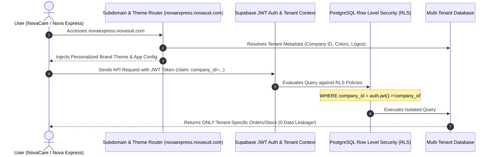

# Multi-Tenant Isolation & White-Label Personalization Engine

This specification details how NovaSuite enforces **strict multi-tenant data isolation (Zero Data Leakage)** and provides a **dynamic White-Label Personalization Engine** allowing E-Commerce and Logistics companies to operate under their own branding, custom subdomains, and custom mobile apps.

---

## Multi-Tenant Isolation Architecture



---

## 🎨 White-Label Personalization Features

### 1. Company Onboarding & Type Selection
When creating a new company in NovaSuite, the admin selects the **Company Type**:
- **E-Commerce Company** (e.g. NovaCare, Leafora): Unlocks Marketing, Sales, Call Center, Sourcing, and Logistics Attachment.
- **Logistics Company** (e.g. Nova Express, GIG): Unlocks Circuit Centers, Hub Inventory, Rider Onboarding, Hybrid Dispatch, and Waybills.

### 2. Branding Configuration Parameters
Each tenant configures their brand identity, injected dynamically across Web, Desktop, and Mobile Apps:

```json
{
  "company_id": "cmp_nova_express_8812",
  "company_name": "Nova Express Logistics",
  "company_type": "LOGISTICS",
  "subdomain": "novaexpress",
  "custom_domain": "dispatch.novaexpress.ng",
  "branding": {
    "primary_color": "#10B981",
    "secondary_color": "#09140E",
    "accent_color": "#F59E0B",
    "dark_surface": "#0C1F17",
    "light_surface": "#F8FAFC",
    "logo_url": "https://cdn.novasuit.com/tenants/novaexpress/logo.png",
    "favicon_url": "https://cdn.novasuit.com/tenants/novaexpress/favicon.png",
    "app_title": "Nova Express Driver Console"
  },
  "idp_mobile_app_config": {
    "app_name": "Nova Express Rider",
    "rider_splash_logo": "https://cdn.novasuit.com/tenants/novaexpress/rider_splash.png",
    "support_hotline": "07003100077"
  }
}
```

---

## 🔒 Security & Data Leakage Prevention

1. **Supabase Row Level Security (RLS)**:
   Every table (`orders`, `inventory`, `circuit_centers`, `riders`) enforces RLS policies checking `company_id`:
   ```sql
   CREATE POLICY tenant_isolation_policy ON orders
   FOR ALL USING (company_id = (auth.jwt() ->> 'company_id')::uuid);
   ```

2. **Cross-Tenant Guard Rails**:
   - E-Commerce Tenant A (NovaCare) can NEVER see orders or leads from E-Commerce Tenant B (Leafora).
   - Logistics Tenant B (Nova Express) only receives order dispatch events explicitly allocated to them.
