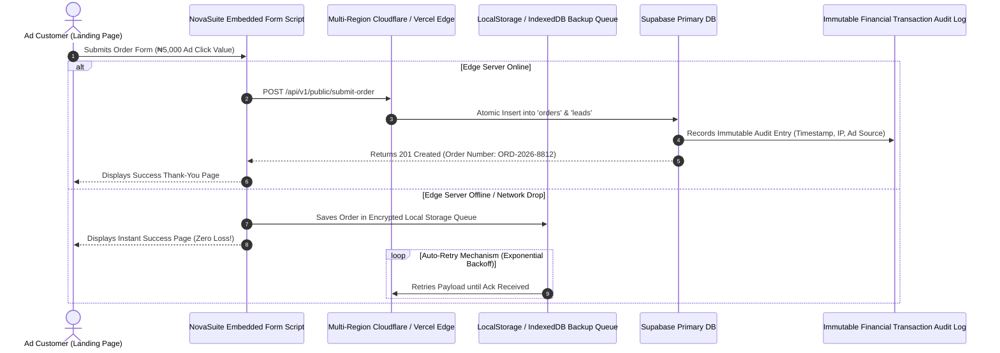

# Zero Data Loss & High Availability Infrastructure Specification

This document details how NovaSuite eliminates marketing revenue leakage (such as Pangea CRM's 70 lost orders daily / ₦350,000 daily loss) by implementing a **Zero Data Loss Ingestion Pipeline**, offline-first queues, multi-region database replication, and financial-grade transaction logging.

---

## 🛡️ Fail-Safe Form Ingestion Pipeline

---

## 🔑 Key Loss Prevention Rules

1. **Atomic Dual Logging**: Every incoming form submission generates a lead record and an immutable financial audit log entry before returning HTTP 200.
2. **Offline-First Resilience**: If a landing page form experiences network drops, the embedded JS library saves the lead payload locally and retries every 3 seconds until confirmed by the server.
3. **Ad Spend Tracking**: Every order is stamped with UTM parameters (`utm_source`, `utm_campaign`, `ad_id`, `cpa_cost`), enabling merchants to track exact ROI per digital ad campaign.
4. **Health Check Probes**: Automated 10-second ping probes monitor form endpoints and trigger instant Telegram/SMS alerts to tech leads if any form error occurs.
