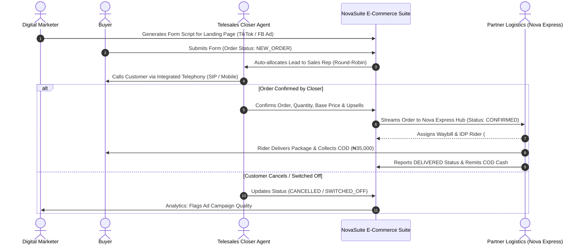

# E-Commerce Suite: End-to-End Workflow & Component Specification

This specification documents the complete lifecycle for **E-Commerce Merchant Tenants** (e.g. NovaCare, Leafora) operating on NovaSuite, spanning Marketing Lead Generation, Telesales Closing, Order Tracking, and Logistics Stock Attachment.

---

## 🔄 End-to-End E-Commerce Workflow

---

## 💻 UI Component Specifications (E-Commerce Suite)

| Screen / Tab | Purpose | UI Components |
| :--- | :--- | :--- |
| **Marketing Dashboard** | Campaign ROI & Ad Spend Tracking | Ad Spend Input, Cost-per-Order Metric Cards, Campaign Comparison Bar Chart, Form Generator Modal |
| **Sales Call Center Suite** | Telesales Closing Workspace | Round-Robin Lead Queue, Integrated SIP Floating Dialer, Product Script Drawer, Upsell/Downsell Calculator, Order Activity Timeline |
| **Order Directory** | Full Order Lifecycle Operations | Multi-Filter Data Table (New, Confirmed, In Transit, Delivered, Cancelled), Waybill PDF Generator, Bulk Re-assignment Modal |
| **Stock Allocation Tab** | Multi-Warehouse Stock Management | Physical Stock Allocation Table, Stock Transfer Request Form, Hub Balance Badges (Ikeja, Abuja, PH) |
