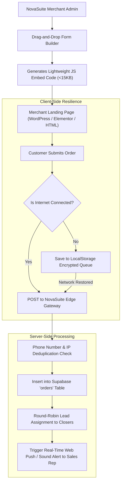

# Landing Page Form Ingestion & Lead Protection Specification

This document details how NovaSuite provides e-commerce merchants with **zero-code form builders** and **fail-safe embeddable JavaScript code snippets** that guarantee 100% order capture from digital marketing campaigns.

---

## 🛡️ Form Generation & Submission Architecture



---

## 📋 Embeddable JS Form Snippet Design

Merchants simply paste a single line into their landing pages (WordPress, Elementor, WooCommerce, or custom HTML):

```html
<!-- NovaSuite Fail-Safe Order Form Embed -->
<iframe src="https://novacare.novasuit.com/embed/form/frm_9912821" 
        style="width:100%; border:none; min-height:450px;" 
        loading="eager" 
        title="Order Form"></iframe>
<script src="https://novasuit.com/sdk/v1/form-guard.js" async></script>
```

---

## ⚡ Lead Protection Rules

1. **Duplicate Prevention**: If a customer submits the form twice within 10 minutes, the system attaches the submission as an update rather than creating a duplicate lead.
2. **Instant Phone Validation**: Validates Nigerian mobile prefixes (080, 081, 070, 090, 091) before form submission to block fake numbers.
3. **UTM Attribution**: Automatically captures `utm_source`, `utm_medium`, `utm_campaign`, `ad_id`, and `placement` to give digital marketers exact cost-per-order analytics.
