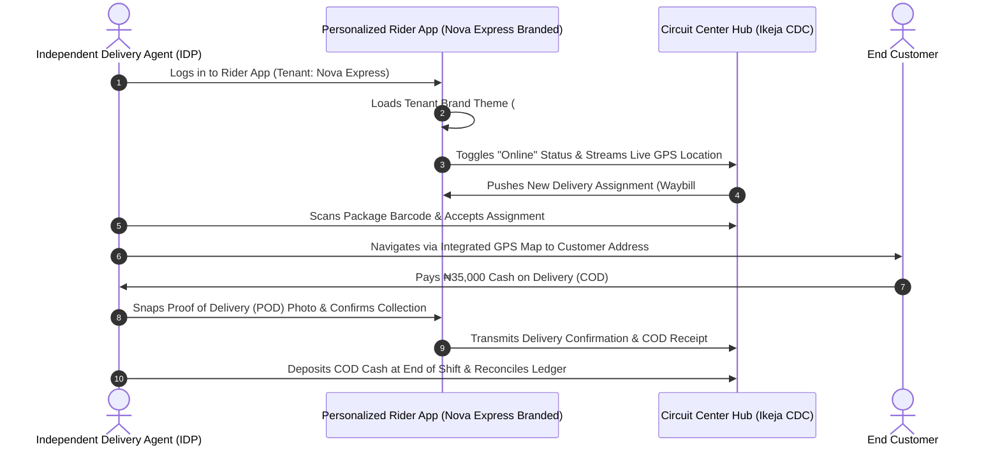

# Circuit Centers & Independent Delivery Agent (IDP) Rider App Specification

This specification documents the operational workflow of **Circuit Centers (Collation & Distribution Centers - CDCs)** and the personalized **White-Labeled IDP Rider Mobile App**.

---

## 📲 IDP Rider App Lifecycle & Handshake

---

## 🎨 IDP Rider Mobile App Personalization Features

When a logistics company (e.g. Nova Express) registers on NovaSuite, their riders download the **NovaSuite Rider App**, which dynamically customizes itself:
1. **Dynamic App Branding**: Displays the logistics company's logo, splash screen, and brand primary/secondary colors.
2. **Custom Support Helpline**: Displays the specific logistics company's support number.
3. **Barcode & QR Scanner**: Built-in camera scanner for rapid package pickup at Circuit Centers.
4. **Offline POD Capture**: Allows riders to capture photos and signatures even in low-signal areas, auto-syncing when internet returns.
