# Logistics Suite Specification: Nova Express & 3PL Ecosystem

This specification details the dedicated **Logistics Suite** unlocked when a company registers as a **Logistics Company** (e.g. Nova Express) on NovaSuite.

---

## 🏛️ Logistics Company Suite Overview

```mermaid
graph TD
    subgraph LogisticsCompany ["Logistics Company Tenant (e.g. Nova Express)"]
        CentralHQ["Nova Express Central Master Console"]
        CircuitCenters["Circuit Centers / Collation & Distribution Centers (CDCs)"]
        DispatchHub["Hybrid Dispatch Engine (Auto Proximity / Manual Dispatch)"]
        RiderFleet["Independent Delivery Agent (IDP) Network"]
    end

    subgraph Operations ["Core Operations & Tools"]
        WaybillEngine["Barcoded Waybill Generator (#NX-WAYBILL-XXXX)"]
        StockReconciler["CDC Stock Receiving & Bin Manager"]
        CODLedger["COD Collection & Merchant Remittance Ledger"]
        MobileApp["Personalized Rider Mobile App (White-Labeled)"]
    end

    CentralHQ --> CircuitCenters
    CircuitCenters --> StockReconciler
    CircuitCenters --> DispatchHub
    DispatchHub --> WaybillEngine
    DispatchHub --> RiderFleet
    RiderFleet --> MobileApp
    RiderFleet --> CODLedger
```

---

## 💻 Logistics Suite UI Components

| Tab / Module | Function | UI Features |
| :--- | :--- | :--- |
| **Circuit Center Directory** | Manage distribution hubs across Nigeria | Hub Creation Modal, State/City Assignment, Hub Capacity Status, Warehouse Manager Assignment |
| **Circuit Center Stock Hub** | Inventory holding & receiving | Inbound Shipment Receiving Scanner, Physical Stock Balance Table, Inter-CDC Stock Transfer Modal |
| **Dispatch Operations Console** | Assign orders to riders (IDPs) | Hybrid Dispatch Board (Auto Proximity List + Drag-and-Drop Manual Dispatcher Board), Waybill Printing Action |
| **IDP Rider Management** | Onboard & monitor delivery agents | Rider Onboarding Modal, Verification Document Upload, Real-Time Rider GPS Map View, Rider Performance Stats |
| **COD Financial Ledger** | Cash collection & merchant remittance | Daily Cash Deposit Ledger, Merchant Remittance Approval Queue, Rider Cash Outstanding Tracker |
