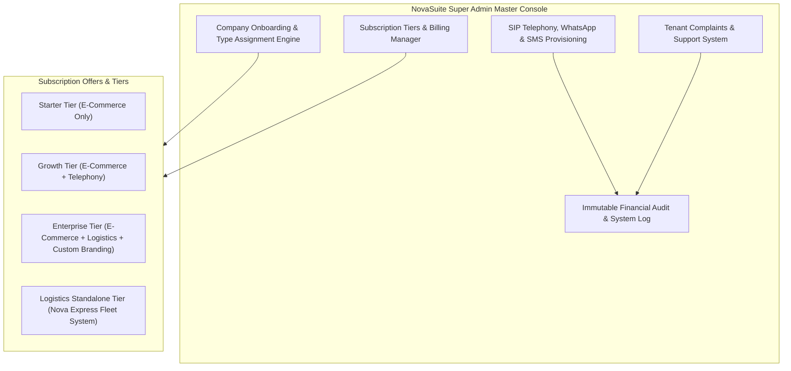

# Super Admin Platform Console & Subscription Management Specification

This specification documents the **Super Admin Master Console** used by NovaSuite platform owners to manage tenant companies, subscription tiers, pricing offers, addon provisioning, and complaints.

---

## 🏛️ Super Admin Console Architecture

---

## 🖥️ Super Admin UI Components

| Module | Function | Features |
| :--- | :--- | :--- |
| **Company Directory** | Onboard & manage tenant companies | Create Company Modal (Select: E-Commerce vs. Logistics), Custom Domain Setter, Subdomain Manager, Active Status Toggle |
| **Subscriptions & Pricing Tiers** | Define SaaS plans & billing offers | Create Plan Form (Price per Month, Included Orders, Telephony Inclusion Toggle, Logistics Module Access), Discount Codes |
| **Addon Provisioner** | Provision Telephony DIDs & APIs | Assign SIP DIDs, WhatsApp API Credentials, SMS Gateway Keys to specific Tenants |
| **Complaints & Support Center** | Ticket management for tenant issues | Ticket Inbox, Status Assignment (Open, In Progress, Resolved), SLA Countdown Timer |
| **Global Financial Audit Log** | Platform revenue & data integrity audit | System Audit Log Viewer, Immutable Event History, System Health Dashboard |
