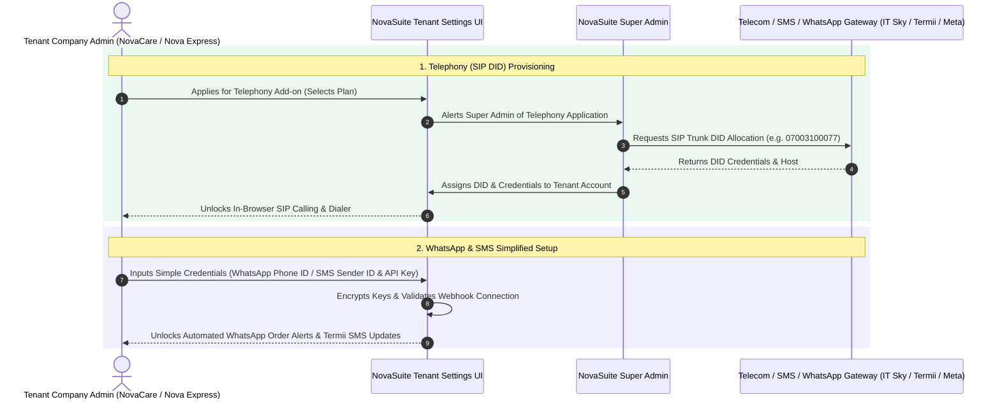

# Telephony, WhatsApp & SMS Add-on Provisioning Specification

This specification details how NovaSuite abstracts complex third-party telecom integrations so tenant companies can configure Telephony, WhatsApp Business API, and SMS Gateways with **simple non-technical inputs**.

---

## 📞 Integration Architecture

---

## 🛠️ Simplified Tenant Configuration Fields

### 1. Telephony Settings (SIP In-Browser Call Center)
- **Status Badge**: `Active (DID: 07003100077)`
- **Configuration Inputs**: Tenant simply toggles **Enable In-Browser SIP Calling**. All technical SIP hosts, ports, and credentials are automatically provisioned by NovaSuite Master Admins.

### 2. WhatsApp Business API Settings
- **Phone Number ID**: Non-technical ID field copied from Meta Developer Portal.
- **Permanent Access Token**: Secure input field for automated WhatsApp order confirmations.
- **Enabled Automated Templates**: Toggle templates for *Order Confirmed*, *Out for Delivery*, and *Delivered*.

### 3. SMS Gateway Settings (Termii / Africa's Talking)
- **SMS Sender ID**: Registered 11-character Sender Name (e.g. `NOVACARE`).
- **API Key**: API Key string copied from SMS provider.
- **Enabled Alerts**: Toggle automated SMS dispatch alerts to buyers.
