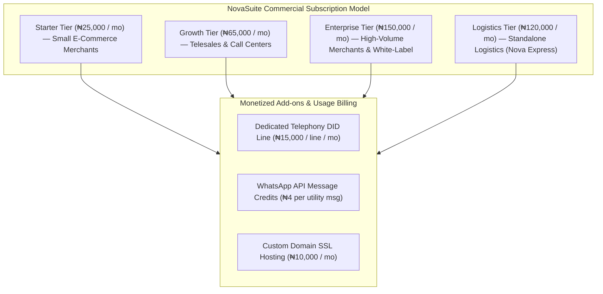

# Financials & Business Model: Subscription Tiers & SaaS Revenue Strategy

This document details the business model, pricing tiers, offer strategies, and financial monetization architecture for NovaSuite Enterprise SaaS.

---

## 💰 Subscription Tier Matrix

---

## 📊 Detailed Tier Specifications

| Feature / Module | Starter Tier (₦25k/mo) | Growth Tier (₦65k/mo) | Enterprise Tier (₦150k/mo) | Logistics Standalone (₦120k/mo) |
| :--- | :--- | :--- | :--- | :--- |
| **Target Audience** | Solo e-commerce sellers | Telesales call centers | High-scale e-commerce brands | Logistics firms (Nova Express) |
| **Monthly Orders Included** | Up to 500 orders/mo | Up to 2,500 orders/mo | Unlimited orders | Unlimited orders |
| **Sales Rep Seats** | Up to 3 Closers | Up to 15 Closers | Unlimited Closers | N/A (Fleet / Hub Staff) |
| **Landing Page Form Builder** | ✅ Included | ✅ Included | ✅ Included | N/A |
| **SIP Telephony Integration** | ❌ Add-on | ✅ Included (1 DID) | ✅ Included (3 DIDs) | ❌ Add-on |
| **Multi-Warehouse Stock Allocation** | Basic (1 Warehouse) | Multi-Warehouse (3 Hubs) | Unlimited Hubs | Central CDC Manager |
| **Logistics Suite (Circuit Centers)** | ❌ | ❌ | ✅ Included | ✅ Complete Suite |
| **Custom Domain & Branding** | ❌ NovaSuite Subdomain | ❌ NovaSuite Subdomain | ✅ Custom Subdomain + Logo | ✅ Custom Domain + Rider App |

---

## 🚀 Marketing & Trial Strategy (NovaCare Initial Pilot)

1. **Initial Pilot Phase (NovaCare & Nova Express Test)**:
   - NovaCare and Nova Express onboard selected staff onto NovaSuite as pilot users.
   - Objective: Eliminate Pangea CRM's 70 lost orders daily (saving **₦350,000 daily**).
   - Once efficiency and 100% order traceability are proven, NovaCare and Nova Express transition into paying Enterprise/Logistics subscribers.

2. **Public SaaS Onboarding**:
   - 14-Day Free Trial for E-Commerce merchants.
   - Self-service credit card / Flutterwave / Paystack subscription billing.
