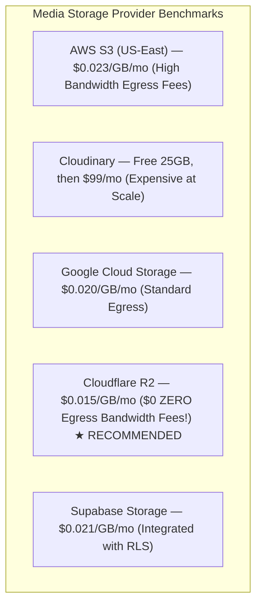
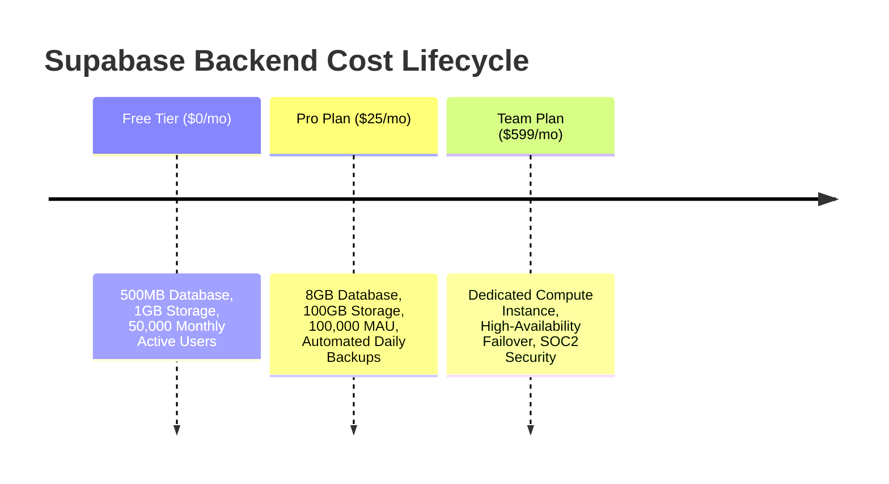

# Infrastructure Cost Benchmarks & Scalable Hosting Comparison

This document provides a financial evaluation of cloud hosting options for static web files, media storage (call audio recordings, product images, POD proof-of-delivery photos), domain names, and database backends, designed to **scale cost linearly with user growth** without massive upfront server overhead.

---

## ☁️ Media & Static Storage Host Comparison

### Comparative Matrix for Audio Call Recordings & POD Photos:

| Provider | Storage Cost / GB | Egress Bandwidth Cost | SSL & CDN Included | Recommendation |
| :--- | :--- | :--- | :--- | :--- |
| **Cloudflare R2** | **$0.015 / GB / mo** | **$0.00 (FREE Zero Egress!)** | ✅ Free Global CDN | 🥇 **RECOMMENDED FOR MEDIA** (Call Recordings & Rider Photos) |
| **Supabase Storage** | $0.021 / GB / mo | $0.09 / GB | ✅ Integrated RLS | 🥈 **RECOMMENDED FOR APP ASSETS** |
| **AWS S3** | $0.023 / GB / mo | $0.09 / GB | ❌ Requires CloudFront | 🥉 Complex setup & bandwidth fees |
| **Cloudinary** | Free 25GB | $99/mo after limit | ✅ Included | ❌ Too expensive for high-volume call audio |

---

## 🛢️ Backend & Database Pricing Scale (Supabase Cloud)

Supabase scales linearly with user growth:

| Scale Stage | Active Companies / Users | Database Size | Est. Monthly Supabase Cost | Est. Media Cost (Cloudflare R2) | Total Infrastructure |
| :--- | :--- | :--- | :--- | :--- | :--- |
| **Stage 1: Launch & Pilot (NovaCare + NovaExpress)** | 2 Companies / 50 Users | 2 GB DB | **$25 / mo (Pro Plan)** | **$0.00 / mo** (Under 10GB R2 Free Tier) | **~$25 / mo (~₦37,500/mo)** |
| **Stage 2: Growth (50 E-Commerce + 10 Logistics)** | 60 Companies / 500 Users | 15 GB DB | **$45 / mo** (Pro + Compute) | **$3.00 / mo** (200GB Audio/Photos) | **~$48 / mo (~₦72,000/mo)** |
| **Stage 3: Scale (500 Companies / 5,000 Users)** | 500 Companies / 5,000 Users | 100 GB DB | **$210 / mo** | **$15.00 / mo** (1TB Audio/Photos) | **~$225 / mo (~₦337,500/mo)** |

---

## 🌐 Web Hosting & Domain Name Costs

| Asset / Service | Vendor | Annual Cost (USD) | Annual Cost (NGN @ ₦1,500/$) |
| :--- | :--- | :--- | :--- |
| **Primary Domain (`novasuit.com`)** | Namecheap / Porkbun | $12.00 / yr | ~₦18,000 / yr |
| **Static Web App Hosting** | Vercel / Netlify / Cloudflare Pages | **$0.00 (Free Tier)** | **₦0.00 (FREE)** |
| **SSL Certificates** | Let's Encrypt / Cloudflare | **$0.00 (FREE)** | **₦0.00 (FREE)** |
| **Total Initial Infrastructure Outlay** | | **~$37.00 / initial month** | **~₦55,500 initial month** |

---

## 💡 Financial Scaling Summary
By combining **Vercel/Cloudflare Pages (Free Web Hosting)** + **Cloudflare R2 (Free Egress Media Storage)** + **Supabase Pro Plan ($25/mo)**, NovaSuite can launch its entire pilot for **less than ₦56,000 initial monthly cost**, while generating **₦270,000+ monthly SaaS revenue** from its first 2 Enterprise customers alone!
