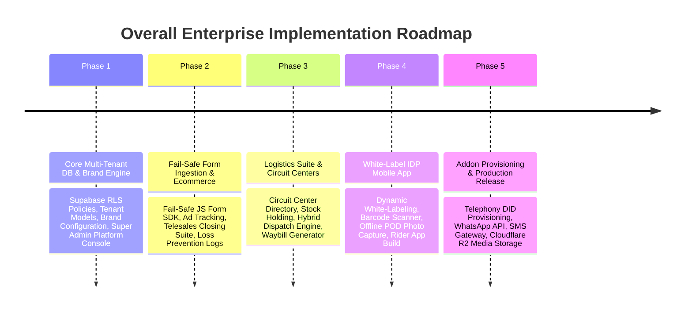

# Overall Enterprise Implementation Phases & Milestones

This document specifies the step-by-step technical implementation phases for building out the entire NovaSuite Multi-Tenant Enterprise Platform.

---

## Master Implementation Timeline

---

## 📅 Detailed Phase Breakdown

### Phase 1: Core Multi-Tenant Database & Brand Personalization Engine
- **Supabase RLS Schema**: Add `company_type` (`ECOMMERCE` vs `LOGISTICS`), branding JSON, and subdomains to `companies` table. Enforce strict RLS policies across all tables (`orders`, `inventory`, `circuit_centers`).
- **Dynamic Brand Provider**: Build `TenantBrandProvider` in `packages/novasuite_core` that dynamically applies company logos, primary/secondary colors, and custom subdomains across Web, Desktop, and Mobile UI.
- **Super Admin Console**: Build company onboarding modal, custom domain router, and subscription management UI.

### Phase 2: Fail-Safe Landing Page Form Ingestion & E-Commerce Suite
- **Fail-Safe Form SDK**: Build lightweight `form-guard.js` script with local storage offline retry queues to guarantee **0 lost orders**.
- **Ad ROI Tracker**: Integrate `utm_source`, `utm_campaign`, and cost-per-order analytics in Marketing Dashboard.
- **Telesales Suite Refinement**: Auto-allocate leads to Closers via round-robin with integrated SIP dialer and product scripts.

### Phase 3: Logistics Suite & Circuit Center Network (Nova Express)
- **Circuit Center Directory**: UI for creating and managing Collation & Distribution Centers (CDCs) across states in Nigeria.
- **Hybrid Order Dispatch Engine**: Geofenced automatic rider assignment and manual dispatcher override console.
- **Barcoded Waybill Generator**: PDF & Thermal Print waybill generator (`#NX-WAYBILL-XXXX`).

### Phase 4: White-Labeled IDP Mobile App & Last-Mile Delivery
- **White-Label Flutter Mobile App**: Mobile app for delivery riders that dynamically loads tenant branding (e.g. Nova Express logo & colors).
- **Rider Workflow**: GPS navigation, camera barcode scanner, offline Proof of Delivery (POD) capture, and COD cash reconciliation.

### Phase 5: Add-on Provisioning & Production Cloud Deployment
- **Telecom & WhatsApp Provisioning**: Super Admin UI for assigning SIP DIDs, WhatsApp API keys, and Termii SMS sender IDs.
- **Cloudflare R2 Storage Integration**: Configure Cloudflare R2 bucket for zero-egress audio call recording and POD photo storage.
- **Release Compilation**: Execute `build_release.ps1` for Web, Android APK, and Windows EXE.

---

## Verification & Code Quality Standards

1. **Inline Technical Documentation**: Every file in `packages/novasuite_core` and `apps/novasuite_admin` must contain JSDoc/DartDoc comments explaining parameters and failure modes.
2. **Static Analysis**: `flutter analyze` must pass with **0 Errors, 0 Warnings** at the conclusion of every phase.
3. **Automated Unit Tests**: Unit tests covering RLS isolation, HMAC signature generation, and stock deduction algorithms.
