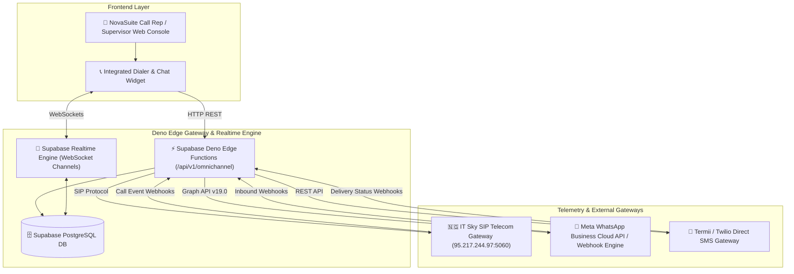
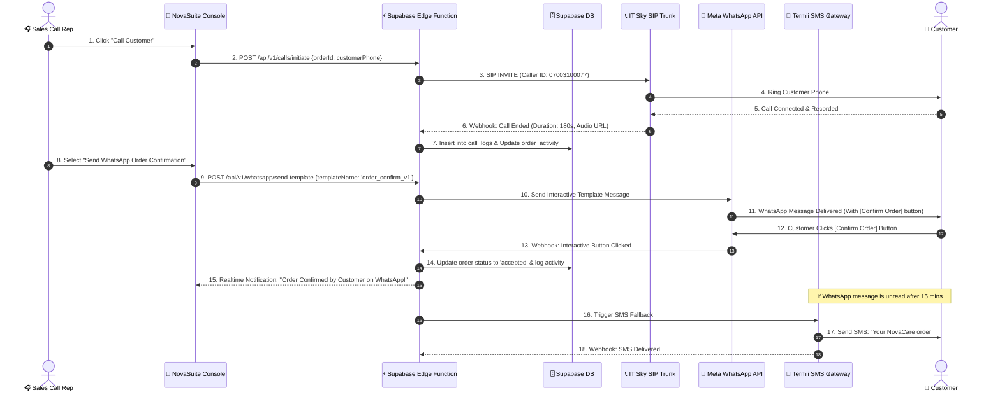
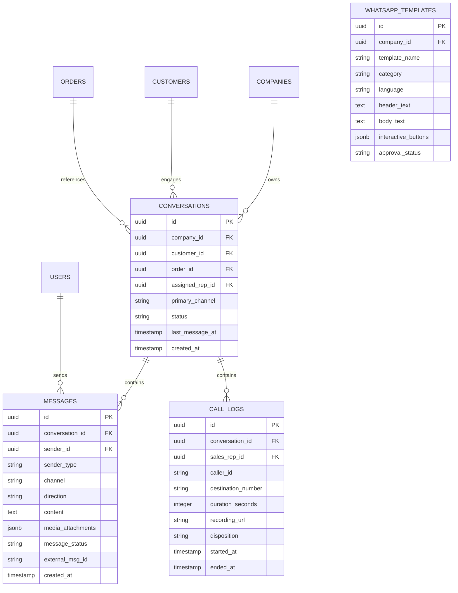

# NovaSuite Omnichannel Sales Communication Hub Architecture & Feasibility Guide

## Executive Summary & Feasibility Assessment

To maximize sales conversion, minimize Cash-on-Delivery (COD) rejection rates, and streamline customer follow-ups, **NovaSuite** is expanding its sales rep communication channels from single-channel VoIP calling (IT Sky SIP Interconnect) into an **Integrated Omnichannel Communication Hub**.

This architecture unifies **VoIP Calls (ITSky)**, **WhatsApp Business Cloud API**, and **SMS Text Messaging** directly inside the Sales Call Rep & Supervisor Console.

---

### Feasibility Matrix

| Communication Channel | Technical Stack / Vendor | Primary Use Cases | Delivery Guarantee & Latency | Cost Impact | Feasibility Rating |
| :--- | :--- | :--- | :--- | :--- | :--- |
| **Voice Calls** | **IT Sky SIP Trunk** (`95.217.244.97:5060`) | Initial order confirmation, high-touch sales negotiation, upsell pitching | Sub-second latency, 99.9% uptime via dedicated E1/SIP trunk | Flat per-minute VoIP trunk rates | **High (Already Integrated)** |
| **WhatsApp Business** | **Meta WhatsApp Business Cloud API / Termii BSP** | Sending waybill tracking, product usage guides, payment receipts, interactive order confirmations | Real-time (<500ms webhook delivery), 98%+ open rate | ~$0.015 - $0.035 / conversation (Meta 24-hr window) | **Very High (Recommended Next Step)** |
| **SMS Messaging** | **Termii / Twilio / Africa's Talking** | Delivery alerts, fallback notifications when customer is offline or internet is disconnected | High delivery rate via direct carrier routes (MTN, Airtel, Glo, 9mobile) | ~$0.005 / SMS | **High (Easy Integration)** |

---

## 📊 Competitor Landscape & Benchmarking

| Feature / Capability | HubSpot Sales Hub | Salesforce Digital Engagement | respond.io / Trengo | Freshsales Omnichannel | **NovaCare CRM (NovaSuite)** |
| :--- | :--- | :--- | :--- | :--- | :--- |
| **VoIP / Telephony** | Integrated (Twilio/Aircall) | Service Cloud Voice | ❌ Third-party plugin | Freshcaller | **Native IT Sky Direct SIP Interconnect** |
| **WhatsApp Business API** | Twilio integration | Native / Meta Cloud API | Native WhatsApp Cloud API | Native | **Native Meta Cloud API & Local BSP (Termii)** |
| **SMS Gateway** | App Marketplace Add-on | MobileConnect SMS | Native SMS | Native | **Integrated West Africa Carrier Route (Termii/Twilio)** |
| **COD E-Commerce Integration** | Generic Custom Fields | Custom Objects | Basic Webhooks | Basic Custom Fields | **Deep Integration (COD Holding, Rider Dispatches, Multi-Tier Commissions)** |
| **Interactive Order Buttons** | ❌ Manual Link | Complex Flow Builder | Basic Quick Replies | ❌ Manual Link | **Native Interactive WhatsApp Buttons (`[Confirm]`, `[Reschedule]`)** |
| **Unified Timeline** | Yes | Yes | Yes | Yes | **Yes (Calls + Recordings + WhatsApp Chat + SMS in 1 View)** |

---

## 🏗️ High-Level System Architecture

The following diagram illustrates how incoming and outgoing voice, WhatsApp, and SMS communications are orchestrated across NovaSuite Deno Edge Functions, Supabase Realtime DB, and External Telecom Gateways:

---

## 🔄 Multi-Channel Communication Handshake Sequence

This sequence diagram depicts how a Sales Call Rep initiates a multi-channel interaction (Call ➔ WhatsApp Confirmation ➔ SMS Fallback) for an assigned order:

---

## 🗄️ Omnichannel Database Schema & Entity Relationships

---

## 💡 Recommended Implementation Roadmap

### Phase 1: Meta WhatsApp Business Cloud API & Webhooks Setup
- Register NovaCare Meta Developer App & WhatsApp Business Account (WABA).
- Configure Webhook Endpoint in Supabase Edge Functions (`/supabase/functions/whatsapp-webhook/index.ts`).
- Define initial approved WhatsApp Templates (`order_confirmation`, `delivery_tracking`, `payment_reminder`).

### Phase 2: Database Migration & Supabase Realtime Engine
- Create database migration `add_omnichannel_messaging_tables.sql` (`conversations`, `messages`, `call_logs`, `whatsapp_templates`).
- Enable Supabase Realtime publication on `messages` table for instant sub-second chat updates in the Flutter UI.

### Phase 3: Integrated Omnichannel Flutter Suite
- Build `OmnichannelChatWidget` inside `SalesCallCenterSuitePage`.
- Unify Voice Calls, WhatsApp Chat, Voice Notes, Image Attachments, and SMS into a single conversation timeline tab.
