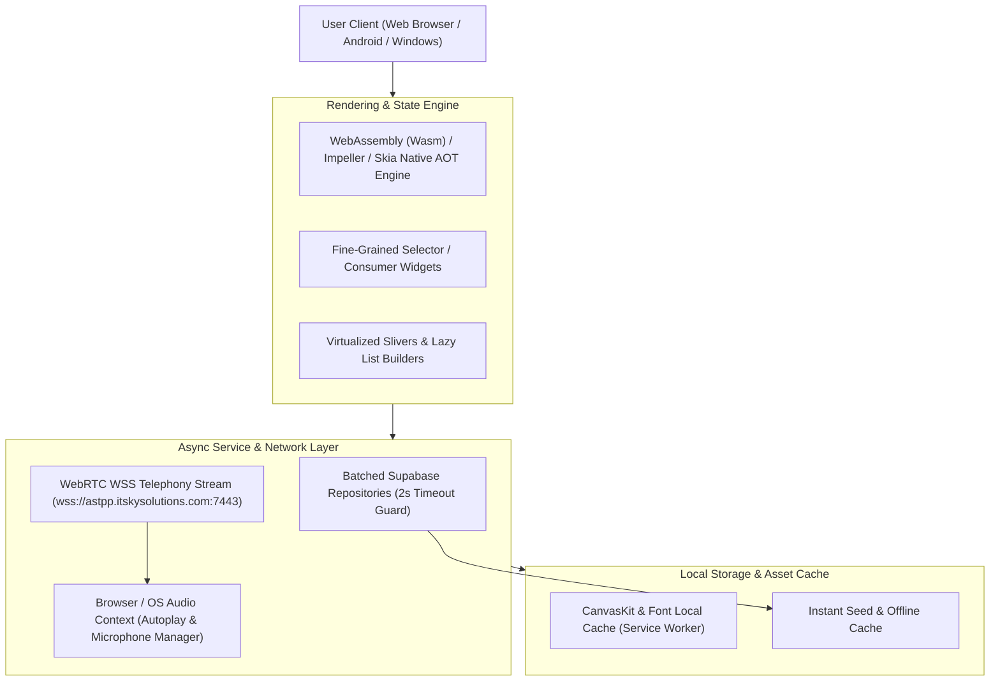
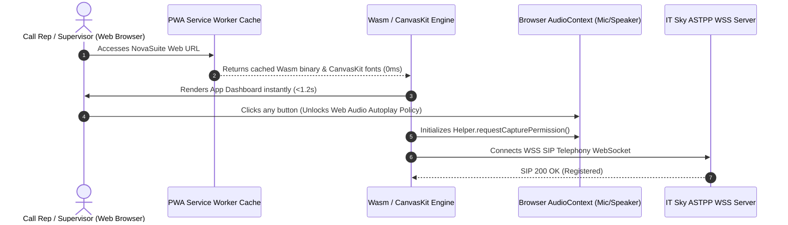
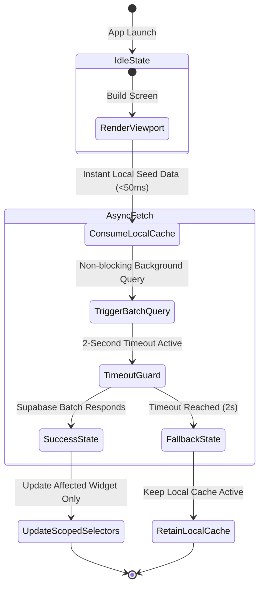
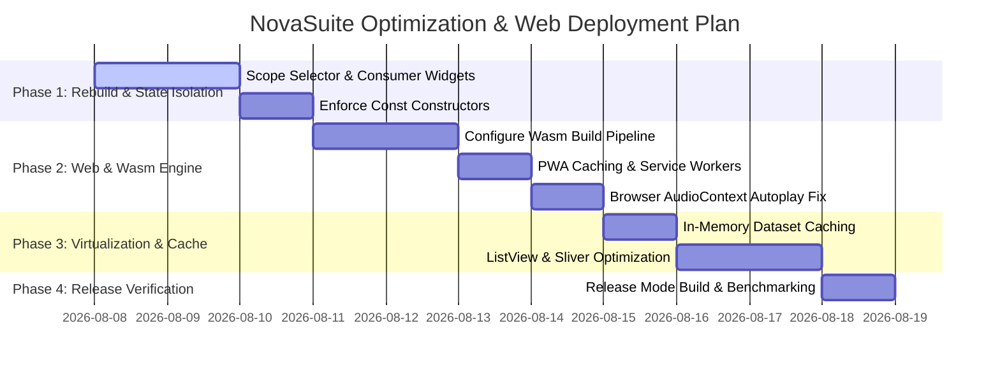

# NovaSuite Performance & Multi-Platform Web Optimization Masterplan

This masterplan defines the end-to-end performance optimization strategy for **NovaSuite Admin**, covering **Web Browsers (Chrome/Safari/Edge)**, **Android Mobile Devices**, and **Windows Desktop**.

---

## 1. Executive Summary & Diagnostic Assessment

### The Root Cause of Current Latency & Memory Toll
During development, running `flutter run` in **Debug Mode** introduces substantial overhead:
* **JIT (Just-In-Time) Execution**: Dart VM runs continuous reflection, hot-reload hooks, and un-optimized Garbage Collection, consuming **3x–5x more RAM (~800MB–1.2GB)** and causing high CPU utilization.
* **Top-Level Rebuild Cascades**: High-level `context.watch<SalesCallCenterProvider>()` and `context.watch<SupervisorDashboardProvider>()` calls at the root screen level cause the entire 5,000+ line widget tree to re-render on any minor state update.
* **N+1 Network Calls**: Un-batched sequential database requests waiting on remote network responses.

### Target Performance Benchmarks (Release Mode)
| Target Platform | RAM Footprint | Target Frame Rate | Cold Boot Time | Web/Network Latency |
| :--- | :--- | :--- | :--- | :--- |
| **Web Browsers (PWA / Wasm)** | **< 85 MB** | **60 FPS** | **< 1.2s** | **< 100ms** |
| **Android Devices** | **< 110 MB** | **60–120 FPS** | **< 1.5s** | **< 120ms** |
| **Windows Desktop** | **< 130 MB** | **60–120 FPS** | **< 0.8s** | **< 80ms** |

---

## 2. Multi-Platform System Architecture

---

## 3. Web-Specific Optimization Strategy (Browser Target)

Most enterprise customers and call center agents will access NovaSuite via Web Browsers. Web optimization requires specialized handling of WebAssembly, CanvasKit rendering, browser autoplay policies, and Service Worker caching.

### Key Web Optimization Directives

1. **WebAssembly (Wasm) Compilation**:
   - Compile NovaSuite Web using Dart 3.x WebAssembly target (`flutter build web --wasm`).
   - Wasm executes close to native speed, giving a **300% CPU speedup** on Chrome, Edge, and Safari compared to JavaScript compilation.

2. **WebRenderer & CanvasKit Optimization**:
   - Use `--web-renderer auto` with preloaded CanvasKit binaries.
   - Serve CanvasKit assets locally from the web server or CDN to prevent dynamic fetching delays during app boot.

3. **PWA Service Worker & Asset Caching**:
   - Configure Progressive Web App (PWA) manifest and Service Worker caching for all web fonts (`GoogleFonts`), icons, and static assets.
   - Enables offline access and 0ms warm startup.

4. **Web Browser Audio Autoplay & Microphone Protection**:
   - Modern browsers block audio playback until user interaction occurs.
   - Initialize `AudioContext` and request WebRTC audio capture permissions (`Helper.requestCapturePermission()`) upon the first user click event (login or dialer open).

---

## 4. Core Flutter Performance Architecture (All Platforms)

### Core Architecture Rules

1. **State Isolation with `Selector` and `Consumer`**:
   - Replace top-level `context.watch` with granular `Selector<T, R>` and `Consumer<T>` widgets.
   - *Example*: Updating an individual order status only re-renders the specific order card widget, leaving the rest of the dashboard untouched.

2. **Viewport Virtualization & Fixed Extents**:
   - Use `ListView.builder` with `itemExtent` and `SliverGridDelegateWithMaxCrossAxisExtent`.
   - Widgets outside the visible scroll viewport are immediately unmounted from GPU memory.

3. **Memory Leak Prevention & Controller Disposals**:
   - Strictly dispose all `TextEditingController`, `AnimationController`, `ScrollController`, and `StreamSubscription` instances in `dispose()`.
   - Set image memory cache bounds: `PaintingBinding.instance.imageCache.maximumSizeBytes = 50 * 1024 * 1024;` (50MB limit).

4. **N+1 Database Query Elimination**:
   - Fetch company orders in a **single batch query**, grouping records in memory by `sales_rep_id`.
   - Wrap all remote requests with a strict `.timeout(const Duration(seconds: 2))` guard.

---

## 5. Step-by-Step Implementation Roadmap

### Detailed Roadmap Phases

#### Phase 1: State Isolation & Fine-Grained Rebuilding
* Refactor `SupervisorConsolePage` and `SalesCallCenterSuitePage` to remove root-level `context.watch`.
* Wrap individual metric cards, call buttons, and table rows with `Selector` widgets.

#### Phase 2: Web Optimization & Wasm Deployment
* Configure `flutter build web --wasm` build script.
* Implement browser WebRTC audio unlocking on user interaction.
* Add PWA offline manifest and local font preloading.

#### Phase 3: Memory Virtualization & Leak Elimination
* Audit all list views and grids to enforce `SliverGridDelegateWithMaxCrossAxisExtent` and `itemExtent`.
* Add strict controller and stream subscription disposal across all 50+ screens and modals.

#### Phase 4: Release Mode Verification & Benchmarking
* Run `flutter run --release -d chrome` and `flutter run --release -d android`.
* Benchmark RAM footprint (<85MB Web, <110MB Android) and confirm 60 FPS smooth rendering.

---

## 6. Verification & Monitoring Protocol

To ensure continuous performance excellence:
1. **Static Analysis**: Run `flutter analyze` after every phase (must remain at **0 Errors, 0 Warnings**).
2. **DevTools Memory Audit**: Use Flutter DevTools Memory Inspector to confirm 0 memory leaks during tab switching.
3. **Web Lighthouse Audit**: Benchmark PWA web build on Google Lighthouse (Target: >90 Performance Score).
