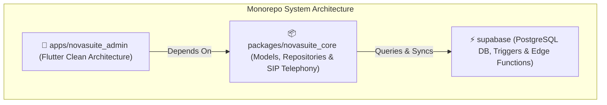
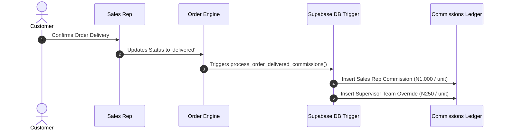
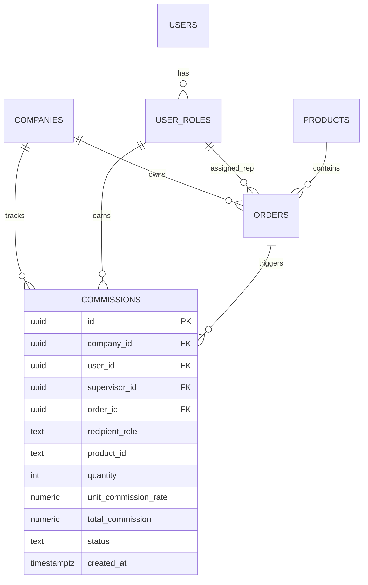
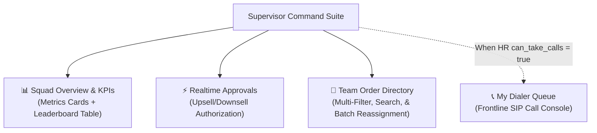

# 🚀 NOVASUITE PROJECT CONTEXT & ARCHITECTURE HIGHLIGHTS

> **Purpose**: Complete context handoff document summarizing the architectural decisions, database schemas, feature implementations, domain rules, and current state for seamless context transfer.

---

## 📌 1. Project Overview & Repository Structure

- **Repository Root**: `c:\PROJECT\novasuite`
- **GitHub Remote**: `https://github.com/odufu/NovaSuit.git` (`main` branch)
- **Monorepo Architecture**:
  - `packages/novasuite_core`: Shared models, repositories, theme tokens, Supabase client configuration, SIP VoIP telephony engine.
  - `apps/novasuite_admin`: Flutter web/mobile/desktop admin application using Feature-First Clean Architecture.
  - `supabase/`: SQL migrations (`supabase/migrations/`) and Deno/TypeScript Edge Functions (`supabase/functions/`).

---

## ⚙️ 2. Core Domain Rules & Business Logic

1. **Product Licensing & Auto-Assignment**:
   - Automatic round-robin lead distribution is strictly per-product.
   - Supervisors manage product licenses per supervisee via the **Agent Profile Modal** (`AgentProfileModal`). Only products assigned/licensed to a call rep will be dispatched to them.
2. **Commissions Engine**:
   - **Sales Rep Commissions**: Earned per delivered product unit (default: ₦1,000.00 / unit).
   - **Team Leader (Supervisor) Override Commissions**: Supervisors earn an override commission calculated cumulatively on all delivered products across their squad team (default: ₦250.00 / unit).
   - **Database & Edge Function Integration**: Managed via Supabase trigger `process_order_delivered_commissions()` and Deno Edge Function `calculate-commissions`.
3. **Daily Operational Report Standards (Monday 27th July, 2026 Baseline)**:
   - **35 Total Assigned**
   - **21 Confirmed**
   - **17 Delivered** (6 yet to be tagged on CRM)
   - **15 Delivered Today / 2 Previous Days**
   - **7 Rescheduled**
   - **6 In Progress**
   - **2 Switched Off**
   - **4 Not Picking / Unanswered**
   - **0 Cancelled**
   - **1 Not Ready / Pending**

---

## 🗄️ 3. Database Schema & Migration Log

| Migration File | Key Tables & Changes |
| :--- | :--- |
| `20260731000000_seed_supervisor_squad_report_data.sql` | Adds `crm_tagged` (BOOLEAN) to `orders`, `assigned_products` (TEXT[]) to `user_roles`, and seeds the 35 July 27 operational report orders into Supabase. |
| `20260731000001_add_commissions_system.sql` | Adds `commissions` ledger table, `rep_commission_per_unit` (₦1,000) & `supervisor_commission_per_unit` (₦250) on `products`, `supervisor_id` mapping on `user_roles`, and `process_order_delivered_commissions()` trigger. |

---

## 💻 4. Key UI Features & Component Reference

### 1. Collapsible Left Side Navigation (`AdminMainShell` in `main.dart`)
- Width: `74px` (collapsed) ↔ `260px` (expanded).
- Top header tabs removed; sub-navigation items driven from left sidebar under `SUPERVISOR COMMAND SUITE`:
  - `Squad Overview & KPIs` (Integrated Daily Operational Summary cards + Live Supervisee Leaderboard)
  - `Realtime Approvals` (Upsell/Downsell authorization queue & cancellation reviews)
  - `Team Order Directory` (Search, multi-filter, & 1-click batch lead reassignment suite)
  - `My Dialer Queue` (Conditional personal call console active when HR `can_take_calls = true`)

### 2. Responsive Leaderboard Table (`SupervisorKpiDashboardTab`)
- **Location**: `apps/novasuite_admin/lib/features/sales_supervisor/presentation/widgets/supervisor_kpi_dashboard_tab.dart`
- **Features**:
  - **No Overflows**: Wrapped in `LayoutBuilder` ➔ `SingleChildScrollView(scrollDirection: Axis.horizontal)` ➔ `ConstrainedBox`.
  - **Text Truncation**: Rep names, emails, and badges use `TextOverflow.ellipsis`.
  - **Clean Header Row**: Text-only uppercase labels without clutter (`AGENT`, `ASSIGNED`, `CONFIRMED`, `DELIVERED`, `TODAY/PREV`, `RESCHEDULED`, `IN-PROGRESS`, `SWITCHED-OFF`, `UNANSWERED`, `CANCELLED`, `PENDING`, `ACTION`).
  - **In-Row Top Performer**: Top rep highlighted directly in table rows with a 👑 Crown badge and gold/emerald gradient background (`0xFF1E3A2B`).
  - **Toolbar Controls Bar**: Search field, Product dropdown filter (`All Products`, `Grazer Detox`, `Vitality Booster`, `Clear Skin`), Timeframe selector (`Daily`, `Weekly`, `Monthly`), and `Cards` ↔ `Table` view mode switcher.

### 3. Agent Profile Modal (`AgentProfileModal`)
- **Location**: `apps/novasuite_admin/lib/features/sales_supervisor/presentation/widgets/agent_profile_modal.dart`
- **Features**:
  - Full mobile responsiveness across mobile (< 650px), tablet, and desktop (0 overflow warnings).
  - Supervisor product license assignment toggle switches.
  - Lead capacity slider (5 to 50 leads) & Auto round-robin distribution toggle.
  - Metrics cards (Calls Made, Confirmed, Conv. Rate, COD Revenue, Commission Earned).
  - One-click lead reassignment trigger.

---

## 🧪 5. Verification & Code Quality Status

- `flutter analyze packages/novasuite_core`: **`No issues found!` (0 errors, 0 warnings)**
- `flutter analyze apps/novasuite_admin`: **`No issues found!` (0 errors, 0 warnings)**
- All changes committed and synced with GitHub `main` branch.
