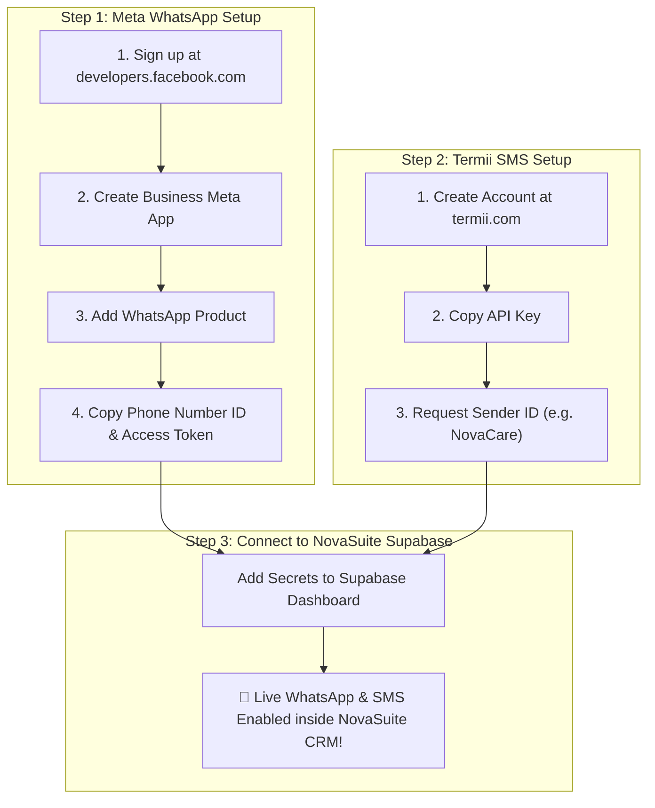
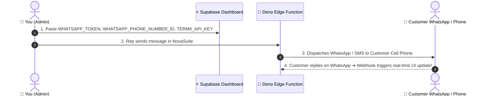

# Step-by-Step Guide: Setting Up Meta WhatsApp Cloud API & Termii SMS for NovaSuite

**Target Audience**: Business Owners & System Administrators (Beginner Friendly)  
**Estimated Time Needed**: 15–20 Minutes  

---

## 🗺️ High-Level Setup Overview

---

## 💬 PART 1: Meta WhatsApp Business Cloud API (Step-by-Step)

Meta allows you to send and receive WhatsApp messages directly via their official Cloud API. Here is how to create your account from scratch:

### Step 1.1: Create a Meta Developer Account
1. Open your web browser and go to: **[developers.facebook.com](https://developers.facebook.com/)**.
2. Click **Log In** in the top right corner and sign in with your Facebook account.
3. Once logged in, click **Get Started** or **My Apps** in the top navigation bar.
4. Follow the prompt to register as a Developer account (takes 1 minute).

---

### Step 1.2: Create a Meta App
1. Inside the Meta Developer Dashboard, click the green **Create App** button.
2. Under "What do you want your app to do?", select **Other** or **Business**, then click **Next**.
3. Select **Business** as the app type and click **Next**.
4. Fill in your details:
   - **App Name**: `NovaCare Communications`
   - **App Contact Email**: Your official email address
   - **Business Account**: Select your Meta Business Account if you have one (or leave default).
5. Click **Create App** and enter your Facebook password when prompted.

---

### Step 1.3: Add WhatsApp to Your App
1. You will be taken to the **Add Products to Your App** page.
2. Scroll down until you see **WhatsApp**, then click **Setup**.
3. Under the WhatsApp setup screen, click **Continue**.

---

### Step 1.4: Get Your Temporary Access Token & Phone Number ID
1. On the left sidebar, navigate to **WhatsApp** ➔ **API Setup**.
2. Under **Step 1: Select phone numbers**:
   - You will see a **Temporary Access Token** (copy this string).
   - You will see a **Phone Number ID** (e.g., `105938472615482`) — **Copy this ID**.
   - You will see a **WhatsApp Business Account ID** — **Copy this ID**.
3. Under **Step 2: Send and receive messages**:
   - Enter your own personal phone number to test sending a test message!
   - Click **Send Code**, enter the verification OTP, and click **Send Message**. You will receive a WhatsApp message from Meta on your phone!

---

### Step 1.5: Set Up Webhook (To Receive Customer Replies)
1. On the left sidebar under WhatsApp, click **Configuration**.
2. Under **Webhooks**, click **Edit**.
3. Enter the following details:
   - **Callback URL**: `https://<your-supabase-project-ref>.supabase.co/functions/v1/omnichannel-messaging/webhook`
   - **Verify Token**: `novacare_whatsapp_verify_token`
4. Click **Verify and Save**.
5. Under **Webhook fields**, click **Manage**, and check the box for **`messages`**, then click **Done**.

---

## 📱 PART 2: Termii SMS Gateway (Step-by-Step for Nigeria & West Africa)

Termii powers SMS notifications across MTN, Airtel, Glo, and 9mobile in Nigeria.

### Step 2.1: Register on Termii
1. Go to **[termii.com](https://termii.com/)**.
2. Click **Create Account** / **Sign Up**.
3. Enter your Business Name (`NovaCare`), official email, and phone number.
4. Verify your email address via the OTP sent to your inbox.

---

### Step 2.2: Copy Your Termii API Key
1. Log into your Termii Dashboard at [dashboard.termii.com](https://dashboard.termii.com/).
2. On the left sidebar menu, click **Settings** ➔ **API Keys**.
3. Copy your **API Key** (e.g., `TLx9483750291847562019`).

---

### Step 2.3: Request a Custom Sender ID (e.g., "NovaCare")
1. On the left sidebar menu, click **Sender ID**.
2. Click **Request Sender ID**.
3. Enter `NovaCare` as your preferred brand name.
4. Click **Submit**. (Approval takes ~1-2 hours).

---

## 🔐 PART 3: Storing Keys in Supabase Dashboard (Final Step)

Now that you have your keys, let's paste them into Supabase so NovaSuite can use them automatically:

### Steps to Paste Secrets in Supabase:
1. Open your browser and go to your **[Supabase Dashboard](https://supabase.com/dashboard)**.
2. Select your **NovaSuite Project**.
3. On the left menu, go to **Project Settings** (Gear icon) ➔ **Edge Functions**.
4. Click **Add New Secret** and add the following 3 entries:

| Secret Name | Value to Paste |
| :--- | :--- |
| **`WHATSAPP_TOKEN`** | Paste your Meta Temporary/Permanent Access Token |
| **`WHATSAPP_PHONE_NUMBER_ID`** | Paste your Meta Phone Number ID (e.g. `105938472615482`) |
| **`TERMII_API_KEY`** | Paste your Termii API Key |

5. Click **Save Secrets**.

---

## 🎉 PART 4: Testing inside NovaSuite Web CRM

1. Open **NovaSuite Web CRM** (`apps/novasuite_admin`).
2. Go to **Sales Call Center Suite**.
3. Find any customer order and click **`WhatsApp 💬`** or **`Omnichannel Timeline`**.
4. Type a message or click **`Templates` ➔ `Send Order Confirmation`**.
5. The message will be dispatched live to the customer's WhatsApp account, and their replies will stream in real time on the timeline!
