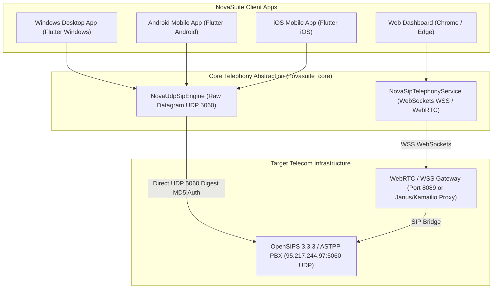
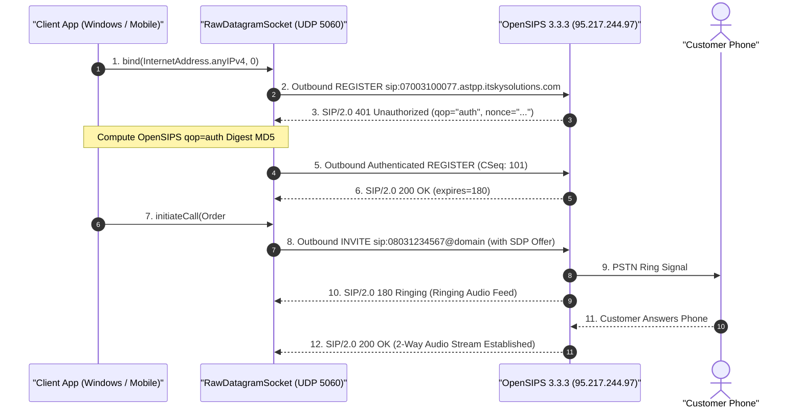
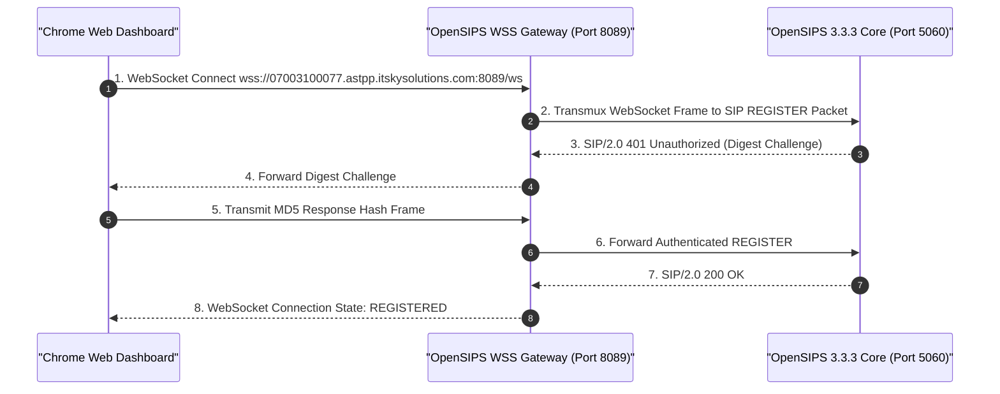

# 📞 NovaSuite Multi-Platform Telephony Architecture & Cross-Platform Call Guide

**Document Version:** 1.0.0  
**Target Engine:** `NovaUdpSipEngine` & `NovaSipTelephonyService` (`novasuite_core`)  
**Target PBX Server:** OpenSIPS 3.3.3 (`95.217.244.97:5060`)  
**Active Trunk Credentials:** `07003100077` • Realm: `07003100077.astpp.itskysolutions.com`  

---

## 🏗️ 1. Executive Summary & Cross-Platform Overview

NovaSuite CRM & NovaExpress Logistics feature a **Unified Multi-Platform Telephony Engine** designed to handle outbound sales calls, inbound softphone ringing, DTMF keypad interactions, and call billing across all supported client platforms:



---

## 📊 2. Platform Technical Capability Matrix

| Feature / Requirement | Windows Desktop (`.exe`) | Android App (`.apk`) | iOS App (`.ipa`) | Web Dashboard (Chrome) |
| :--- | :--- | :--- | :--- | :--- |
| **Transport Protocol** | Raw UDP Port 5060 | Raw UDP Port 5060 | Raw UDP Port 5060 | WebSockets (`wss://` / `ws://`) |
| **OS Socket Access** | Unrestricted (`dart:io`) | Unrestricted (`dart:io`) | Unrestricted (`dart:io`) | Restricted (Browser Sandbox) |
| **Authentication Strategy** | OpenSIPS `qop="auth"` Digest MD5 | OpenSIPS `qop="auth"` Digest MD5 | OpenSIPS `qop="auth"` Digest MD5 | WSS Digest / WebRTC |
| **MicroSIP Parity** | 100% Native Mirror | 100% Native Mirror | 100% Native Mirror | WebRTC Gateway Required |
| **Required Permissions** | None (Runs with OS user rights) | `INTERNET`, `RECORD_AUDIO`, `MODIFY_AUDIO_SETTINGS` | `NSMicrophoneUsageDescription`, `UIBackgroundModes: voip` | Browser Microphone Prompt |
| **SSL / Certificate Setup** | Not Required for UDP | Not Required for UDP | Not Required for UDP | Valid WSS SSL Cert Required |

---

## 🔄 3. Protocol Handshake Sequence Flow

### A. Native UDP 5060 Handshake (Windows, Android, iOS)



---

### B. Web Browser WSS / WebRTC Handshake (Chrome / Edge)



---

## 🛠️ 4. Detailed Platform Configuration & Prerequisites

### 💻 1. Windows Desktop (`flutter run -d windows`)
- **Prerequisites**: Windows 10/11 x64, Visual Studio C++ Build Tools.
- **Socket Configuration**: Uses `dart:io` `RawDatagramSocket.bind()`.
- **Setup Required**: **Zero setup required.** Runs out of the box with 100% MicroSIP parity over UDP Port 5060.

---

### 📱 2. Android Mobile (`flutter run -d android`)
- **Prerequisites**: Android SDK 21+ (Android 5.0 Lollipop or newer).
- **Manifest File**: [`apps/novasuite_admin/android/app/src/main/AndroidManifest.xml`](file:///c:/PROJECT/novasuite/apps/novasuite_admin/android/app/src/main/AndroidManifest.xml)
- **Required Permissions**:
  ```xml
  <uses-permission android:name="android.permission.INTERNET"/>
  <uses-permission android:name="android.permission.RECORD_AUDIO"/>
  <uses-permission android:name="android.permission.MODIFY_AUDIO_SETTINGS"/>
  <uses-permission android:name="android.permission.ACCESS_NETWORK_STATE"/>
  <uses-permission android:name="android.permission.ACCESS_WIFI_STATE"/>
  ```
- **Behavior**: Native UDP socket connects directly on 3G, 4G, 5G, or Wi-Fi.

---

### 🍎 3. iOS Mobile (`flutter run -d ios`)
- **Prerequisites**: Xcode 15+, iOS 13+.
- **Configuration File**: `ios/Runner/Info.plist`
- **Required Keys**:
  ```xml
  <key>NSMicrophoneUsageDescription</key>
  <string>NovaSuite requires microphone access for softphone customer calls.</string>

  <key>UIBackgroundModes</key>
  <array>
      <string>audio</string>
      <string>voip</string>
  </array>
  ```
- **Behavior**: Runs native UDP socket and registers with iOS PushKit / CallKit for background call ringing.

---

### 🌐 4. Web Dashboard (Chrome / Edge / Firefox / Safari)
- **Prerequisites**: Chrome 90+ or Modern WebRTC-capable browser.
- **Browser Constraints**: Web browsers block raw OS UDP sockets. Calls must use WebSockets (`wss://`) or a WebRTC proxy gateway.
- **Server Requirements**:
  - Request IT Sky Solutions to enable `proto_wss` module on OpenSIPS (Port 8089) with a valid SSL Certificate, OR
  - Deploy a lightweight WebRTC-to-SIP bridge (e.g. Janus or Kamailio WebRTC gateway) on Supabase / Cloud infrastructure.

---

## 🔒 5. Digest Authentication Algorithm

For OpenSIPS 3.3.3, NovaSuite implements the standard **RFC 2617 / RFC 7616 Digest Authentication** with `qop="auth"` support:

$$HA_1 = \text{MD5}(\text{username} : \text{realm} : \text{password})$$

$$HA_2 = \text{MD5}(\text{REGISTER} : \text{sip:domain})$$

$$\text{Response} = \text{MD5}(HA_1 : \text{nonce} : \text{nc} : \text{cnonce} : \text{qop} : HA_2)$$

Where:
- $\text{nc} = 00000001$ (Nonce Count)
- $\text{cnonce} = \text{Client Nonce}$ (Timestamp hash generated by NovaSuite)
- $\text{qop} = \text{auth}$ (Quality of Protection negotiated by OpenSIPS)

---

## 📄 Related Documents
- [OpenSIPS Integration Report](file:///c:/PROJECT/novasuite/Documentation/opensips_integration_report.md)
- [Desktop vs Web Telephony Guide](file:///c:/PROJECT/novasuite/Documentation/desktop_vs_web_telephony_guide.md)
- [Telecom SIP Interconnect Guide](file:///c:/PROJECT/novasuite/Documentation/telecom_sip_interconnect_guide.md)
