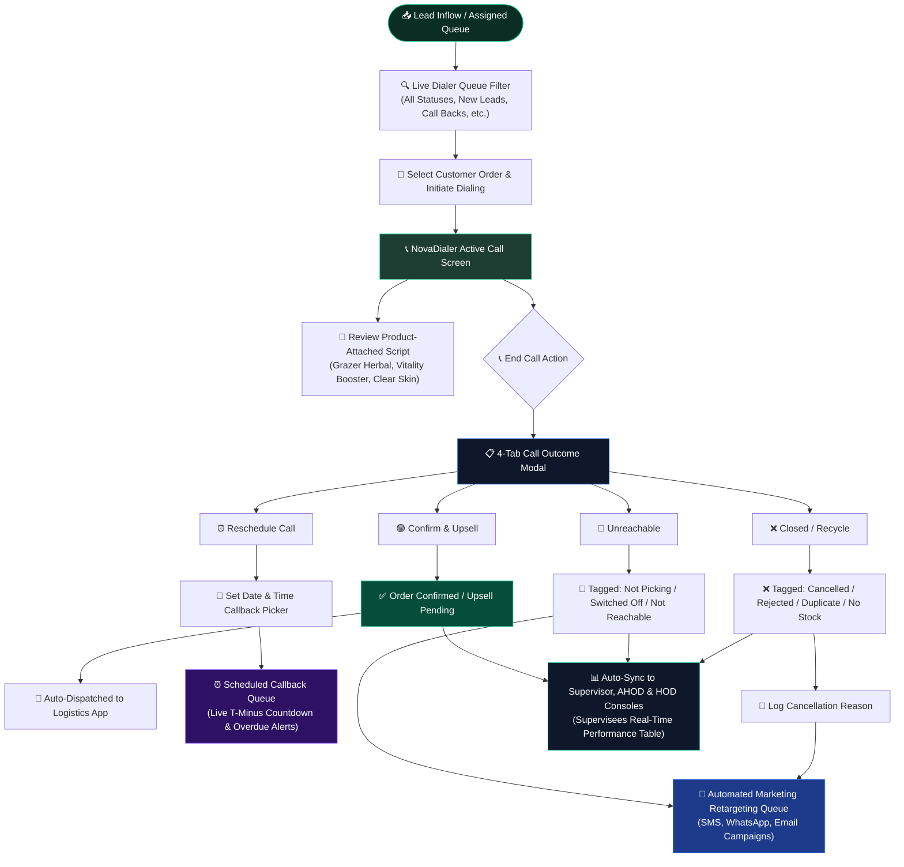
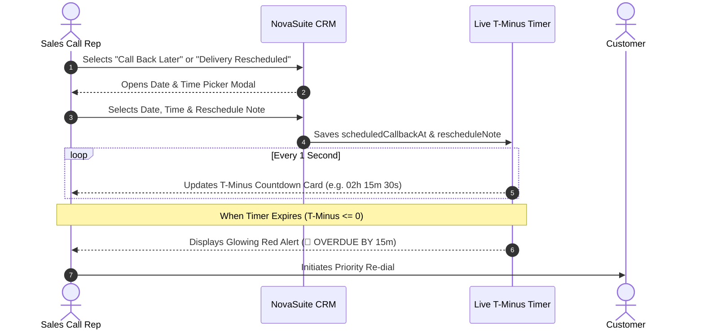
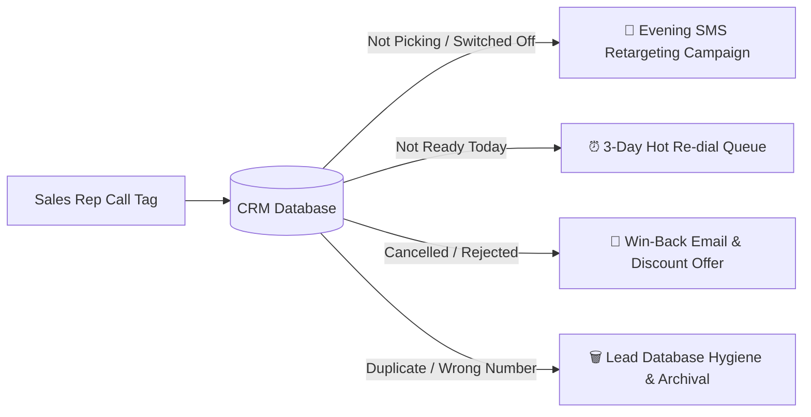

# NovaSuite Sales Call Rep Operational Workflow & Call Center Guide

This document outlines the complete operational workflow for **Sales Call Reps (Supervisees)** within NovaSuite’s Call Center & CRM Suite. It details the step-by-step lifecycle of lead processing, live call handling, 4-tab macro status tagging, automated callback timers, real-time organogram reporting, and marketing lead recycling hand-off.

---

## 1. End-to-End Call Rep Workflow Architecture

---

## 2. Core Call Console Components

### A. Live Call Queue & Status Filters
- Reps access their personal call queue featuring full search across Customer Name, Phone Number, State, and City.
- **Status Filter Bar**: Allows reps to filter their active leads by 28 precise status categories (e.g., `New Lead`, `Confirmed`, `Call Back`, `Not Picking`, `Switched Off`, `Delivery Rescheduled`, `Cancelled`, etc.).
- **Page Truncation Removed**: Displays all matching orders directly in a smooth scrollable list for instant access.

### B. Product-Attached Call Scripts
- Every assigned lead displays its specific product bundle value proposition:
  - **Grazer Herbal Detox**: Organic toxin flush, digestion aid, and daily vitality.
  - **Vitality Booster**: Maca Root & Ginseng stamina enhancer.
  - **Clear Skin Care**: Hydration, blemish clearing, and glowing skin.
- **Script Bar**: Floating interactive widget providing verified greetings, objection handling, and COD closing templates.

---

## 3. The 4-Tab Call Outcome Modal

When a call ends, reps use the **4-Tab Outcome Modal** to tag the lead in under 5 seconds:

| Category Tab | Icon & Color | Included CRM Statuses | Operational Action |
| :--- | :--- | :--- | :--- |
| **1. Confirm & Upsell** | 🟢 Emerald | `Confirmed`, `Upsell Requested`, `Dispatch Assigned` | Locks order details, queues upsell for Supervisor approval, and routes to Logistics. |
| **2. Reschedule Call** | ⏰ Purple | `Call Back Later`, `Delivery Rescheduled`, `Not Ready Today` | Automatically opens the **Date & Time Reschedule Modal** to lock callback time. |
| **3. Unreachable** | 📵 Blue | `Not Picking`, `Switched Off`, `Not Reachable`, `Agent Notified` | Tags lead for **Marketing Retargeting Queue** (SMS/WhatsApp campaigns). |
| **4. Closed / Recycle** | ❌ Red | `Cancelled`, `Rejected`, `No Product Stock`, `Duplicate`, `Returned`, `On Hold` | Opens cancellation logger, removes from active queue, and routes to Lead Recycling. |

---

## 4. Callback & Reschedule Management

---

## 5. Automated Supervisor Console & Organogram Reporting

- **Zero Manual WhatsApp Submission**: Sales reps no longer manually format or copy text daily reports over WhatsApp.
- **Real-Time Organogram Auto-Sync**:
  - As reps log call outcomes, metrics instantly aggregate upward across the 4-tier organogram:
    - **Supervisee Level**: Displays personal daily CRM breakdown table (Products assigned, total assigned, confirmed, delivered, rescheduled, switched off, not picking, etc.).
    - **Supervisor Level**: Displays squad supervisees table with live call breakdown & verification badges.
    - **AHOD Level**: Aggregates division totals across all supervisor squads.
    - **HOD Level**: Full department pipeline COD volume, conversion rates, and total orders.

---

## 6. Marketing Console Hand-off Matrix (Lead Recycling)

Leads tagged with non-converting statuses are automatically categorized in the database for the **Marketing Console Lead Recycling Engine**:

---

## 7. Standard Operating Procedure (SOP) Summary Checklist

- [x] **Step 1**: Log in to NovaSuite Admin & navigate to **Sales Call Center Suite**.
- [x] **Step 2**: Filter queue by `New Lead` or `Call Back`.
- [x] **Step 3**: Tap customer card to expand order details & read product call script.
- [x] **Step 4**: Tap **Start Call** on NovaDialer bar.
- [x] **Step 5**: Tap **End Call & Log Outcome** upon call completion.
- [x] **Step 6**: Select one of the 4 Macro Category Tabs (`Confirm`, `Reschedule`, `Unreachable`, `Closed`).
- [x] **Step 7**: Select specific sub-chip status and tap **Save Outcome & Complete**.
- [x] **Step 8**: System auto-updates database, updates Supervisor Organogram, and queues marketing retargeting.
