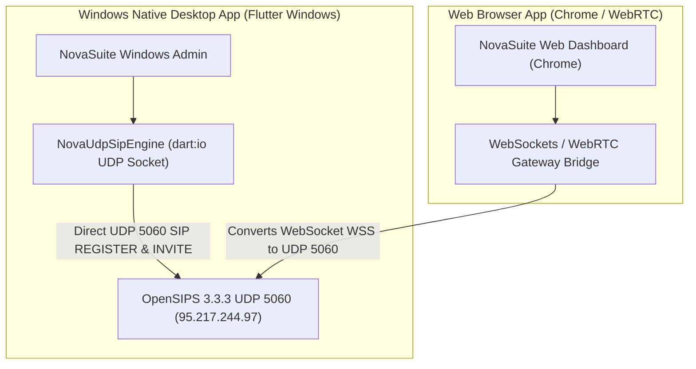

# 🌐 Desktop vs Web Telephony Architecture Guide

**Version:** 1.0.0  
**Target Platform:** NovaSuite CRM & NovaExpress Logistics Monorepo  

---

## 🏗️ 1. Platform Architectural Comparison

---

## 📊 2. Feature & Protocol Capability Matrix

| Capability | Windows Desktop App (`flutter run -d windows`) | Web Browser App (`flutter run -d chrome`) |
| :--- | :--- | :--- |
| **SIP Signaling Protocol** | Raw UDP Port 5060 (Native OpenSIPS Handshake) | WebSockets (`wss://` / `ws://`) |
| **Authentication Support** | `qop="auth"` Digest MD5 (`200 OK` Verified) | Requires OpenSIPS WSS Module or WebRTC Gateway |
| **Network Overhead** | Ultra Low Latency (Direct UDP datagrams) | Encapsulated WebSocket Framing |
| **Browser Security Restrictions** | None (Runs with full OS datagram permissions) | Restricted by Browser Same-Origin & WSS SSL Rules |

---

## 🛠️ 3. Recommendations for Deployment

1. **Primary Call Center Deployment (Windows App)**:
   - Provide sales call reps with the compiled **NovaSuite Windows Desktop Executable**.
   - Out-of-the-box native UDP calling on port 5060 with zero browser configuration required!

2. **Web Browser Calling Solution**:
   - Request IT Sky Solutions support to enable the OpenSIPS `proto_wss` module on port 8089, OR
   - Deploy a lightweight 1-file WebRTC-to-SIP bridge (e.g. Janus or Kamailio WebRTC gateway) on Supabase / Cloud infrastructure.
