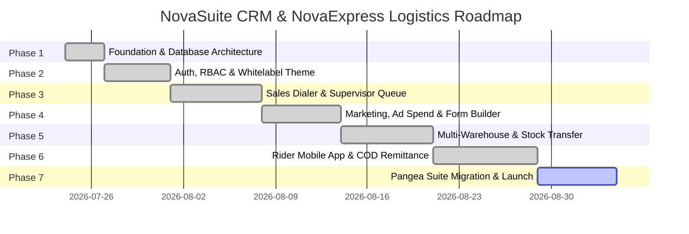

# NovaSuite CRM & NovaExpress Logistics - Development Milestones & Roadmap

**Version:** 1.0.0  
**Project:** NovaSuite White-Label CRM & NovaExpress Logistics Platform  
**Target Architecture:** Flutter Monorepo + Supabase (PostgreSQL, RLS, Edge Functions, Realtime, Storage)  

---

## 🗺️ Master Roadmap Overview

---

## 📋 Detailed Milestone Breakdowns

### ✅ Milestone 1: Foundation & Database Architecture (COMPLETED)
- [x] Multi-tenant PostgreSQL database migration script (`init_novasuite_schema.sql`).
- [x] Supabase project credentials setup (`oygtaeriljuelhshfvkv`).
- [x] Serverless Edge Function (`submit-order`) for high-scale order webhooks.
- [x] Atomic round-robin call rep assignment algorithm (`assign_order_round_robin`).
- [x] Core Dart shared package (`novasuite_core`) with `TenantTheme` & `OrderModel`.
- [x] Scaffolding & initial UI layouts for `novasuite_admin` and `novaexpress_rider`.

---

### ✅ Milestone 2: Authentication, RBAC & Tenant Whitelabeling (COMPLETED)
- [x] **UserModel & Auth Repository**: Implemented `UserModel` and `AuthRepository` for Supabase authentication.
- [x] **Role-Based Access Control (RBAC)**: Enforced User Roles (`super_admin`, `agm`, `supervisor`, `sales_call_rep`, `logistics_call_rep`, `digital_marketer`, `delivery_agent`, `finance_manager`).
- [x] **Split-Screen Responsive Login Portal**: Implemented `LoginScreen` in `novasuite_admin` with dynamic brand previews and role mode switching.
- [x] **Live Whitelabel Branding Engine**: `TenantTheme` dynamic theme switcher applying custom logos, brand colors, and regional currency tokens.

---

### ✅ Milestone 3: Sales Call Center & Realtime Supervisor Approvals (COMPLETED)
- [x] **Order Repository**: Implemented `OrderRepository` for fetching orders, updating statuses, submitting upsell requests, approving/rejecting upsells, and listening to Supabase Realtime channels.
- [x] **Sales Rep Dialer & Order Queue**: Interactive queue with quick-dial phone links and customer order details.
- [x] **Up-sell & Down-sell Request Engine**: Interactive `RequestUpsellDialog` modal calculating base prices, extra promotional amounts, discounts, and customer notes.
- [x] **Supervisor Realtime Approval Queue**: Live visual badge counter & 1-click Approve/Reject action handlers automatically updating total order amounts and moving approved orders to the logistics queue.

---

### ✅ Milestone 4: Digital Marketing, Ad Spend & Pangea Campaign Form Builder (COMPLETED)
- [x] **Marketing & Campaign Models**: Implemented `MarketerBudgetModel`, `AdCampaignModel`, `CampaignFormModel`, and `MarketingRepository` in `novasuite_core`.
- [x] **Pangea Campaign Form Builder (3-Step Wizard)**:
  - **Step 1: Basics**: Form Title, Digital Marketer, Thank You Redirect URL, Success Message, Submit Button Text, Quantity Display Mode (`Number input`, `Dropdown`, `Radio buttons`), Preset Country, Description.
  - **Step 2: Builder & Styling**: Product category dimensions, Field Visibility & Required switches (Full Name, Email, Phone, Address Line 1/2, State, Country), live appearance color pickers, font family selector, and live preview box.
  - **Step 3: Upsell & Embed Code Generator**: Instant checkout 1-click upsell offers + Copy-to-clipboard HTML/JS embed snippet posting to `/submit-order` and redirecting to the Thank You Page URL for CAPI conversion tracking.
- [x] **Pangea Ad Performance Dashboard**: Live metrics for `SPEND`, `GENERATED`, `DELIVERED`, Spend Trend analytics graph, and Top Campaigns by Conversions.

---

### ✅ Milestone 5: Multi-Warehouse Inventory & Inter-Warehouse Stock Transfers (COMPLETED)
- [x] **Inventory Models & Repository**: Implemented `WarehouseModel`, `StockTransferModel`, and `InventoryRepository` in `novasuite_core`.
- [x] **Inter-Warehouse Transfer (IWT) Dispatch Engine**: Interactive `CreateTransferDialog` modal for logistics managers to generate Waybills (`WB-2026-XXXX`) and ship stock between warehouses.
- [x] **Multi-Warehouse Hub Matrix**: Real-time nationwide stock tracking across Central Factory Hubs, Agency Regional Hubs, and Independent Rider Mini-Hubs.
- [x] **Stock Transfer Verification & Restock**: Live Waybills table with 1-click **Confirm Receipt** action handlers that update destination warehouse inventory balances.

---

### ✅ Milestone 6: Rider Mobile App & Cash-on-Delivery (COD) Reconciliation (COMPLETED)
- [x] **Cash Remittance Model & Repository**: Implemented `CashRemittanceModel` and `RemittanceRepository` in `novasuite_core`.
- [x] **Rider Bank Deposit Upload**: Interactive `UploadDepositReceipt` dialog in `novaexpress_rider` for riders to submit cash deposit receipts.
- [x] **Finance Remittance Verification Engine**: Interactive `VerifyRemittanceDialog` in `novasuite_admin` allowing Finance Managers to verify receipts and reset rider holding cash balances.
- [x] **Automated COD Credit Limit Threshold**: Credit limit meter (₦150,000 max limit) protecting business cashflow and enforcing timely rider remittances.

---

### 📦 Milestone 7: Legacy Pangea Suite Data Migration & B2B SaaS Launch (Target: Week 6 - NEXT UP)
- [ ] **Pangea Suite ETL Migration Tool**: Automated import script for legacy CSV exports (Customers, Products, Historical Orders, Reps).
- [ ] **B2B SaaS Tenant Management**: Feature flags and subscription plan tiering for external client companies.
- [ ] **High-Volume Load & Stress Testing**: Simulated burst test (10,000+ daily orders) verifying zero duplicate assignments or data leaks.
