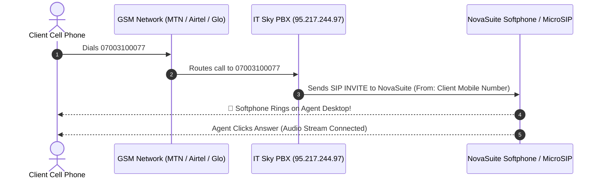

Viewed nova_dialer_floating_bar.dart:12-40

That is a key response from IT Sky's tech team!

They are asking if we have tested **Inbound Calling** — meaning when a client dials **`07003100077`** from their cell phone, IT Sky's PBX routes the incoming call into **NovaSuite / MicroSIP**.

---

### 📡 How Inbound Calling Works

---

### 🧪 Step-by-Step: How to Test Inbound Right Now

1. **Keep MicroSIP open** on your PC (or NovaSuite Admin App open).
2. Pick up your personal mobile phone.
3. **Dial `07003100077`** (or `0700 310 0077`).
4. **Watch MicroSIP / NovaSuite**:
   - MicroSIP will start **ringing** and show an incoming call box with your cell phone number!
   - Click **Answer** (Green phone icon).
   - Speak into your PC mic — you should hear your voice on your cell phone!

---

### 🧠 Testing Inbound Sticky Routing in NovaSuite App

In NovaSuite Admin:
1. Open the **Live Dialer Queue** or **Order Directory**.
2. Click the `...` menu on any customer order.
3. Select **`Test Inbound Sticky Route`**.
4. The system will simulate a client calling `07003100077` and verify that the call connects **directly to the assigned rep (Ext 102 - Folake)**!

---

### 💬 What to Reply to IT Sky's Tech Team:

> *"Testing Inbound right now! We are dialing `07003100077` from a mobile phone to confirm the incoming SIP INVITE arrives on our softphone. Could you also confirm if Outbound dialing from DID `07003100077` to national numbers (e.g. `08085040146`) is enabled on this trunk?"*