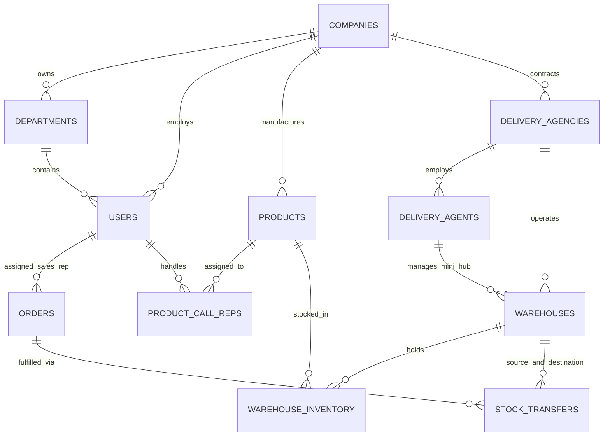

# Implementation Plan & Architecture Blueprint: NovaSuite CRM & NovaExpress Logistics

NovaSuite is a modern, high-performance, white-label Multi-Tenant CRM and Logistics Platform designed to replace legacy systems like Pangea Suite. It powers **Nova Care** (and its sub-marketing companies) for herbal direct-to-consumer (D2C) sales, alongside **Nova Express** (and 3rd-party logistics agencies/independent riders) for nationwide Cash-on-Delivery (COD) fulfillment.

---

## 🏗️ Architectural Overview & Tech Stack

```mermaid
graph TD
    subgraph Frontend Ecosystem (Flutter Monorepo)
        A[NovaSuite Admin & Portal - Responsive Web/Desktop]
        B[NovaExpress Rider App - iOS / Android Mobile]
        C[Embedded Landing Page Forms - Web Widget]
    end

    subgraph Serverless API & Integration Layer (Supabase)
        D[Edge Function: Order Ingestion & Webhooks]
        E[Edge Function: Facebook CAPI & Pixel Attribution]
        F[Edge Function: Pangea Data Migration Tool]
        G[Supabase Realtime Channel Manager]
    end

    subgraph Data & Storage Layer (PostgreSQL)
        H[(Supabase Postgres DB + Row Level Security)]
        I[Supabase Storage: Receipts & Proof of Delivery]
        J[Supabase Auth & Custom JWT Claims]
    end

    C -->|HTTP POST| D
    D -->|Atomic Assign| H
    D -->|Fire Server Event| E
    A & B -->|GraphQL/REST & Realtime| G
    A & B -->|Direct Auth & SQL Queries| H
    B -->|Upload POD / Receipts| I
```

### Core Technologies
- **Frontend**: Flutter (Multi-platform: Web, Windows, macOS, iOS, Android).
- **Backend Services**: Supabase (PostgreSQL, Row Level Security, Realtime Engine, Edge Functions in Deno/TypeScript, Storage).
- **State Management & Architecture**: Flutter BLoC / Provider with Clean Architecture & Modular Monorepo structure.
- **Form Integration**: Serverless Webhooks + Facebook Conversions API (CAPI) for 100% ad attribution.

---

## ⚠️ Key Architectural Rules & Constraints

1. **Multi-Tenant Isolation Strategy**: All database tables enforce Row-Level Security (RLS) based on `company_id`. A company cannot access another company's products, reps, or customers unless explicit cross-company logistics sharing (e.g. using Nova Express as a public 3rd-party logistics provider) is enabled.

2. **Dual Call Rep Workflow**:
   - **Sales Call Rep**: Focuses strictly on calling client, pitching products, adding up-sells/down-sells (requiring Supervisor Real-time Approval), and marking the order as `Accepted`.
   - **Logistics Call Rep (Nova Express / Agency)**: Receives `Accepted` orders, calls customer to re-confirm physical location & delivery readiness, and updates status to `Delivery Agent Notified`.

3. **COD Credit Limit Enforcement**: Direct Independent Riders have a maximum Cash-on-Delivery credit threshold (e.g. ₦150,000). Once reached, the system blocks new order assignments to that rider until they upload a bank deposit receipt and clear their pending cash balance.

---

## 📐 Detailed System Breakdown

### 1. Database & Security Layer (Supabase PostgreSQL)

#### Core Data Entities & Schema Topology



#### Key Tables & Schema Highlights:
- `companies`: Platform tenants (e.g., Nova Care, Nova Express, Sub-Companies).
- `tenant_settings`: Whitelabel configuration (Logos, Color Hex Codes, Custom Domain, Currency Symbol).
- `users`: User profiles with roles (`agm`, `supervisor`, `sales_call_rep`, `logistics_call_rep`, `marketer`, `rider`, `super_admin`).
- `products`: Product catalog linked to allowed Call Reps (`product_call_reps`).
- `orders`: Central transaction ledger tracking statuses, upsells, discounts, sales rep, logistics rep, rider, COD remittance status.
- `warehouses` & `warehouse_inventory`: Multi-location stock balances (`available`, `allocated`, `in_transit`, `damaged`).
- `stock_transfers` & `stock_transfer_items`: Inter-warehouse waybills with receipt verification and discrepancy logs.
- `cash_remittances`: Ledger for rider bank transfer proof uploads and finance team verifications.

---

### 2. High-Scale Atomic Round-Robin Order Distribution Engine

To prevent race conditions during high-volume ad bursts (thousands of incoming form hits):

1. **Endpoint**: Landing pages POST to Supabase Edge Function `/submit-order`.
2. **Atomic Postgres Function**:
   - Queries `product_call_reps` for active reps handling the product.
   - Selects the rep with the lowest `pending_orders_count` using `SELECT ... FOR UPDATE`.
   - Assigns order, increments rep's load counter, and fires a Supabase Realtime event to the rep's dashboard.
3. **Facebook CAPI Trigger**: Edge Function asynchronously forwards the conversion payload to Facebook Graph API for accurate ad conversion tracking.

---

### 3. Frontend Architecture (Flutter Monorepo)

Monorepo workspace structure powered by Dart/Flutter:

```text
novasuite/
├── apps/
│   ├── novasuite_admin/               # Responsive Web & Desktop App
│   │   ├── lib/features/auth/
│   │   ├── lib/features/marketing/     # Marketer Ad Spend & Form Builder
│   │   ├── lib/features/sales/         # Call Rep Dialing & Upsell Request Modal
│   │   ├── lib/features/supervisor/    # Team Metrics & Live Approval Queue
│   │   ├── lib/features/logistics/     # Warehouse Transfers & Agency Dispatch
│   │   └── lib/features/finance/       # COD Reconciliation & Remittance Approval
│   │
│   └── novaexpress_rider/              # Cross-Platform Mobile App (iOS / Android)
│       ├── lib/features/delivery/      # Active Jobs, Map Routing & Location Update
│       ├── lib/features/inventory/     # Mini-Hub Stock Quantity Tab
│       └── lib/features/remittance/    # Cash Collected & Receipt Upload
│
└── packages/
    ├── novasuite_core/                 # Shared Data Models & Supabase Repositories
    ├── novasuite_ui/                   # Design System & Dynamic Whitelabel Theme Engine
    └── novasuite_services/             # Location Service, Push Notifications, Local Cache
```

---

## 🧪 Verification & Testing Plan

### Automated Testing
- **Database Unit Tests (pgTAP)**: Verify Row Level Security (RLS) policies prevent cross-tenant data leaks. Test atomic round-robin assignment under simulated concurrent inserts.
- **Edge Function Integration Tests**: Mock webhook payloads from landing page forms and verify JSON response, database record creation, and Facebook CAPI event payload.
- **Flutter BLoC Unit Tests**: Validate state transitions for Sales Rep order updates, Supervisor upsell approvals, and Rider job completion.

### Manual & Operational Verification
- **Simulated Ad Burst Test**: Send 500 concurrent order requests to the order submission webhook and verify equal distribution among active call reps without duplicate assignments.
- **Realtime Upsell Approval Flow**:
  1. Sales Rep triggers an Upsell on an order in `novasuite_admin`.
  2. Verify Supervisor receives an instant visual notification without manually refreshing the screen.
  3. Supervisor approves $\rightarrow$ Verify status updates instantly on both screens.
- **Rider Mobile App Offline & Proof of Delivery Test**:
  1. Rider accepts order, turns off internet connection.
  2. Captures proof of delivery signature/photo $\rightarrow$ Re-connects internet $\rightarrow$ Verify offline queued data syncs cleanly to Supabase Storage.
- **Pangea Data Migration Test**: Run sample import of legacy Pangea Suite CSV data and verify customer history, products, and historical orders map accurately.
