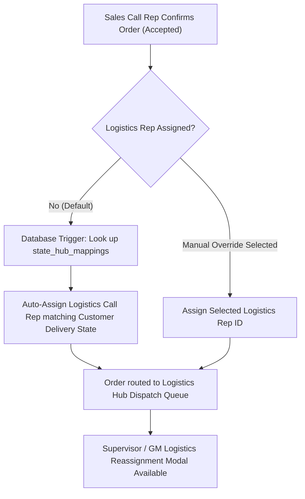

# 🚚 NovaSuite Logistics Auto-Assignment Engine & Manual Override Guide

## 1. Executive Summary & Architectural Flow

In NovaCare's D2C Herbal Pay-on-Delivery (COD) operational model, speed to dispatch directly impacts delivery success rate. Waiting for manual assignment after a sale is closed causes delivery delays and cancellations.

### Hybrid Assignment Pipeline:


---

## 2. Supabase Database & Function Considerations

### Migration File Created:
Path: `supabase/migrations/20260725000000_auto_assign_logistics_rep.sql`

### Key Objects Created:
1. **`state_hub_mappings` Table**:
   - Maps delivery states (`Lagos`, `Abuja`, `Rivers`, `Kano`) to specific `assigned_logistics_rep_id` and `assigned_hub_id`.

2. **`trigger_auto_assign_logistics_rep` Trigger Function**:
   - Fires `BEFORE UPDATE OF status ON orders` when `NEW.status = 'accepted'`.
   - Automatically matches `NEW.delivery_state` against `state_hub_mappings`.
   - Falls back to Round-Robin distribution across active `logistics_call_rep` profiles if no state-specific mapping exists.

3. **`reassign_logistics_rep(p_order_id, p_new_logistics_rep_id, p_reason)` RPC**:
   - Allows Supervisors or GM Logistics to manually reassign an order to another logistics rep with an audit trail note.

---

## 3. Manual Actions Required to Deploy Backend

Follow these steps to deploy and test the database changes:

### Step A: Apply Supabase Migration
If using Supabase CLI:
```bash
supabase db push
```
Or copy the contents of `supabase/migrations/20260725000000_auto_assign_logistics_rep.sql` into the **Supabase Dashboard SQL Editor** and click **Run**.

### Step B: Seed State-to-Hub Mappings (Optional)
Run the following SQL snippet in the SQL Editor to map states to your logistics reps:
```sql
INSERT INTO public.state_hub_mappings (company_id, state_name, assigned_logistics_rep_id)
VALUES 
  ('11111111-1111-4111-8111-111111111111', 'Lagos', '30000000-0000-4000-8000-000000000003'),
  ('11111111-1111-4111-8111-111111111111', 'Abuja', '30000000-0000-4000-8000-000000000003')
ON CONFLICT (company_id, state_name) DO UPDATE 
SET assigned_logistics_rep_id = EXCLUDED.assigned_logistics_rep_id;
```

---

## 4. Frontend UI Capabilities Implemented

1. **`sales_call_center_suite_page.dart`**:
   - **Auto-Assignment Badge**: Displayed inside the Order Confirmation modal (`⚡ Auto-Assigning to Logistics Call Rep based on [Delivery State] Hub`).
   - **Manual Override Button**: Allows Sales Reps or Supervisors to select a specific logistics rep before confirming.
   - **Confirmed Orders Datatable**: Displays assigned logistics rep per order + 1-click **Reassign Rep** button.

2. **`reassign_logistics_rep_dialog.dart`**:
   - Modal dialog for reassigning orders to any logistics rep / hub manager with optional reassignment reason.
