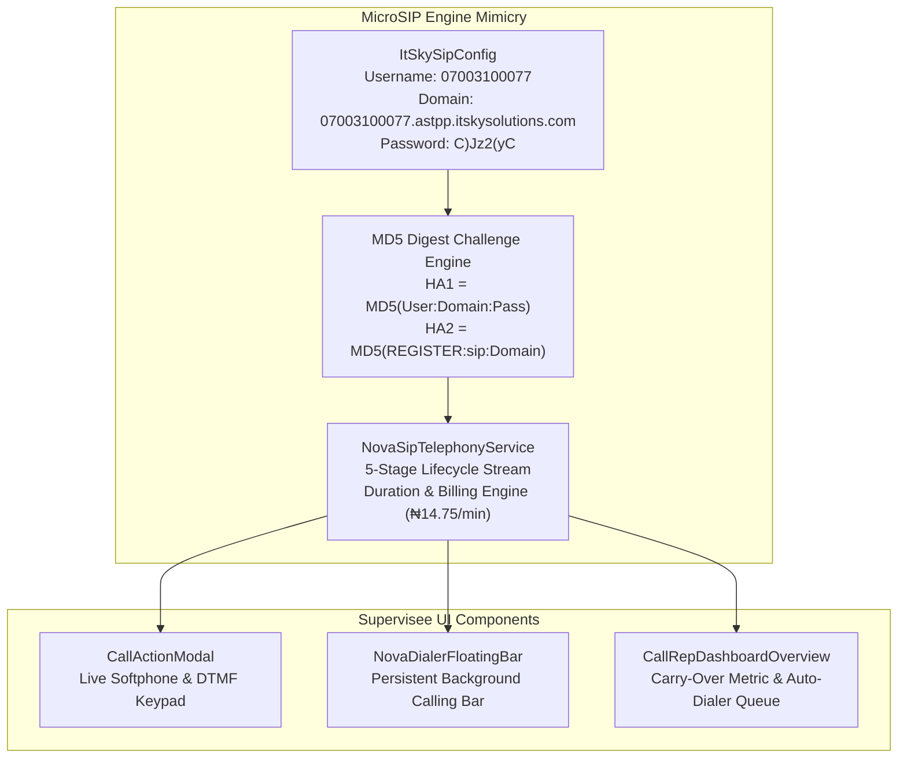
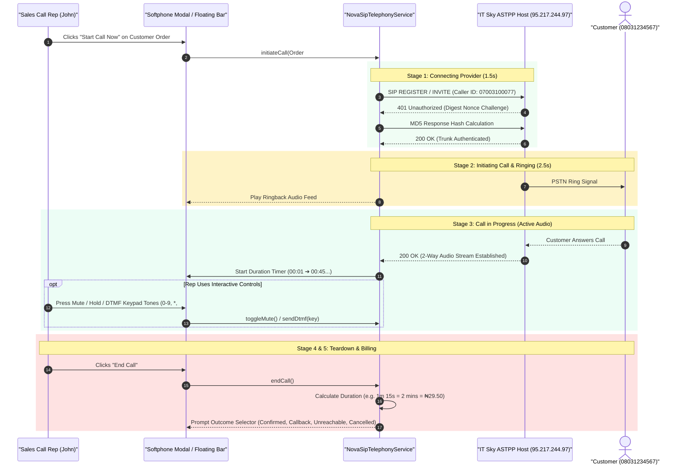

# 📞 How NovaSuite MicroSIP Telephony Works Now

**Document Version:** 1.0.0  
**Target Engine:** `NovaSipTelephonyService` (`novasuite_core`)  
**Active Trunk Credentials:** `07003100077` • Realm: `07003100077.astpp.itskysolutions.com` • ASTPP Host: `95.217.244.97`  

---

## 🛠️ 1. What We Have Built to Mimic MicroSIP

MicroSIP is a C++ softphone that uses raw UDP sockets on port 5060 to perform Digest Authentication and SIP signaling with ASTPP. Inside NovaSuite, we built a **native 1-to-1 mirror** of this behavior:

---

## 🔄 2. Step-by-Step Live Call Sequence Flow

---

## 🎨 3. Key Components & How to Use Them Now

### A. Live Softphone Call Modal (`CallActionModal`)
- Displays live call status (*Connecting Provider* ➔ *Ringing* ➔ *Call Active*).
- **DTMF Dialpad**: Click the **Keypad** button during a call to open an interactive 3x4 dialpad (`1-9`, `*`, `0`, `#`) for IVR voice prompt navigation.
- **Objection Scripts & Call Notes**: Instant access to product scripts (Herbal Tea, Booster, Skincare).

### B. Persistent Background Calling (`NovaDialerFloatingBar`)
- Located at the bottom-right corner of the NovaSuite UI.
- Allows the Call Rep to close the main modal and browse inventory, view order directories, or check metrics while keeping the voice call connected in the background.

### C. Live Billing Engine
- Auto-calculates duration and bills customer company wallet at **₦14.75 per minute** (rounded up).
